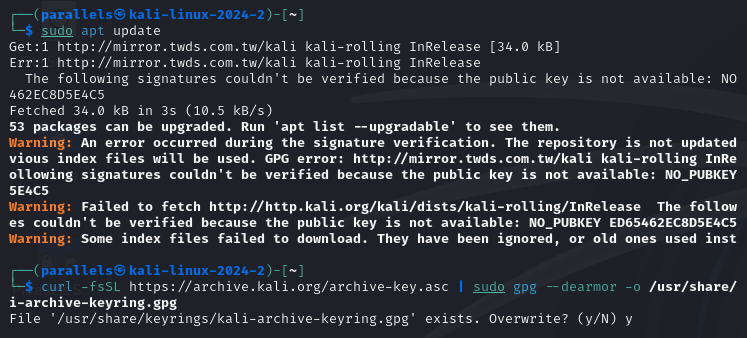
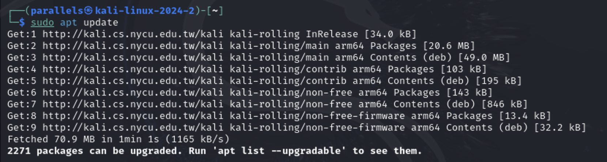
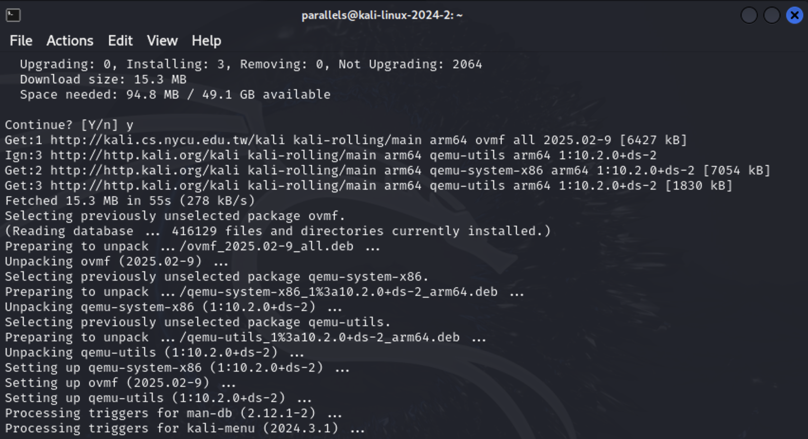
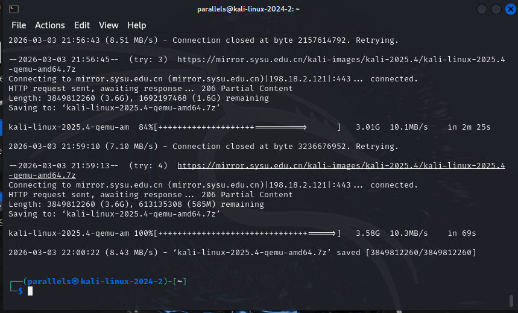
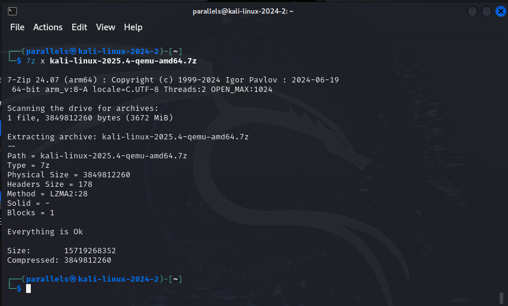
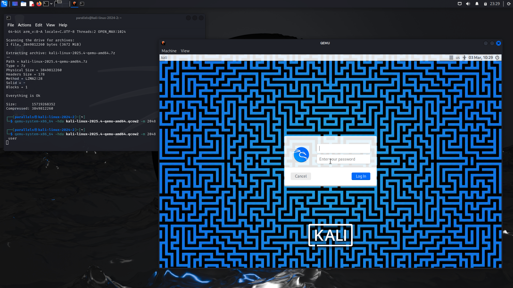

# 作业一： Kali Linux QEMU 虚拟化技术实验报告

## 一、实验目的
1. 掌握在 Linux 环境中部署 QEMU 虚拟化工具的方法。 
2. 学习使用 QEMU 创建与管理虚拟机的基本流程。 
3. 完成 Linux 系统在 QEMU 环境下的安装与配置，并能够启动运行。 

## 二、实验环境
- 计算机型号：Apple MacBook Air
- 处理器型号：Apple M4
- 内存容量：24 GB
- 宿主机操作系统：macOS Sequoia 15.6.1
- 虚拟机操作系统：Kali Linux
- 虚拟化软件：QEMU

## 三、实验步骤
### 第一部分：QEMU环境搭建
#### 1. 更新系统软件包列表
```bash
sudo apt update
```
在实验过程中执行 `sudo apt update` 更新系统软件源时，系统提示由于缺少公钥（NO_PUBKEY），导致 Kali 官方仓库的数字签名无法验证，软件源索引文件未能成功更新。该问题主要是由于**实验环境中预置的仓库密钥过期或不完整，而 Kali 软件仓库的签名密钥已更新**所致。为解决该问题，实验中通过手动下载并导入最新的 Kali 官方仓库 GPG 公钥，更新本地密钥环文件，从而恢复了软件源签名验证功能，随后系统软件包列表可正常更新。





#### 2. 安装QEMU组件

```bash
sudo apt install qemu-system-x86
```


#### 3. 验证安装
```bash
qemu-system-x86_64 --version
```


### 第二部分：虚拟机创建

#### 1. 下载qemu磁盘文件
查找最新的镜像磁盘文件：
```bash
wget https://mirror.sysu.edu.cn/kali-images/kali-2025.4/kali-linux-2025.4-qemu-amd64.7z
```


#### 2. 解压磁盘文件
```bash
7z x kali-linux-2025.4-qemu-amd64.7z
```


#### 3. 创建虚拟磁盘
```bash
qemu-system-x86_64 -hda kali-linux-2025.4-qemu-amd64.qcow2 -m 2048 -smp 2 -net nic -net user
```


## 四、实验总结

本实验以 QEMU 虚拟化平台为基础，完成了 Kali Linux 虚拟机环境的搭建与运行配置，系统地学习了虚拟化环境从安装、镜像获取、虚拟机创建到启动运行的完整流程。通过本次实验，加深了对虚拟机架构、虚拟磁盘格式以及资源参数配置等关键技术的理解，为后续开展安全分析与系统实验提供了稳定可靠的运行环境。同时，实验过程提升了对 Linux 系统操作与环境管理的实践能力，达到了预期的实验目标。