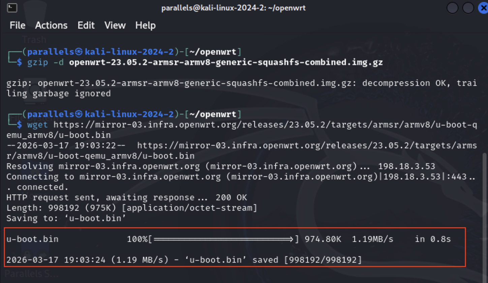
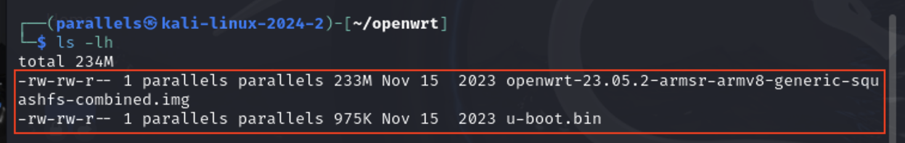
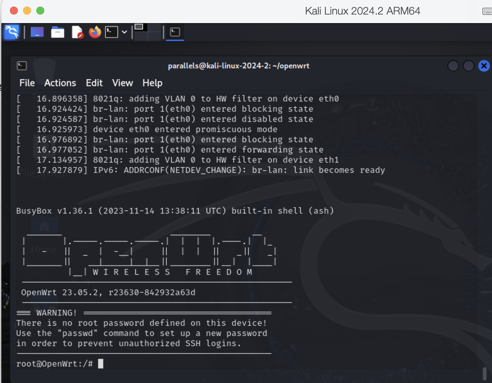
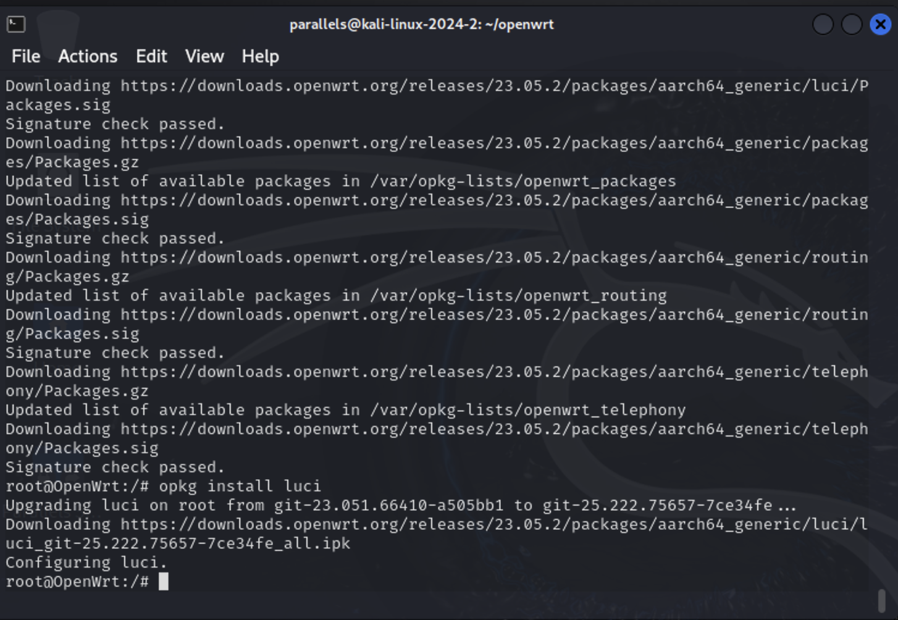
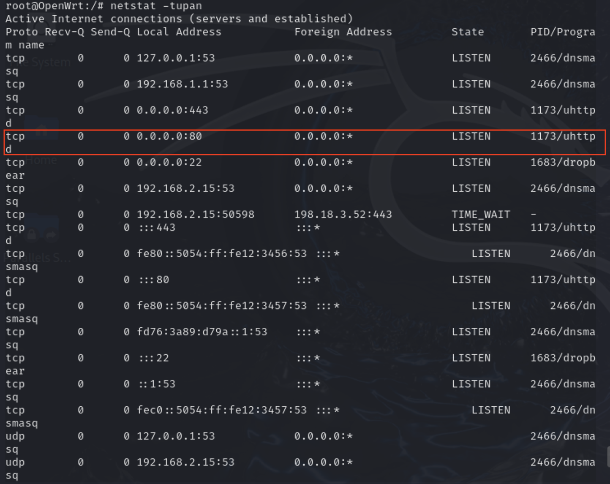
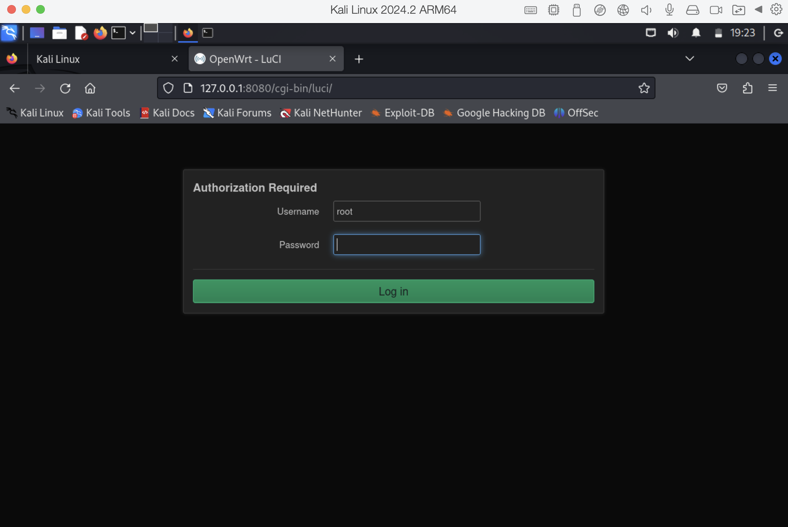
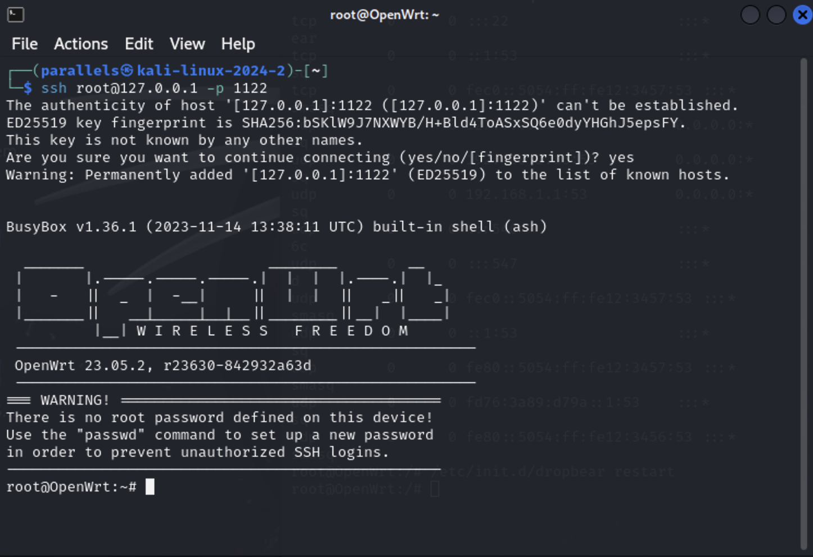

# 实验二：基于 QEMU 的 OpenWrt 仿真实验报告

## 一、实验目的

- 在 QEMU 虚拟环境中运行适用于 ARM 架构的 OpenWrt 镜像，验证 OpenWrt 系统能否正常启动并工作。
- 通过 Web 浏览器访问 LuCI 管理界面，验证 OpenWrt 的 Web 管理服务是否正常运行。
- 通过 SSH 连接 OpenWrt 系统，验证 Dropbear SSH 服务是否可用。
- 掌握 QEMU ARM 虚拟机启动、U-Boot 引导、端口转发和 OpenWrt 基础服务配置方法。

## 二、实验环境

| 项目 | 配置 |
|------|------|
| 计算机型号 | Apple MacBook Air |
| 处理器型号 | Apple M4 |
| 内存容量 | 24 GB |
| 宿主机操作系统 | macOS Sequoia 15.6.1 |
| 实验操作系统 | Kali Linux |
| 仿真系统 | OpenWrt 23.05.2 armsr armv8 |
| 虚拟化软件 | QEMU |
| 引导文件 | u-boot.bin |
| 系统镜像 | openwrt-23.05.2-armsr-armv8-generic-squashfs-combined.img |
| 浏览器 | Kali Linux 内置浏览器 |
| SSH 客户端 | OpenSSH client |

## 三、实验原理与基础知识

### （一）OpenWrt 仿真原理

OpenWrt 是面向路由器和嵌入式设备的 Linux 发行版，常用于网络设备管理、路由配置和服务部署。真实 OpenWrt 通常运行在 ARM、MIPS 等嵌入式硬件上，而 QEMU 可以模拟 ARMv8/AArch64 虚拟硬件，使 OpenWrt 镜像在普通主机或虚拟机中运行。

本实验使用 `qemu-system-aarch64` 启动 ARMv8 64 位虚拟机，并通过 OpenWrt 官方提供的 armsr armv8 镜像作为系统磁盘。这样可以在不依赖真实路由器硬件的情况下完成 OpenWrt 启动、Web 管理界面访问和 SSH 远程登录验证。

### （二）U-Boot 引导机制

U-Boot 是嵌入式系统中常见的引导程序，负责完成硬件初始化、加载系统镜像并将控制权交给操作系统内核。本实验中通过 `-bios u-boot.bin` 指定 U-Boot 作为 QEMU 虚拟机的引导固件，使 OpenWrt 镜像能够按照 ARM 虚拟平台的启动流程被正确加载。

### （三）LuCI 与 Dropbear 服务

LuCI 是 OpenWrt 的 Web 管理界面，通常运行在 `uhttpd` Web 服务之上。安装 LuCI 后，可以通过浏览器访问 OpenWrt 的管理页面，进行网络、系统和服务配置。

Dropbear 是 OpenWrt 默认常用的轻量级 SSH 服务，适合资源受限的嵌入式环境。通过 SSH 登录 OpenWrt，可以在命令行中执行系统管理、网络配置和服务维护操作。

### （四）QEMU 网络与端口转发

本实验使用 QEMU 的用户态网络模式。用户态网络配置简单，虚拟机可以通过 NAT 访问外部网络，同时可使用 `hostfwd` 将宿主机本地端口转发到虚拟机端口。

实验中的端口转发关系如下：

| 宿主机地址 | 转发到 OpenWrt | 用途 |
|------------|----------------|------|
| 127.0.0.1:1122 | 192.168.1.1:22 | SSH 连接 |
| 127.0.0.1:8080 | 192.168.1.1:80 | LuCI Web 管理界面 |

通过上述配置，可以在 Kali 中访问 `http://127.0.0.1:8080` 打开 LuCI 页面，也可以使用 `ssh root@127.0.0.1 -p 1122` 连接 OpenWrt。

## 四、实验内容

### （一）镜像下载与准备

#### 1. 创建工作目录

新建一个专门存放 OpenWrt 镜像和启动文件的目录，避免实验文件与其他文件混杂：

```bash
mkdir ~/openwrt
cd ~/openwrt
```

该目录用于保存 OpenWrt 系统镜像、解压后的磁盘文件以及 U-Boot 引导文件，后续 QEMU 启动命令也在该目录下执行。

#### 2. 下载并解压 OpenWrt 镜像

执行以下命令下载 OpenWrt 23.05.2 ARMv8 镜像，并将 `.gz` 压缩文件解压为 QEMU 可直接加载的 `.img` 文件：

```bash
wget https://downloads.openwrt.org/releases/23.05.2/targets/armsr/armv8/openwrt-23.05.2-armsr-armv8-generic-squashfs-combined.img.gz
gzip -d openwrt-23.05.2-armsr-armv8-generic-squashfs-combined.img.gz
```

随后下载 ARMv8 QEMU 启动所需的 U-Boot 引导文件：

```bash
wget https://mirror-03.infra.openwrt.org/releases/23.05.2/targets/armsr/armv8/u-boot-qemu_armv8/u-boot.bin
```



如图所示，终端正在下载 OpenWrt 镜像文件和 U-Boot 引导文件。该步骤的关键结果是获得系统磁盘镜像和启动固件，两者缺一不可：镜像提供 OpenWrt 系统内容，U-Boot 负责引导系统启动。

#### 3. 检查文件准备情况

使用 `ls -lh` 查看当前目录下的文件，确认镜像和引导文件是否存在：

```bash
ls -lh
```



截图显示目录中已经包含解压后的 OpenWrt `.img` 镜像文件和 `u-boot.bin` 文件，说明镜像准备阶段完成。文件大小也能辅助判断下载和解压是否完整，避免后续启动时因文件缺失或损坏导致 QEMU 无法运行。

### （二）QEMU 环境配置与系统启动

#### 1. 验证 QEMU AArch64 支持

启动 OpenWrt ARMv8 镜像前，先检查 QEMU 的 AArch64 系统模拟器是否可用：

```bash
qemu-system-aarch64 --version
```


截图中终端能够输出 `qemu-system-aarch64` 的版本信息，说明当前环境已经安装支持 ARMv8/AArch64 架构的 QEMU 组件，可以继续进行 OpenWrt 仿真实验。

#### 2. 启动 OpenWrt 虚拟机

在包含 `u-boot.bin` 和 OpenWrt 镜像文件的目录下执行以下命令启动虚拟机：

```bash
qemu-system-aarch64 -cpu cortex-a72 -m 1024 -M virt,highmem=off -nographic \
-bios u-boot.bin \
-drive file=openwrt-23.05.2-armsr-armv8-generic-squashfs-combined.img,format=raw,if=virtio \
-device virtio-net,netdev=net0 -netdev user,id=net0,net=192.168.1.0/24,hostfwd=tcp:127.0.0.1:1122-192.168.1.1:22,hostfwd=tcp:127.0.0.1:8080-192.168.1.1:80 \
-device virtio-net,netdev=net1 -netdev user,id=net1,net=192.168.2.0/24
```

主要参数说明如下：

- `qemu-system-aarch64`：启动 AArch64 架构系统模拟器。
- `-cpu cortex-a72`：指定模拟的 CPU 类型为 ARM Cortex-A72。
- `-m 1024`：为虚拟机分配 1024 MB 内存。
- `-M virt,highmem=off`：使用 QEMU 通用 `virt` 机器类型，并关闭高地址内存以提高兼容性。
- `-nographic`：不启用图形界面，虚拟机串口输出直接显示在当前终端。
- `-bios u-boot.bin`：指定 U-Boot 作为引导程序。
- `-drive file=...,format=raw,if=virtio`：将 OpenWrt 镜像作为虚拟磁盘挂载，并使用 virtio 磁盘接口。
- `hostfwd=tcp:127.0.0.1:1122-192.168.1.1:22`：将本地 1122 端口转发到 OpenWrt 的 22 端口，用于 SSH。
- `hostfwd=tcp:127.0.0.1:8080-192.168.1.1:80`：将本地 8080 端口转发到 OpenWrt 的 80 端口，用于访问 LuCI。
- 第二块 `virtio-net` 网卡连接到 `192.168.2.0/24` 网段，用于模拟多网卡网络环境。



截图显示 OpenWrt 已经通过 QEMU 启动并进入命令行界面，说明 U-Boot 引导、系统镜像加载和虚拟硬件配置均正常。由于使用了 `-nographic` 参数，系统不会弹出图形窗口，而是在终端中直接提供 OpenWrt shell。

### （三）启动 LuCI 网页管理界面

#### 1. 安装 LuCI

OpenWrt 默认镜像通常不包含完整 Web 管理界面，因此需要先更新软件包索引并安装 LuCI：

```bash
opkg update
opkg install luci
```



截图显示 `opkg` 正在更新软件包列表并安装 LuCI 相关组件。LuCI 安装完成后，系统会安装并启用与 Web 管理界面相关的软件包，为后续浏览器访问 OpenWrt 管理页面提供条件。

#### 2. 检查 Web 服务监听状态

LuCI 依赖 `uhttpd` 提供 Web 服务。安装完成后使用 `netstat` 查看端口监听情况：

```bash
netstat -tupan
```



截图中可以看到 `uhttpd` 进程正在监听 `0.0.0.0:80`，说明 OpenWrt 内部的 Web 服务已经启动。结合 QEMU 启动命令中的端口转发规则，宿主机访问 `127.0.0.1:8080` 会被转发到 OpenWrt 的 80 端口。

#### 3. 访问 LuCI 登录页面

在 Kali 浏览器中访问以下地址：

```text
http://127.0.0.1:8080
```



截图显示浏览器成功打开 OpenWrt 的 LuCI 登录页面，说明 QEMU 的 Web 端口转发配置正确，OpenWrt 内部的 `uhttpd` 服务运行正常，Web 管理功能验证成功。

### （四）SSH 连接 OpenWrt

#### 1. 重启 Dropbear 服务

在 OpenWrt shell 中重启 SSH 服务，确保 Dropbear 正常运行：

```bash
/etc/init.d/dropbear restart
```

Dropbear 是 OpenWrt 中常用的轻量级 SSH 服务。重启该服务可以确保 SSH 监听状态正常，便于后续从 Kali 终端进行远程登录测试。

#### 2. 使用 SSH 登录 OpenWrt

在 Kali 中新开一个终端窗口，执行以下命令连接 OpenWrt：

```bash
ssh root@127.0.0.1 -p 1122
```

第一次连接时，SSH 客户端会提示是否信任目标主机指纹，输入 `yes` 后继续连接。



截图显示 SSH 已成功连接到 OpenWrt 系统，并进入远程 shell。由于本地 1122 端口已通过 QEMU 转发到 OpenWrt 的 22 端口，该结果说明 Dropbear 服务和 SSH 端口转发均配置正确。


## 五、实验总结

本次实验成功在 QEMU 上搭建了 ARMv8 架构的 OpenWrt 仿真环境，通过 U-Boot 正常引导系统进入 OpenWrt shell，并完成了 LuCI Web 管理界面访问和 SSH 远程登录验证。

通过本次实验，加深了对以下内容的理解：

- **QEMU ARM 虚拟化**：`qemu-system-aarch64` 配合 `-cpu cortex-a72`、`-M virt` 等参数可以模拟 ARMv8 硬件平台，使 OpenWrt ARM 镜像在 x86 宿主机上运行，无需依赖真实路由器硬件。
- **U-Boot 引导流程**：通过 `-bios u-boot.bin` 指定引导固件，U-Boot 完成硬件初始化后加载 OpenWrt 内核，体现了嵌入式系统从上电到操作系统启动的完整引导链。
- **OpenWrt 服务管理**：通过 `opkg` 包管理器安装 LuCI，使用 `netstat` 验证服务端口监听状态，掌握了 OpenWrt 中 Web 服务与 SSH 服务的安装和状态检查方法。
- **QEMU 用户态网络与端口转发**：`hostfwd` 将宿主机本地端口映射到虚拟机内部端口（1122→22、8080→80），实现了从宿主机通过浏览器和 SSH 客户端访问虚拟机内部服务。

相比直接使用真实路由器硬件，QEMU 仿真环境更便于重复实验和排错，为后续开展 OpenWrt 网络配置、服务部署和安全测试提供了基础平台。

## 参考资料

1. 《基于 QEMU 的 OpenWrt 仿真实验报告》0x02，课程实验资料，2025-03-03。
2. OpenWrt 官方下载站：https://downloads.openwrt.org/
3. OpenWrt LuCI 文档：https://openwrt.org/docs/guide-user/luci/start
4. QEMU 官方文档：https://www.qemu.org/docs/master/
