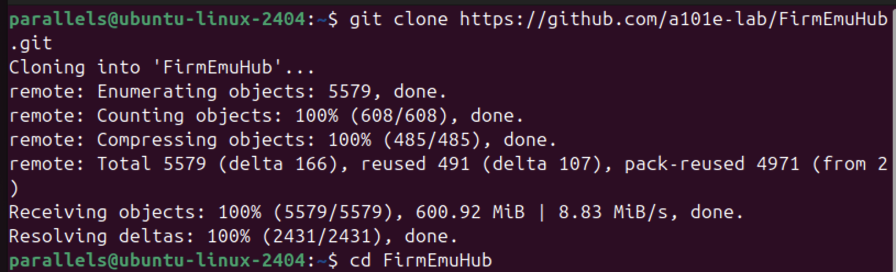
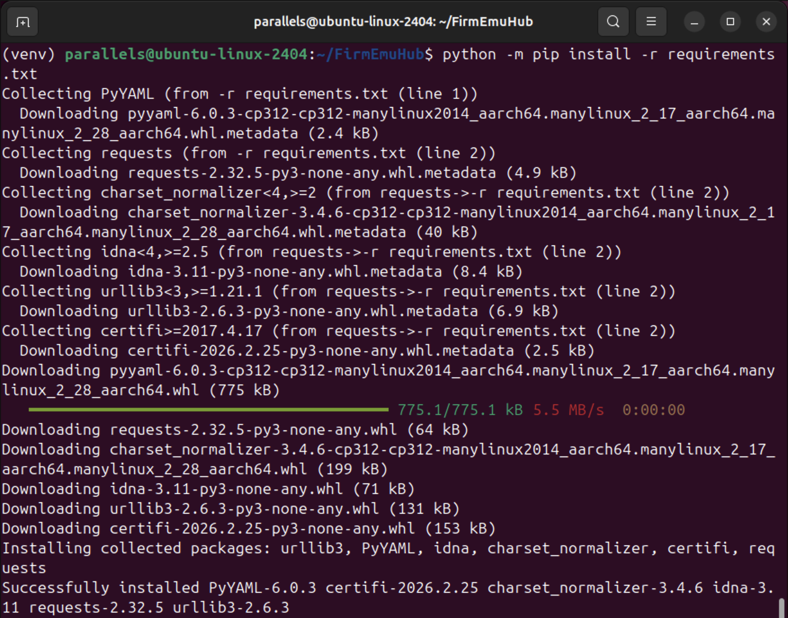
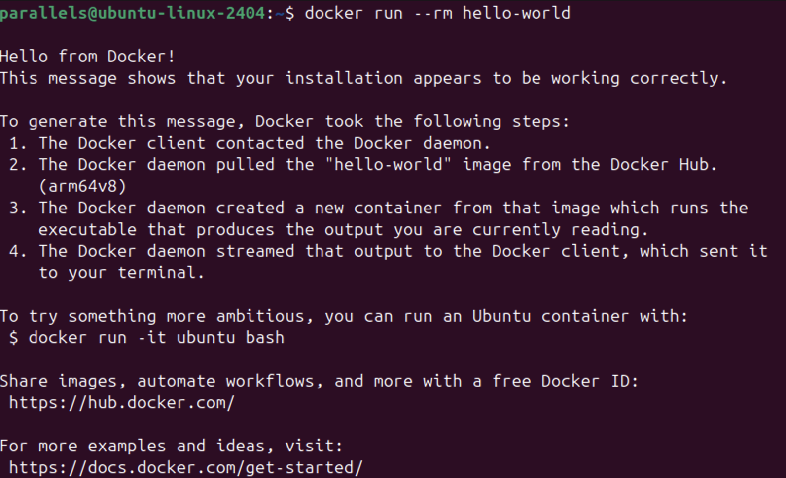
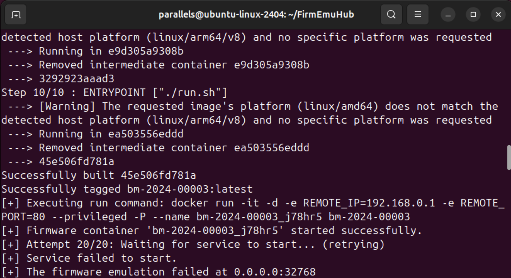
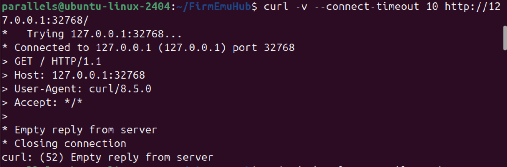

# 系统态固件仿真实验报告

## 一、实验目的

（1）掌握系统态固件仿真的基本原理与技术路线。

（2）使用开源工具 **FirmEmuHub** 完成指定基准固件的完整仿真流程。

（3）在仿真环境中复现固件相关漏洞（本实验为 **CVE-2020-10213** 命令注入漏洞）。

## 二、实验环境

**平台**：宿主机为 Apple 芯片，通过 **Parallels Desktop** 运行 **Ubuntu 24.04** 虚拟机；虚拟机为 **ARM64（aarch64）**，分配内存 **6GB**。

**项目**：`https://github.com/a101e-lab/FirmEmuHub`，本实验基准 **`./Benchmark/BM-2024-00003`**。

| 软件 | 版本 |
|------|------|
| Docker | 28.2.2（build 28.2.2-0ubuntu1~24.04.1） |
| Git | 2.43.0 |
| Python | 3.12.3 |

**跨架构说明**：该基准的 `Dockerfile` 使用 **`linux/amd64`** 基础镜像（如 `fitzbc/fat_ubuntu1604:v6`）。在 ARM 虚拟机上构建/运行容器时，需注册 **QEMU binfmt**，并在启动仿真前设置 **`DOCKER_DEFAULT_PLATFORM=linux/amd64`**，用 **`sudo -E python3 emulation.py ...`** 将变量传入 `sudo` 环境（见下文过程）。

```bash
sudo apt install -y qemu-user-static binfmt-support
sudo docker run --rm --privileged tonistiigi/binfmt --install all
export DOCKER_DEFAULT_PLATFORM=linux/amd64
```

## 三、实验过程与结果

### 第一部分：系统态固件仿真环境搭建

**1. 克隆 FirmEmuHub**

在虚拟机中执行（仓库较大，需等待克隆完成）：

```bash
git clone https://github.com/a101e-lab/FirmEmuHub.git
cd FirmEmuHub
```



**2. Python 虚拟环境与依赖**

安装 venv、在项目目录创建环境并安装 `requirements.txt`：

```bash
sudo apt update
sudo apt install python3-venv -y
cd ~/FirmEmuHub
python3 -m venv venv
source venv/bin/activate
python -m pip install --upgrade pip
python -m pip install -r requirements.txt
```



**问题与处理**：若在用户主目录 `~` 下执行 `source venv/bin/activate` 报错 **`No such file or directory`**，原因是虚拟环境在 **`~/FirmEmuHub/venv`**，须先 **`cd ~/FirmEmuHub`** 再激活。

**3. Docker 权限与可用性**

将用户加入 `docker` 组后，**当前登录会话不会自动带上新组**，直接 `docker run` 可能 **`permission denied ... docker.sock`**。处理：**`newgrp docker`** 或注销/重启后再开终端；或临时统一使用 **`sudo docker ...`**。

```bash
docker run --rm hello-world
```



**4. ARM 主机上的跨架构支持（避免 `exec format error`）**

基准镜像为 **amd64**，在 **ARM64** 虚拟机上未配置时构建会出现 **`exec /bin/sh: exec format error`**。处理：安装 **qemu-user-static**、注册 binfmt；注册命令需对 Docker 有权限，应使用 **`sudo docker run --rm --privileged tonistiigi/binfmt --install all`**（若不加 `sudo` 会同样报 `docker.sock` 权限错误）。

```bash
sudo apt install -y qemu-user-static binfmt-support
sudo docker run --rm --privileged tonistiigi/binfmt --install all
```

**5. 仿真前环境变量**

每次启动仿真前在同一终端执行 **`export DOCKER_DEFAULT_PLATFORM=linux/amd64`**；运行脚本时用 **`sudo -E python3 emulation.py ...`**，以便把该变量传入 `sudo` 环境。构建时若出现镜像平台与主机不一致的 **Warning**，在已配置 binfmt 的前提下可继续。

---

### 第二部分：固件仿真

**1. 启动命令**

在 `FirmEmuHub` 目录激活 venv，设置平台变量后执行一键仿真：

```bash
cd ~/FirmEmuHub
source venv/bin/activate
export DOCKER_DEFAULT_PLATFORM=linux/amd64
sudo -E python3 emulation.py -b ./Benchmark/BM-2024-00003
```

**2. 第一次运行：脚本报失败**



镜像可构建成功、容器可启动，但 **`emulation.py`** 轮询 **20 次**后仍提示 **`Service failed to start`**、**`The firmware emulation failed at 0.0.0.0:32768`**。**`sudo docker ps -a`** 显示容器 **`bm-2024-00003_j78hr5`** 仍为 **`Up`**，映射 **`32768->80`**，说明失败来自**健康检查超时**，而非容器立刻退出。

**3. 宿主机验证**

对映射端口执行 **`curl -v http://127.0.0.1:32768/`**，得到 **`Empty reply from server`（curl 52）**：TCP 通但无正常 HTTP 响应。



**4. 清理后第二次运行**

删除旧容器与本地镜像标签后重新执行第 1 步命令：

```bash
sudo docker rm -f bm-2024-00003_j78hr5
sudo docker rmi bm-2024-00003
cd ~/FirmEmuHub
source venv/bin/activate
export DOCKER_DEFAULT_PLATFORM=linux/amd64
sudo -E python3 emulation.py -b ./Benchmark/BM-2024-00003
```

新容器 **`bm-2024-00003_ulzu96`**；健康检查于 **第 5/20 次** 通过，提示 **`Service started successfully`**；主机 **`0.0.0.0:32769` → 容器 80**（**`-P` 端口每次可能不同，以终端为准**）。


**5. Web 访问**
```bash
parallels@ubuntu-linux-2404:~/FirmEmuHub$ hostname -I
10.211.55.29 172.17.0.1 fdb2:2c26:f4e4:0:c7b5:e005:2084:90f7 fdb2:2c26:f4e4:0:4639:6cca:7ddf:d5f1 
```

浏览器访问 **`http://10.211.55.29:32769`**


---

### 第三部分：漏洞复现（CVE-2020-10213）

**1. 目标与工具**

在仿真 Web 可达的前提下，使用 **Burp Suite Community Edition** 的 **Repeater** 模块，手工构造并发送 **HTTP** 请求，验证 **CVE-2020-10213** 命令注入路径。

**2. 请求格式**

**方法路径**：**`POST /set_sta_enrollee_pin.cgi`**，协议 **HTTP/1.1**。

**目标**：与本实验仿真映射一致，**`Host: 10.211.55.29:32769`**（与 **`hostname -I`** 中虚拟机地址及 **`docker -P`** 映射端口一致）。

**头字段**：**`Content-Type: application/x-www-form-urlencoded`**，并设置与 Body 长度一致的 **`Content-Length`**（本请求为 **111**）；可按需使用 **`Connection: close`**。

**Body**：除注入参数外，包含手册要求的 **`html_response_page=do_wps.asp`**、**`html_response_return_page=do_wps.asp`**。

**3. Payload 要点**

参数 **`wps_sta_enrollee_pin`** 在请求体中为 **URL 编码**形式：**`a%27%24%28reboot%29%27b`**，解码后为 **`a'$(reboot)'b`**：单引号用于闭合原命令中的引号，**`$(reboot)`** 为 **shell 命令替换**，从而在设备侧执行 **`reboot`**，作为命令注入是否成立的判据。

**4. Burp Repeater 实测**

在 **Repeater → Raw** 中粘贴并核对上述请求后点击 **Send**。下图为本实验构造的原始请求（含 **Host**、**Content-Type** 与 **Body**）；若 **`reboot`** 生效，仿真内系统重启，**响应区可能为空、连接被重置或长时间无完整 HTTP 响应**，与真实设备被重启后的表现一致。


**5. 宿主机侧验证（curl）**

在虚拟机内对仿真地址仅取响应头进行探测：

```bash
curl -I http://10.211.55.29:32769
```

发送漏洞利用请求后，服务可能已崩溃或正在重启，**`curl`** 报错 **`curl: (52) Empty reply from server`**：表示 **TCP 能建立但服务端未返回合法 HTTP 报文**，可与 **Burp** 侧无正常响应相互印证。


---

## 四、实验问题总结

在固件仿真启动阶段出现了较明显的兼容性与调试问题。运行 emulation.py 后，曾一度出现容器日志报错、根文件系统挂载失败、平台架构不一致等现象，例如镜像为 linux/amd64，而当前虚拟机宿主平台为 linux/arm64/v8。此外，仿真启动本身也需要较长时间，手册中也提示若多次尝试仍未成功，应优先使用 Ubuntu 而非 Kali 作为实验环境。经过重新检查 Docker 状态、等待服务启动并确认映射端口后，最终才成功访问到固件 Web 管理页面。

---

## 五、实验总结

本实验在 **ARM64 Ubuntu（Parallels，6GB 内存）** 上，借助 **QEMU binfmt** 与 **`DOCKER_DEFAULT_PLATFORM=linux/amd64`、`sudo -E`**，完成 **FirmEmuHub** 依赖安装、**BM-2024-00003** 镜像构建与容器启动；在经历首次健康检查失败及容器日志中的 **kernel panic** 后，通过删除旧容器与镜像并重新执行 **`emulation.py`**，最终在 **`http://10.211.55.29:32769`** 稳定访问仿真 Web。漏洞复现部分使用 **Burp Suite Repeater** 向 **`/set_sta_enrollee_pin.cgi`** 提交 **URL 编码**的 **`wps_sta_enrollee_pin`** 命令注入载荷，并结合 **`curl -I`** 观察到 **`curl: (52) Empty reply from server`**，与 **CVE-2020-10213** 利用 **`reboot`** 后的预期现象一致。通过本次实验，巩固了系统态固件仿真工具链的使用方法，以及对 **CGI 参数未过滤导致的命令注入** 及其验证方式的理解。
