# 第五章：固件 Patch 与动态调试实验报告

## 一、实验目的

本实验以 Tenda AC9 原始固件为对象，重点完成原始固件的用户态仿真，并观察其在未 Patch 状态下的异常表现。

主要目标如下：

- 掌握固件下载、解包和文件系统提取流程；
- 熟悉 QEMU 用户态仿真固件程序的基本方法；
- 记录原始固件启动 `httpd` 时的运行现象；
- 分析原始固件无法正常访问 Web 页面的原因；
- 为后续使用 Ghidra 对 `httpd` 进行 Patch 做准备。

## 二、实验环境

| 项目 | 内容 |
|---|---|
| 操作系统 | Ubuntu 虚拟机 |
| 固件对象 | Tenda AC9 原始固件 |
| 目标程序 | `bin/httpd` |
| 解包工具 | `binwalk` |
| 仿真工具 | `qemu-user`、`qemu-user-static`、`qemu-system-arm`、`qemu-utils` |
| 网络工具 | `bridge-utils`、`uml-utilities`、`ifupdown`、`net-tools` |
| 后续分析工具 | Ghidra |

## 三、实验内容

### （一）第一部分：仿真原始 Tenda AC9 固件

#### 1. 实验背景

上一次实验中使用的是经过 Patch 处理的 Tenda AC9 固件，可以较顺利地进行用户态仿真。本次实验改为运行原始未 Patch 固件，用于观察其真实运行问题。

原始固件在 QEMU 用户态仿真中容易出现异常，主要原因是：

- 固件启动时会执行真实路由器上的硬件初始化逻辑；
- 仿真环境中不存在对应硬件设备或系统服务；
- `httpd` 访问这些资源时可能阻塞或报错；
- 最终表现为程序“假死”或 Web 页面无法访问。

因此，第一部分的核心任务不是修复问题，而是复现问题、记录现象并说明后续 Patch 的必要性。

#### 2. 固件获取与解包

##### 2.1 准备实验目录

将下载得到的 Tenda AC9 原始固件放入实验目录：

```bash
mkdir -p ~/iot_0x05
cd ~/iot_0x05
```

##### 2.2 安装相关工具

由于当前 Ubuntu 软件源中没有单独的 `qemu` 软件包，因此安装 QEMU 的具体组件：

```bash
sudo apt update
sudo apt install -y binwalk qemu-user qemu-user-static qemu-system-arm qemu-utils bridge-utils uml-utilities ifupdown net-tools
```

工具作用简要说明：

- `binwalk`：提取固件中的文件系统；
- `qemu-user`、`qemu-user-static`：用户态运行 ARM 程序；
- `bridge-utils`、`uml-utilities`、`ifupdown`：配置后续仿真网络；
- `net-tools`：查看端口和网络状态。

##### 2.3 提取固件文件系统

使用 `binwalk -Me` 递归提取固件：

```bash
binwalk -Me ./ac9_kf_V15.03.05.19\(6318_\)_cn.zip
find . -maxdepth 4 -type d -name "squashfs-root"
```

提取结果显示，固件中包含 SquashFS 文件系统，并成功生成 `squashfs-root` 目录。

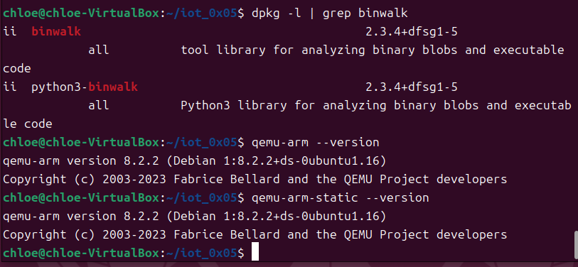

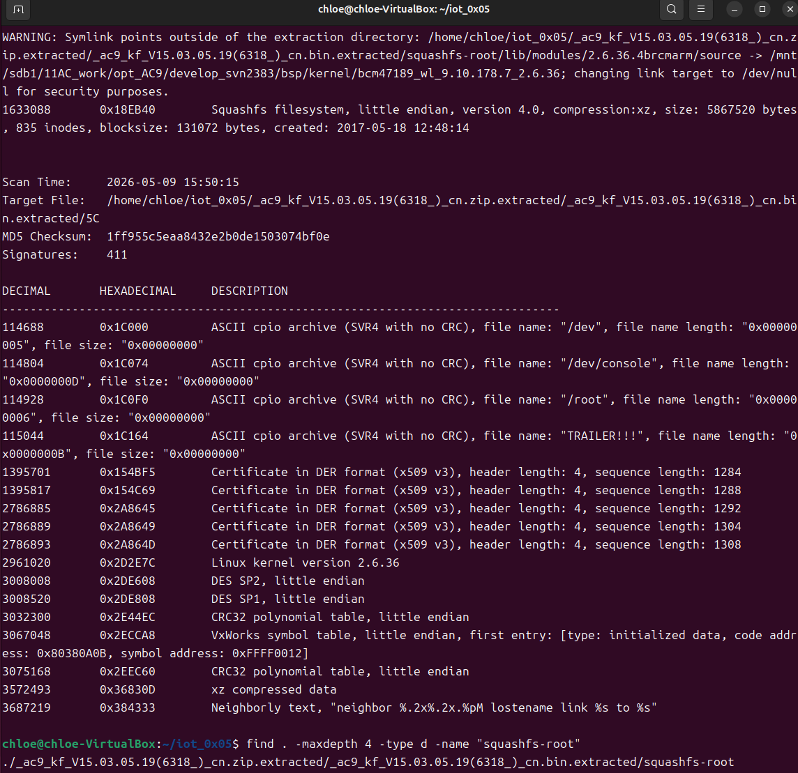

#### 3. 用户态仿真原始固件

##### 3.1 检查端口占用

启动 Web 服务前，先检查 80 端口是否被占用：

```bash
sudo netstat -tulnp | grep ':80'
```

本次实验中未发现明显端口冲突，因此继续进行网络配置。

##### 3.2 配置仿真网络

通过 `ip a` 查看当前虚拟机网卡，确认主要网卡为 `enp0s3`。

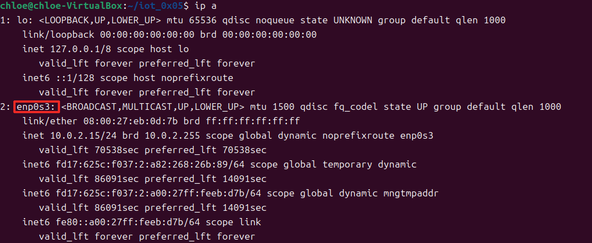

因此，在 `/etc/network/interfaces` 中将实验手册中的 `eth0` 调整为本机实际网卡 `enp0s3`，并配置桥接网卡 `br0`：

```bash
auto lo
iface lo inet loopback

auto enp0s3
iface enp0s3 inet dhcp

auto br0
iface br0 inet dhcp
bridge_ports enp0s3
bridge_maxwait 0
```

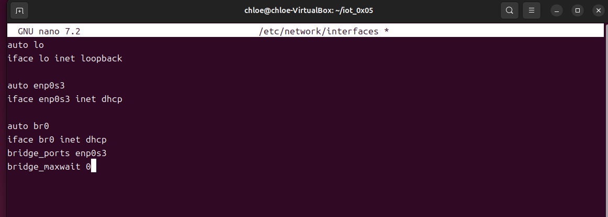

同时配置 `/etc/qemu-ifup`，用于 QEMU 启动时拉起网络接口：

```bash
#! /bin/sh
echo "Executing /etc/qemu/ifup"
echo "Bringing up $1 bridged mode..."
sudo /sbin/ifconfig $1 0.0.0.0 promisc up
echo "Adding $1 to br0..."
sudo /sbin/brctl addif br0 $1
sleep 3
```

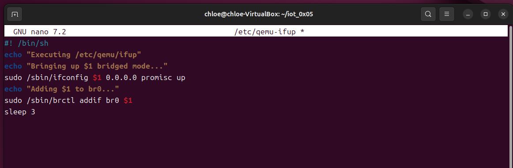

保存后添加执行权限，并重启网络服务：

```bash
sudo chmod a+x /etc/qemu-ifup
sudo systemctl daemon-reload
sudo systemctl restart systemd-networkd.service
sudo ifdown br0 && sudo ifup br0
```

执行过程中出现 `ifdown: interface br0 not configured`，说明 `br0` 此前尚未启用；随后 `ifup br0` 成功执行，并通过 DHCP 获取到 `10.0.2.16/24`，说明桥接网卡已经启动。

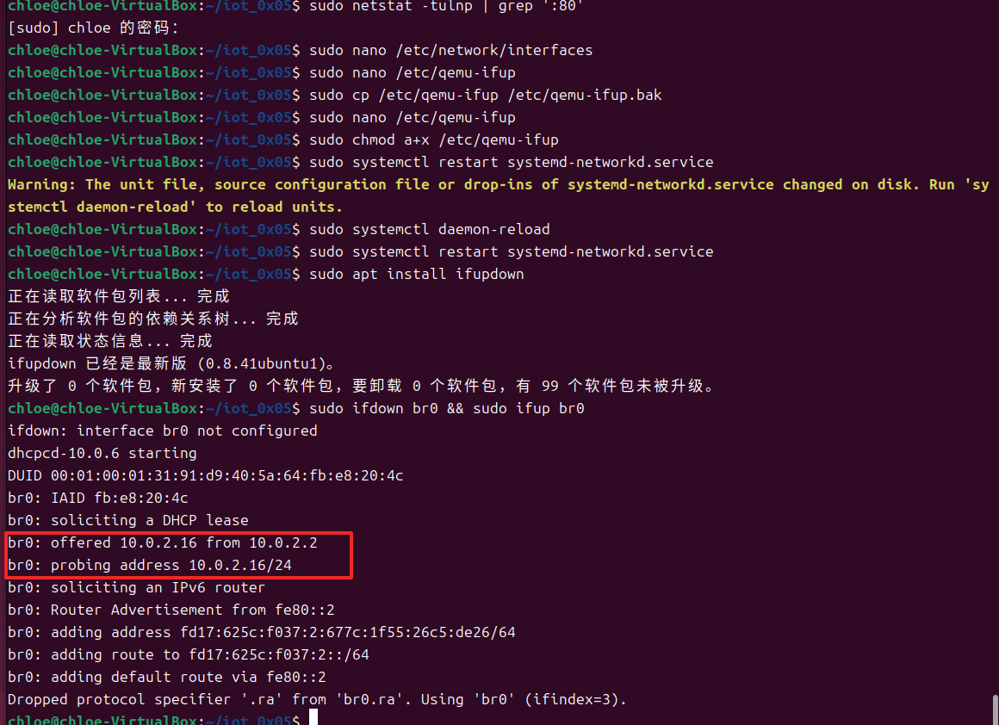

##### 3.3 准备固件运行环境

进入提取出的固件根目录后，复制 QEMU ARM 静态程序，并修复 Web 目录：

```bash
cd _ac9_kf_V15.03.05.19\(6318_\)_cn.zip.extracted/_ac9_kf_V15.03.05.19\(6318_\)_cn.bin.extracted/squashfs-root
sudo cp /usr/bin/qemu-arm-static qemu-arm-static
cp -r webroot_ro/* webroot/
```

随后检查并设置 `httpd` 的执行权限：

```bash
ls -l bin/httpd
chmod +x bin/httpd
```

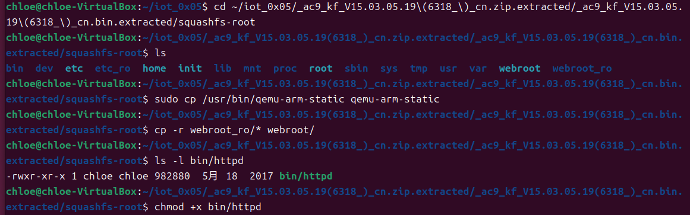

##### 3.4 启动原始 httpd

使用 QEMU 用户态方式启动原始固件中的 `httpd`：

```bash
sudo qemu-arm -L ./ bin/httpd
```

程序启动后，终端输出了 `init_core_dump`、`WeLoveLinux`、`Welcome to ...` 等信息，说明 `httpd` 已经开始执行。但随后出现连接失败信息：

- `connect: No such file or directory`
- `connect to server failed`
- `connect cfm failed`

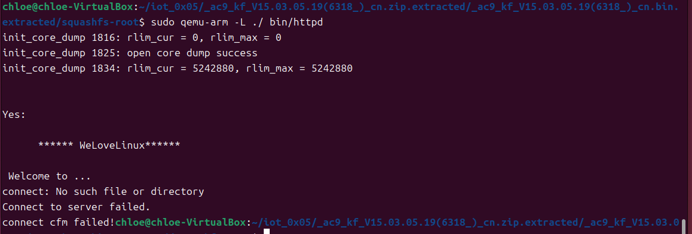

此时在浏览器中访问 `10.0.2.16/main.html`，页面无法建立连接。

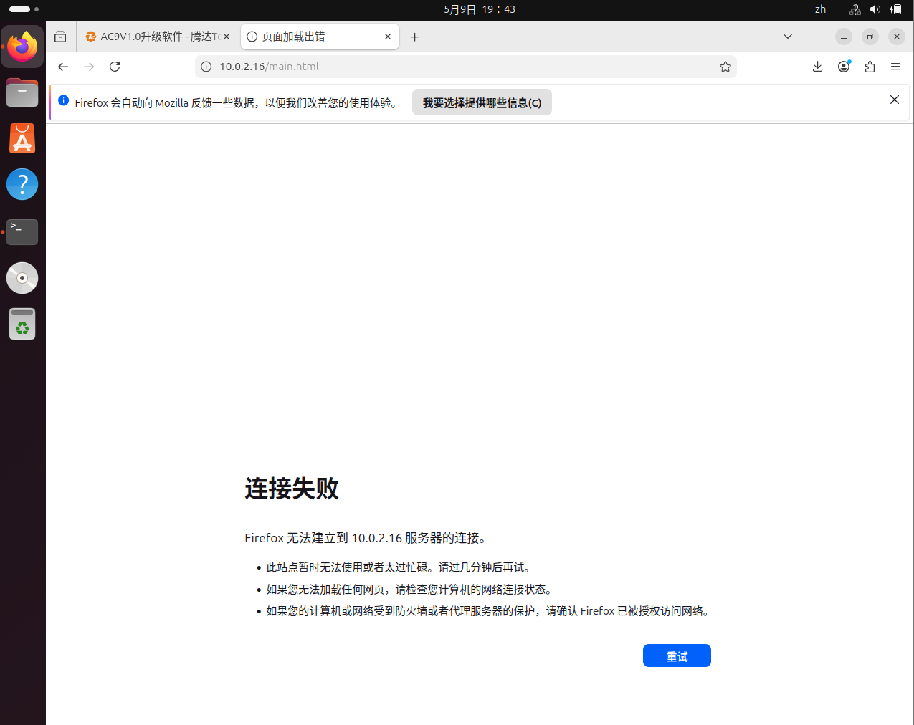

#### 4. 结果分析

从终端输出和浏览器访问结果可以看出：

- `httpd` 能够被 QEMU 启动，说明文件权限和基本运行路径已经配置成功；
- 程序启动后卡在运行时依赖连接阶段，说明异常并非简单的命令错误；
- `connect cfm failed` 表明程序尝试连接某个固件内部服务或硬件相关组件失败；
- 浏览器无法访问 Web 页面，说明原始固件尚不能在当前用户态仿真环境中正常提供服务。

该现象与实验手册中描述一致：原始 Tenda AC9 固件在初始化过程中依赖真实硬件或专有系统服务，QEMU 用户态环境无法完整模拟这些资源，因此会出现“假死”或 Web 服务不可用的问题。

### （二）第二部分：对原始二进制文件进行 Patch

第一部分已经复现了原始 `httpd` 在 QEMU 用户态仿真中的异常现象：程序虽然能够启动，但会在连接检测阶段失败，导致 Web 页面无法访问。本部分使用 Ghidra 修改 `httpd` 中的关键指令，使程序绕过该失败判断，继续启动 Web 服务。

#### 1. 安装并启动 Ghidra

在 Ubuntu 虚拟机中安装并启动 Ghidra：

```bash
sudo snap install ghidra
ghidra
```

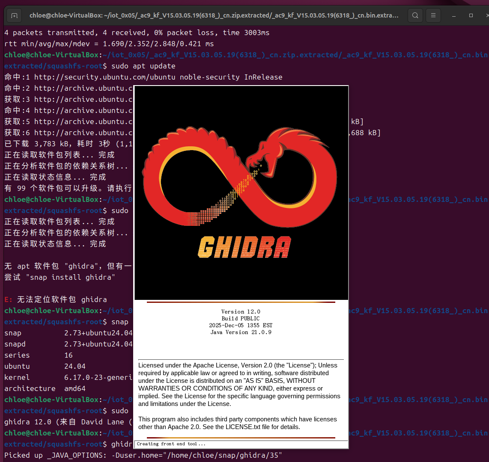

启动后新建工程：

- 工程类型选择 `Non-Shared Project`；
- 工程名称设置为 `iot`；
- 创建完成后进入 Ghidra 主界面。

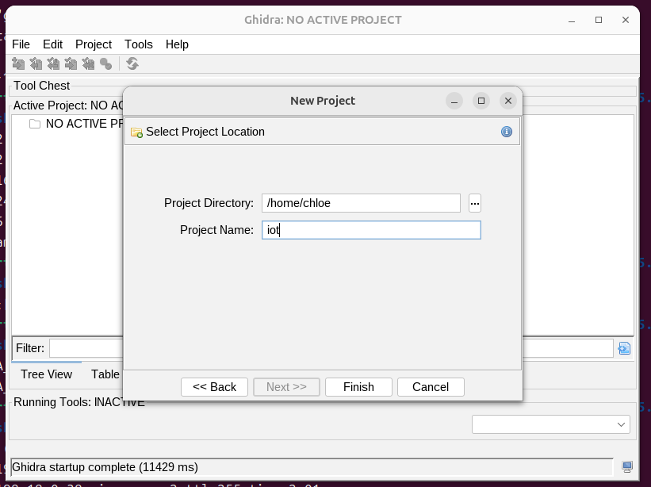

#### 2. 导入并分析 `httpd`

在 Ghidra 中选择 `File -> Import File`，导入固件文件系统中的目标程序：

```text
squashfs-root/bin/httpd
```

导入完成后，双击 `httpd` 进入 CodeBrowser，并使用默认选项进行自动分析。

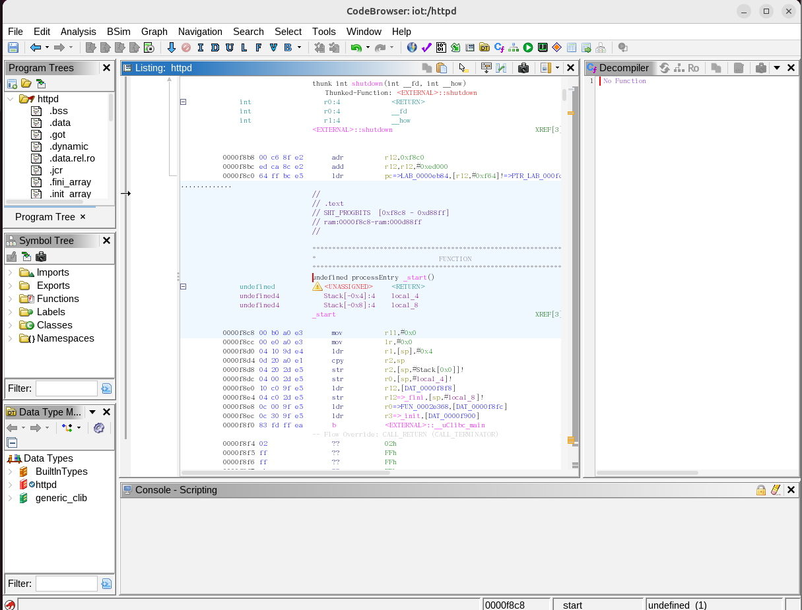

#### 3. 定位并修改关键指令

根据实验手册，关键 Patch 地址为：

```text
0x0002E47C
```

跳转到该地址后，可以看到原始指令为：

```asm
0002e47c    00 30 a0 e1    cpy    r3,r0
```

该指令会将 `r0` 的值复制到 `r3`。结合反编译结果和第一部分的运行现象可知，该位置附近与连接确认或硬件相关检测逻辑有关。在仿真环境中，检测结果容易失败，进而导致程序无法继续正常提供 Web 服务。

在该地址右键选择 `Patch Instruction`，将指令修改为：

```asm
MOV R3, 1
```

修改后对应机器码为：

```text
01 30 A0 E3
```

Ghidra 中显示的新指令为：

```asm
0002e47c    01 30 a0 e3    mov    r3,#0x1
```

该 Patch 的作用是直接将 `r3` 设置为 `1`，使程序不再完全依赖原本的连接检测返回值，从而绕过导致仿真失败的关键判断。

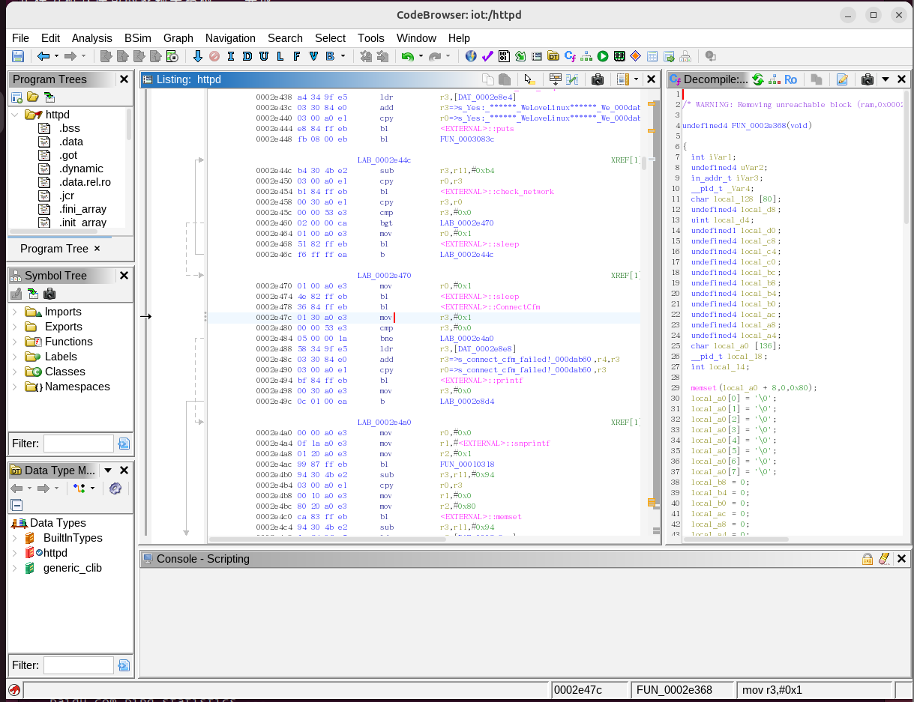

#### 4. 导出并替换 `httpd`

完成指令修改后，在 Ghidra 中选择导出文件，格式保持为 `Original File`，导出路径设置为：

```text
/home/chloe/iot_0x05/httpd_patch
```

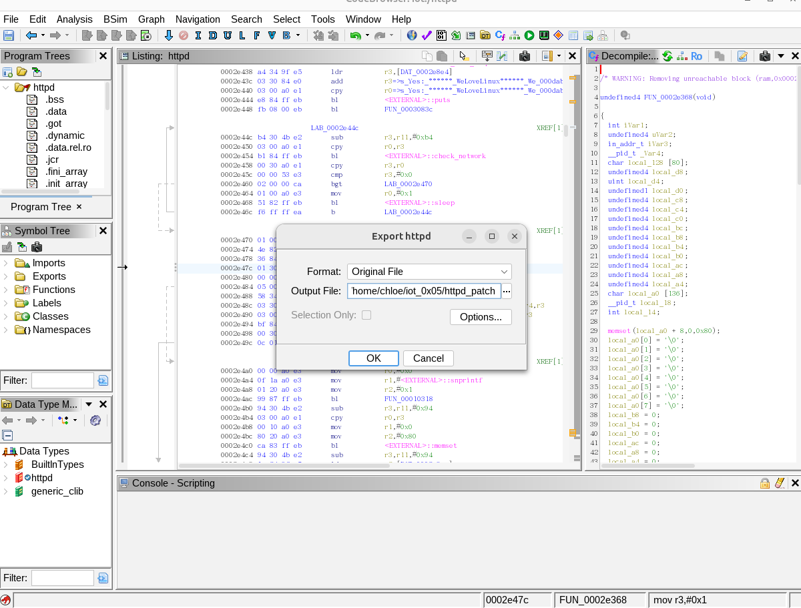

导出完成后，回到固件文件系统目录，先备份原始文件，再使用 Patch 后的文件进行替换：

```bash
cp bin/httpd bin/httpd_original
cp ~/iot_0x05/httpd_patch bin/httpd
chmod +x bin/httpd
```

这样可以保留原始 `httpd`，便于后续对比 Patch 前后的运行结果。

#### 5. 重新运行 Patch 后的 `httpd`

替换完成后，在 `squashfs-root` 目录下重新启动 `httpd`：

```bash
sudo qemu-arm -L ./ bin/httpd
```

运行后，终端仍然出现了部分连接失败信息，例如：

- `connect: No such file or directory`
- `Connect to server failed`
- `create socket fail -1`

但与 Patch 前不同的是，程序没有停留在失败状态，而是继续向后执行，并成功输出：

```text
httpd listen ip = 10.0.2.16 port = 80
webs: Listening for HTTP requests at address 10.0.2.16
```

这说明 Patch 后的 `httpd` 已经成功启动 Web 服务，并监听在 `10.0.2.16:80`。

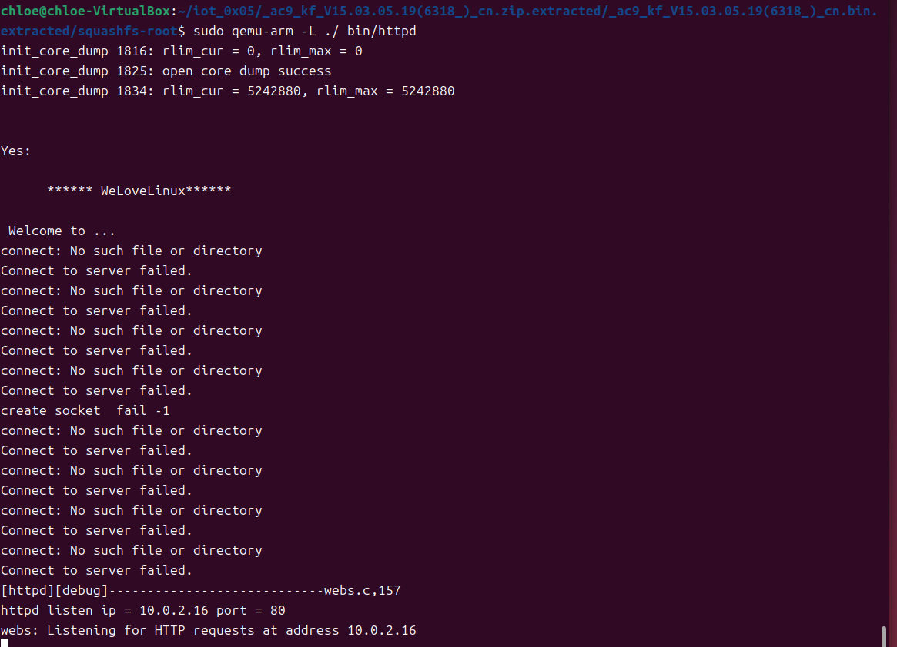

随后在浏览器中访问：

```text
http://10.0.2.16/main.html
```

页面成功进入 Tenda 路由器 Web 管理界面，显示网络状态、无线状态、LAN IP 和软件版本等信息。这表明 Patch 后的固件 Web 服务已经可以在 QEMU 用户态环境中正常访问。

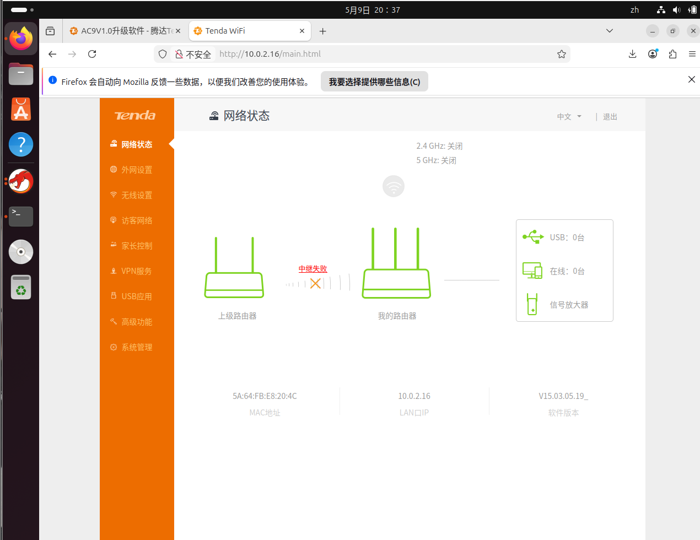

#### 6. 第二部分小结

本部分完成了对原始 `httpd` 的二进制 Patch，主要结果如下：

- 在 Ghidra 中定位到关键地址 `0x0002E47C`；
- 将原始指令 `cpy r3,r0` 修改为 `mov r3,#0x1`；
- 导出 Patch 后的 `httpd` 并替换固件文件系统中的原始文件；
- 重新运行后，`httpd` 成功监听 `10.0.2.16:80`；
- 浏览器可以正常访问 Tenda Web 管理页面。

通过对比 Patch 前后的结果可以看出，原始固件运行失败的关键原因在于初始化过程中存在不适合仿真环境的检测逻辑。修改该判断后，程序能够跳过失败分支并继续启动 Web 服务，实验达到了预期目标。


### （三）第三部分：逆向分析 Patch 原理与原因

第三部分主要说明本次 Patch 为什么能够解决原始固件仿真失败的问题。结合 Ghidra 中的汇编代码、反编译伪代码以及 Patch 后的运行结果，可以看出本次修改的核心是绕过 `httpd` 初始化阶段的连接确认逻辑。

#### 1. 原始问题定位

在第一部分中，原始 `httpd` 启动后出现了如下现象：

- 程序能够输出 `WeLoveLinux` 和 `Welcome to ...`，说明 `httpd` 已经开始执行；
- 随后出现 `connect cfm failed` 等错误；
- 浏览器无法访问 `10.0.2.16/main.html`。

这说明问题并不在于 `httpd` 无法启动，而是在初始化过程中某个连接确认或硬件检测逻辑没有通过，导致程序无法继续正常监听 Web 请求。

#### 2. 修改前后的汇编逻辑

在 Ghidra 中定位到地址 `0x0002E47C` 后，可以看到该位置位于 `ConnectCfm` 调用之后。原始逻辑会使用 `ConnectCfm` 的返回值继续判断程序是否能够向后执行。

Patch 后的关键汇编如下：

```asm
0002e470    mov    r0,#0x1
0002e474    bl     sleep
0002e478    bl     ConnectCfm
0002e47c    mov    r3,#0x1
0002e480    cmp    r3,#0x0
```

其中最关键的修改是：

```asm
mov r3,#0x1
```

也就是将原来依赖函数返回值的结果，直接改为固定成功值 `1`。

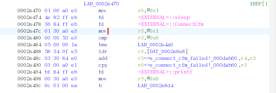

该修改的效果是：

- 不再使用 `ConnectCfm` 的实际返回结果作为判断依据；
- 即使仿真环境中缺少真实硬件或相关服务，也不会因为检测失败而卡住；
- 程序可以继续执行后续 Web 服务初始化流程。

#### 3. 反编译伪代码分析

从 Ghidra 的反编译结果可以看到，`httpd` 启动阶段会执行网络检测和连接确认相关逻辑，例如：

- 通过 `check_network` 等函数等待网络状态；
- 调用 `ConnectCfm()` 进行连接确认；
- 后续继续读取 Web 服务配置项，例如 `lan.webiplanssen`、`lan.webport`、`lan.webipen`、`lan.ip` 等。

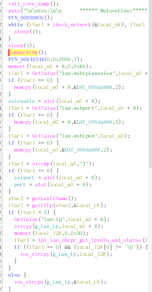

结合伪代码可以看出，`ConnectCfm()` 所在位置处于 Web 服务初始化之前。如果这里的检测失败，后面的监听 IP、监听端口和 Web 页面服务就无法正常建立。

本次 Patch 的思路不是完整模拟真实路由器硬件，而是将关键检测结果强制置为成功，使程序跳过不适合在 QEMU 用户态环境中执行的失败分支。

#### 4. Patch 后运行验证

重新运行 Patch 后的 `httpd`，终端输出显示程序最终成功进入 Web 服务监听阶段：

```text
httpd listen ip = 10.0.2.16 port = 80
webs: Listening for HTTP requests at address 10.0.2.16
```


随后访问：

```text
http://10.0.2.16/main.html
```

浏览器成功打开 Tenda Web 管理页面，页面中能够看到网络状态、LAN IP 和软件版本等信息。


因此可以确认，本次 Patch 已经绕过导致仿真失败的关键检测逻辑，使原始固件的 Web 服务能够在 QEMU 用户态环境中运行。

## 四、实验总结

本次实验完整完成了 Tenda AC9 原始固件从解包、仿真、问题复现到二进制 Patch 的流程。

实验首先使用 `binwalk` 提取固件中的 SquashFS 文件系统，并在 QEMU 用户态环境下尝试运行原始 `httpd`。运行结果表明，原始固件会在初始化阶段因为连接确认或硬件相关检测失败而无法正常访问 Web 页面。

随后使用 Ghidra 对 `httpd` 进行逆向分析，定位到关键地址 `0x0002E47C`，并将原始依赖返回值的指令修改为 `mov r3,#0x1`。该修改使程序跳过仿真环境中无法通过的检测逻辑，继续完成 Web 服务初始化。

最终，Patch 后的 `httpd` 成功监听 `10.0.2.16:80`，浏览器也能够正常打开 Tenda 管理页面。通过 Patch 前后的对比可以看出，固件仿真中的“假死”问题并不一定需要完整模拟所有硬件环境，有时可以通过逆向分析关键判断逻辑，并对二进制程序进行有针对性的修改来解决。

通过本次实验，我加深了对固件解包、用户态仿真、Ghidra 静态分析和二进制 Patch 流程的理解，也认识到在固件安全分析中，动态运行现象和静态逆向结果需要结合起来分析，才能更准确地定位问题原因。
