# 实验十：RouterSploit 模块开发实验报告

## 一、实验目的

本次实验围绕 RouterSploit 模块开发展开，旨在完成以下学习目标：

- **掌握 RouterSploit 模块开发的基本规范和要求**：理解 RouterSploit 框架的模块化设计思想，熟悉漏洞利用模块的文件结构、目录组织方式、类继承关系和接口设计规范，能够独立编写符合框架要求的自定义模块。
- **学习编写符合 RouterSploit 框架的漏洞利用模块**：掌握 Exploit、Scanner、Creds、Generic 等不同类型模块的基类继承关系、作用特点和使用场景，重点理解 Exploit 模块中 `run()` 方法和 `check()` 方法的功能分工与实现方式。
- **理解 RouterSploit 模块的继承关系和接口设计**：掌握如何在模块中定义目标地址、端口、路径、本地监听地址等参数选项，学习 `OptIP`、`OptPort`、`OptString`、`OptBool`、`OptInteger`、`OptSelection` 等多种选项类型的使用方式，以及 `register_option()` 注册机制和自定义验证器的实现方法。
- **掌握模块测试和调试方法**：能够编写单元测试代码，结合 `pytest` 测试框架对自定义模块进行自动化验证；同时能够利用 RouterSploit 控制台的命令行交互结果和报错信息，对模块进行问题排查和修复，为后续编写、复现和分析路由器漏洞利用模块打下基础。

## 二、实验环境

| 环境类别   | 配置内容                                      |
| ------ | ----------------------------------------- |
| 宿主机系统  | Windows 11 Home China 10.0.26200            |
| 虚拟化软件  | Oracle VM VirtualBox                      |
| 虚拟机系统  | Ubuntu Linux 24.04                         |
| Python 版本 | Python 3.12.3                              |
| 实验框架   | RouterSploit v3.4.7（threat9/routersploit）    |
| 测试工具   | pytest 8.3.4、threat9-test-bed                 |
| 代码编辑器  | VSCode / Nano                              |
| 版本控制   | Git                                       |


## 三、实验原理与基础知识

* **RouterSploit 框架的基本思想**

  RouterSploit 是一个面向路由器、嵌入式设备和物联网设备的安全测试框架。它采用模块化设计，将不同功能按照模块进行组织，例如漏洞利用、漏洞扫描、凭证管理和通用辅助功能等。通过这种设计，开发者可以在不修改框架主体代码的情况下，按照统一规范编写新的漏洞利用模块，从而扩展框架功能。

* **RouterSploit 的主要模块类型**

  RouterSploit 中常见的模块主要包括 Exploits、Scanners、Creds 和 Generic 四类。其中，Exploits 模块用于执行具体漏洞利用，是本次实验关注的重点；Scanners 模块用于检测目标是否存在某类漏洞；Creds 模块用于管理认证信息；Generic 模块则提供一些通用功能。不同模块继承不同的基础类，并按照框架要求实现对应的方法。

* **漏洞利用模块的基本结构**

  一个 RouterSploit 漏洞利用模块通常由模块信息（`__info__`）、参数选项、初始化方法（`__init__`）、漏洞检测方法（`check`）和漏洞利用方法（`run`）组成。模块信息一般写在 `__info__` 字段中，用于说明模块名称、漏洞描述、作者、参考资料和受影响设备等内容。参数选项用于接收用户输入，例如目标 IP、目标端口、请求路径、本地监听 IP 和监听端口等，可以通过类属性直接定义，也可以在 `__init__()` 方法中通过 `self.register_option()` 动态注册并绑定验证函数。模块文件需要放在规定目录下（`routersploit/modules/exploits/routers/<vendor>/`），才能被 RouterSploit 正确识别和加载。此外，模块还可以通过 `show_options()` 和 `show_info()` 等方法向用户展示模块帮助信息和使用说明。

* **模块参数与交互机制**

  RouterSploit 为模块参数提供了多种选项类型：
  - `OptIP`：用于定义 IPv4 或 IPv6 地址，如目标 IP 和本地监听 IP；
  - `OptPort`：用于定义端口号，如目标 HTTP 端口和本地监听端口；
  - `OptString`：用于定义字符串类型的参数，如请求路径；
  - `OptBool`：用于定义布尔开关，如是否启用 SSL、是否启用详细输出（verbosity）；
  - `OptInteger`：用于定义整数值，如请求超时时间；
  - `OptSelection`：用于从预定义选项中选择，如 HTTP 请求方法可以从 `["GET", "POST"]` 中选择。

  除了直接定义选项变量外，RouterSploit 还支持通过 `register_option()` 方法在 `__init__()` 中动态注册选项，并通过 `required` 参数设置必填选项、通过 `validator` 参数绑定自定义验证函数（如 `_validate_target()`），从而在模块运行前对用户输入进行校验。用户在 RouterSploit 控制台中可以通过 `set` 命令修改这些参数，通过 `show options` 查看当前配置，再通过 `check` 或 `run` 命令执行模块。这样的交互方式使漏洞利用过程更加规范，也便于调试和复现。

* **`check()` 与 `run()` 方法的作用**

  在 Exploit 模块中，`check()` 方法通常用于判断目标是否可能存在漏洞，例如通过发送测试请求、分析返回页面或检查响应状态来确认漏洞特征。`run()` 方法则用于执行真正的漏洞利用逻辑，例如构造恶意请求、触发命令执行、建立反弹连接等。两者分工明确，前者偏向漏洞验证，后者偏向漏洞利用。

* **HTTP 请求与漏洞触发原理**

  许多路由器漏洞都与 Web 管理接口有关，例如参数过滤不严格、命令拼接不安全或接口鉴权不足等。在模块开发中，可以通过 RouterSploit 提供的 HTTP 客户端能力向目标设备发送 GET 或 POST 请求，并在请求路径、参数或请求体中构造特定内容。如果目标设备存在相应漏洞，就可能触发命令执行、信息泄露或其他异常行为。

* **模块测试与调试方法**

  模块开发完成后，需要在 RouterSploit 控制台中加载模块，设置目标地址、端口等参数，然后执行检测或利用命令。若运行过程中出现报错，需要结合报错信息检查模块路径、类名、依赖库、参数设置和网络连通性等问题。通过不断测试和修改，可以验证模块是否符合 RouterSploit 的开发规范，也能加深对漏洞利用流程和框架运行机制的理解。


## 四、实验内容

本次实验按照 RouterSploit 模块开发流程完成，主要包括模块结构设计、模块选项定义、模块命令交互设计、模块测试以及模块文档编写等内容。根据实验手册要求，RouterSploit 的 Exploit 模块需要放置在指定模块目录下，并实现 `check()` 和 `run()` 方法，同时可以定义模块特定的参数选项。

### 0. 实验环境准备

本次实验在 Windows VirtualBox 虚拟机中的 Ubuntu 系统下完成。为保证源码下载和依赖安装过程稳定，首先将虚拟机网络模式调整为 NAT，并在用户主目录下新建 `0x10` 文件夹作为本次实验目录。

首先进入实验目录，使用 Git 获取 RouterSploit 源码：

```bash
cd ~/0x10
git clone https://github.com/threat9/routersploit.git
cd routersploit
ls
```

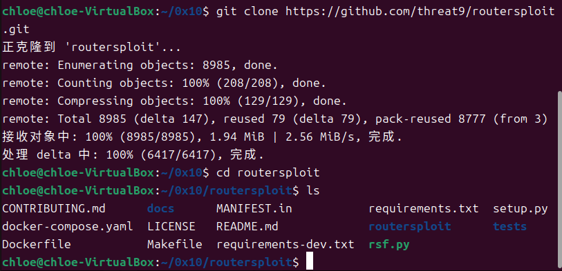

从截图可以看到，RouterSploit 源码成功克隆到本地，目录中包含 `requirements.txt`、`requirements-dev.txt`、`rsf.py`、`routersploit`、`tests` 等核心文件，说明源码获取成功。

随后创建并激活 Python 虚拟环境，在虚拟环境中安装运行依赖：

```bash
python3 -m venv venv
source venv/bin/activate
pip install -r requirements.txt -i https://pypi.tuna.tsinghua.edu.cn/simple
```

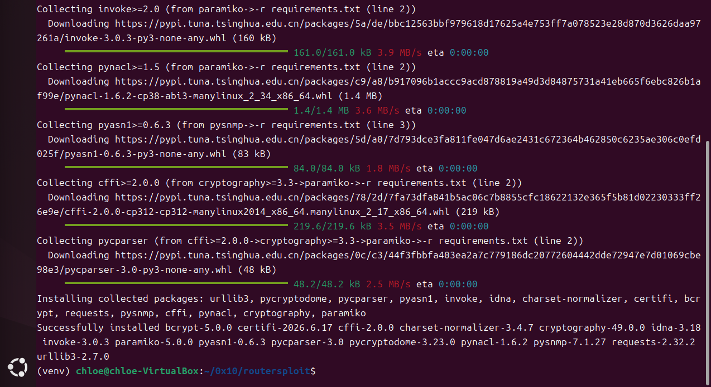

截图显示，`requirements.txt` 中的运行依赖安装成功，包括 `requests`、`paramiko`、`pysnmp`、`cryptography` 等依赖包。

接着安装开发依赖：

```bash
pip install --no-build-isolation -r requirements-dev.txt -i https://pypi.tuna.tsinghua.edu.cn/simple
```

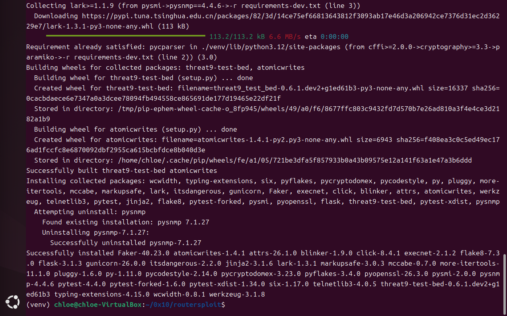

从截图可以看到，`threat9-test-bed` 和 `atomicwrites` 等依赖成功完成 wheel 构建，并显示 `Successfully installed`，说明开发依赖安装完成。

为验证开发测试环境是否正常，执行以下命令：

```bash
pytest --version
pip show threat9-test-bed
```

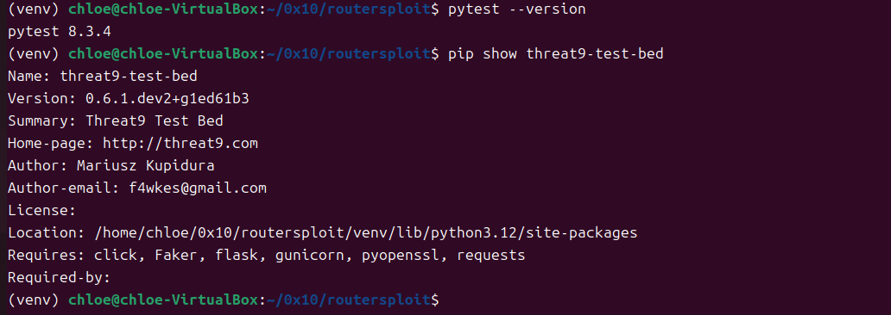

结果显示 `pytest 8.3.4`，同时 `threat9-test-bed` 已成功安装到当前虚拟环境路径 `/home/chloe/0x10/routersploit/venv/lib/python3.12/site-packages` 下，说明测试工具和开发依赖均配置成功。

最后启动 RouterSploit 框架：

```bash
python3 rsf.py
```

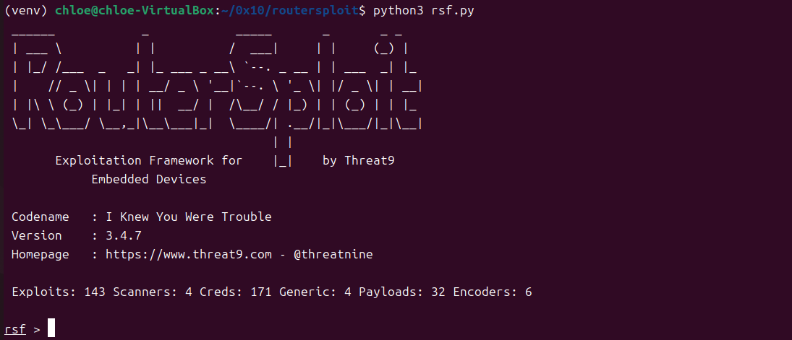

截图显示 RouterSploit 成功启动并进入 `rsf >` 交互界面，版本为 `3.4.7`，同时加载出 Exploits、Scanners、Creds、Generic、Payloads 和 Encoders 等模块，说明实验环境准备完成，可以继续进行后续模块开发与测试。


---

### 1. 模块结构设计

#### 1.1 创建自定义模块目录

根据 RouterSploit 的模块组织结构，路由器漏洞利用模块应放置在 `routersploit/modules/exploits/routers/` 目录下。下图展示了 RouterSploit 中 Exploit 模块的标准目录结构：

```
routersploit/
└── modules/
    └── exploits/
        └── routers/
            └── vendor/               # 厂商目录（如 demo_vendor）
                └── model_exploit.py  # 漏洞利用模块文件
```

按照该目录规范，本实验创建自定义厂商目录 `demo_vendor`，用于存放实验模块文件。

执行命令如下：

```bash
cd ~/0x10/routersploit
mkdir -p routersploit/modules/exploits/routers/demo_vendor
touch routersploit/modules/exploits/routers/demo_vendor/__init__.py
ls routersploit/modules/exploits/routers/demo_vendor
```

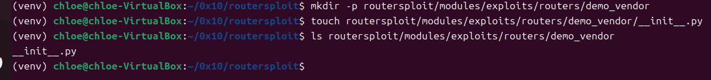

从截图可以看到，`demo_vendor` 目录创建成功，并在其中创建了 `__init__.py` 文件。该文件用于使目录被 Python 识别为模块包，便于 RouterSploit 后续加载该目录下的自定义模块。

#### 1.2 编写自定义模块文件

在 `demo_vendor` 目录下创建模块文件 `demo_status_check.py`，用于实现一个简单的 HTTP 状态检测模块。该模块通过向本地模拟路由器服务发送 HTTP 请求，判断目标服务是否可访问。

执行命令如下：

```bash
nano routersploit/modules/exploits/routers/demo_vendor/demo_status_check.py
```

模块文件的基本结构如下：

```python
#!/usr/bin/env python3

from routersploit.core.exploit import *
from routersploit.core.http.http_client import HTTPClient


class Exploit(HTTPClient):
    __info__ = {
        "name": "Demo Router HTTP Status Check",
        "description": "A demo RouterSploit module for learning module structure, options, check and run methods.",
        "authors": [
            "Chloe",
        ],
        "references": [
            "RouterSploit module development guide",
        ],
        "devices": [
            "Local mock router service",
        ],
    }

    # Target options
    target = OptIP("127.0.0.1", "Target IPv4 or IPv6 address")
    port = OptPort(8000, "Target HTTP port")
    ssl = OptBool(False, "SSL enabled: true/false")

    # Module options
    path = OptString("/", "HTTP request path")
    method = OptString("GET", "HTTP request method")
    timeout = OptInteger(10, "HTTP request timeout")
```

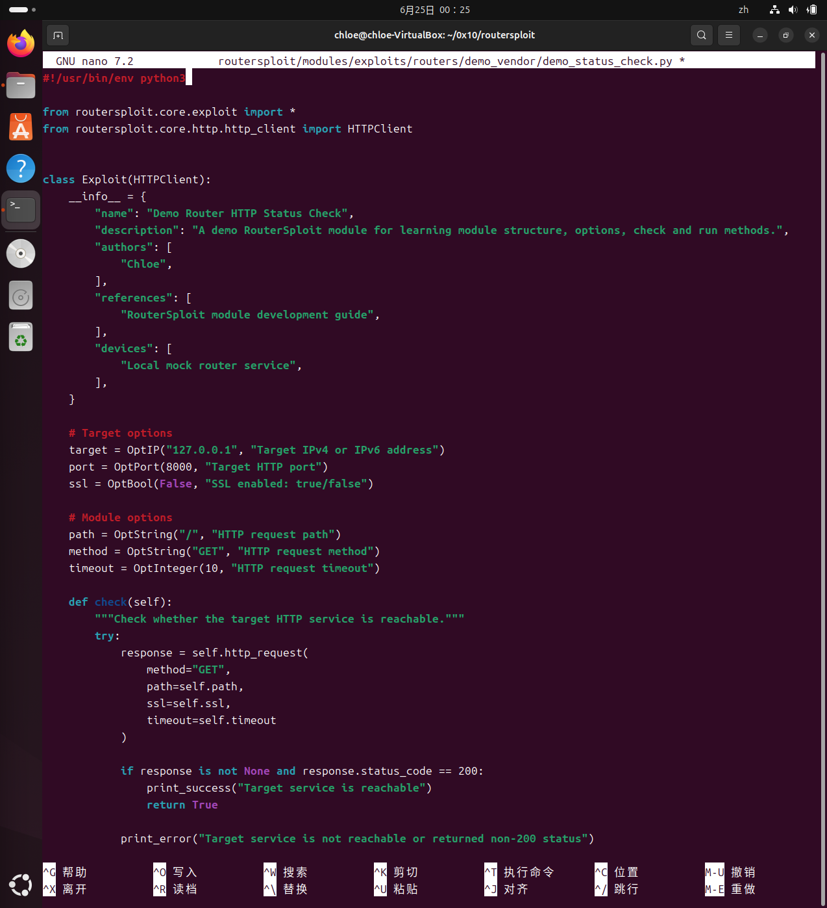

该模块继承 `HTTPClient`，并在类中定义了 `__info__` 模块信息、目标参数、模块参数以及后续用于检测和运行的 `check()`、`run()` 方法。整体结构符合 RouterSploit 中 Exploit 模块的基本编写要求。

完成编辑后，使用以下命令查看模块文件是否创建成功：

```bash
ls -lh routersploit/modules/exploits/routers/demo_vendor/
```

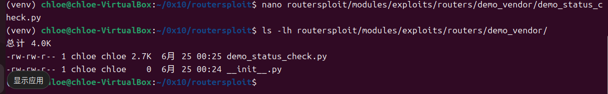

从截图可以看到，目录中已经包含 `demo_status_check.py` 和 `__init__.py`，说明自定义模块文件创建完成。

---

### 2. 模块选项定义

#### 2.1 选项类型概述

RouterSploit 提供了六种常用的选项类型，分别适用于不同的参数场景：

| 选项类型          | 语法示例                                              | 说明                      |
| ------------- | ------------------------------------------------- | ----------------------- |
| `OptIP`       | `OptIP("127.0.0.1", "Target IPv4 or IPv6 address")` | 定义 IPv4/IPv6 地址        |
| `OptPort`     | `OptPort(8000, "Target HTTP port")`               | 定义端口号（1–65535）         |
| `OptString`   | `OptString("/", "HTTP request path")`             | 定义字符串参数                 |
| `OptBool`     | `OptBool(False, "SSL enabled: true/false")`       | 定义布尔开关（True/False）     |
| `OptInteger`  | `OptInteger(10, "HTTP request timeout")`          | 定义整数参数                  |
| `OptSelection` | `OptSelection(["GET","POST"], "HTTP method")`     | 从预定义选项列表中选择            |

在本实验的自定义模块中，主要使用了 `OptIP`、`OptPort`、`OptBool`、`OptString` 和 `OptInteger` 五种类型。其中 `method` 选项在实验手册建议中使用 `OptSelection` 类型以限制可选的 HTTP 方法范围，本实验为简化起见使用了 `OptString` 类型，实际开发中应根据需求选择合适的选项类型。

#### 2.2 定义目标选项

在自定义模块中，首先定义目标相关参数，包括目标 IP 地址、目标端口和是否启用 SSL：

```python
target = OptIP("127.0.0.1", "Target IPv4 or IPv6 address")
port = OptPort(8000, "Target HTTP port")
ssl = OptBool(False, "SSL enabled: true/false")
```

其中，`target` 表示目标地址，本实验中设置为本地地址 `127.0.0.1`；`port` 表示目标 HTTP 服务端口，本实验中使用 `8000`；`ssl` 表示是否启用 SSL，本实验中设置为 `False`。这三个选项属于目标选项组（Target options），用于定义目标设备的基本连接信息。

#### 2.3 定义模块功能选项

除目标选项外，模块还定义了请求路径、请求方法和请求超时时间，这些属于模块选项组（Module options），用于定义模块特定的行为配置：

```python
path = OptString("/", "HTTP request path")
method = OptString("GET", "HTTP request method")
timeout = OptInteger(10, "HTTP request timeout")
```

其中，`path` 用于指定 HTTP 请求路径，`method` 用于指定请求方式（GET 或 POST），`timeout` 用于设置请求超时时间。通过这些选项，用户可以在 RouterSploit 控制台中使用 `set` 命令修改模块运行参数，并使用 `show options` 命令查看当前所有选项的配置情况。

#### 2.4 选项注册与验证机制（高级特性）

根据实验手册，除了直接在类中定义选项外，RouterSploit 还支持通过 `register_option()` 方法在 `__init__()` 中动态注册选项，并结合 `required` 和 `validator` 参数实现输入校验。例如：

```python
def __init__(self):
    super().__init__()
    self.register_option(
        OptIP("", "Target IPv4 or IPv6 address"),
        required=True,
        validator=self._validate_target
    )

def _validate_target(self, value):
    """验证目标 IP 地址格式"""
    if not value:
        return False, "Target IP address is required"
    return True, ""
```

这种模式在编写正式的漏洞利用模块时非常重要，可以确保用户在执行漏洞利用前正确设置了必填参数。此外，模块还可以实现 `show_options()` 和 `show_info()` 方法来提供更详细的模块帮助信息，不过 RouterSploit 框架本身已内置 `show options` 和 `show info` 命令，因此在简单模块中通常不需要额外编写这些方法。

#### 2.5 实现 check 和 run 方法

模块中的 `check()` 方法用于判断目标服务是否可访问，`run()` 方法用于执行具体的 HTTP 请求逻辑。

核心代码如下：

```python
def check(self):
    """Check whether the target HTTP service is reachable."""
    try:
        response = self.http_request(
            method="GET",
            path=self.path,
            timeout=self.timeout
        )

        if response is not None and response.status_code == 200:
            print_success("Target service is reachable")
            return True

        print_error("Target service is not reachable or returned non-200 status")
        return False

    except Exception as e:
        print_error("Check failed: {}".format(str(e)))
        return False


def run(self):
    """Send an HTTP request to the target service."""
    if not self.target:
        print_error("Target IP address is required")
        return

    print_status("Target: {}".format(self.target))
    print_status("Port: {}".format(self.port))
    print_status("SSL: {}".format(self.ssl))
    print_status("Path: {}".format(self.path))
    print_status("Method: {}".format(self.method))

    try:
        response = self.http_request(
            method=self.method,
            path=self.path,
            timeout=self.timeout
        )

        if response is not None:
            print_success("Request completed successfully")
            print_status("HTTP status code: {}".format(response.status_code))

            if response.text:
                print_status("Response body:")
                print(response.text[:300])
        else:
            print_error("No response received")

    except Exception as e:
        print_error("Exploit failed: {}".format(str(e)))
```

其中，`check()` 方法通过发送 GET 请求判断目标是否返回 `200` 状态码；`run()` 方法会输出当前模块配置，并向目标发送 HTTP 请求，最后输出响应状态码和响应内容。

---

### 3. 模块命令交互设计

#### 3.1 编写本地模拟路由器服务

为了验证模块功能，本实验使用 Python 编写了一个本地 HTTP 服务，用于模拟路由器 Web 管理服务。该服务监听 `8000` 端口，并在收到请求后返回固定内容。

执行命令如下：

```bash
nano /tmp/mock_router.py
```

测试服务代码如下：

```python
from http.server import BaseHTTPRequestHandler, HTTPServer


class MockRouterHandler(BaseHTTPRequestHandler):
    def do_GET(self):
        self.send_response(200)
        self.send_header("Content-type", "text/plain")
        self.end_headers()
        self.wfile.write(b"Mock Router Service OK")

    def do_POST(self):
        self.send_response(200)
        self.send_header("Content-type", "text/plain")
        self.end_headers()
        self.wfile.write(b"Mock Router POST OK")


if __name__ == "__main__":
    server = HTTPServer(("0.0.0.0", 8000), MockRouterHandler)
    print("Mock router service started on port 8000")
    server.serve_forever()
```

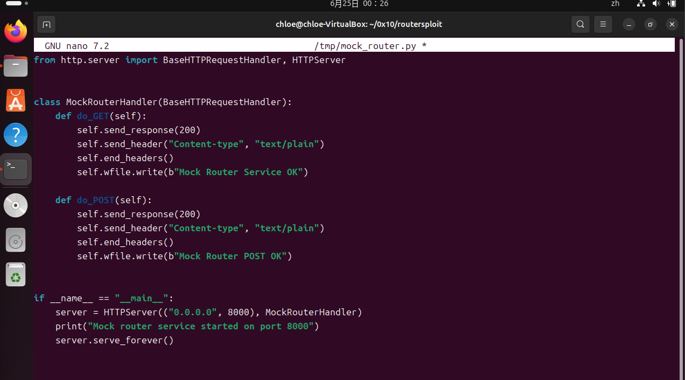

### 3.2 启动本地模拟服务

编写完成后，执行以下命令启动模拟服务：

```bash
python3 /tmp/mock_router.py
```


从截图可以看到，终端输出 `Mock router service started on port 8000`，说明本地模拟服务已经成功启动，并开始监听 `8000` 端口。

#### 3.3 加载自定义模块并设置参数

重新打开一个终端，进入 RouterSploit 项目目录并启动框架：

```bash
cd ~/0x10/routersploit
source venv/bin/activate
python3 rsf.py
```

进入 RouterSploit 控制台后，使用 `use` 命令加载自定义模块：

```bash
use exploits/routers/demo_vendor/demo_status_check
```

随后设置模块参数：

```bash
set target 127.0.0.1
set port 8000
set path /
set method GET
set timeout 10
show options
```

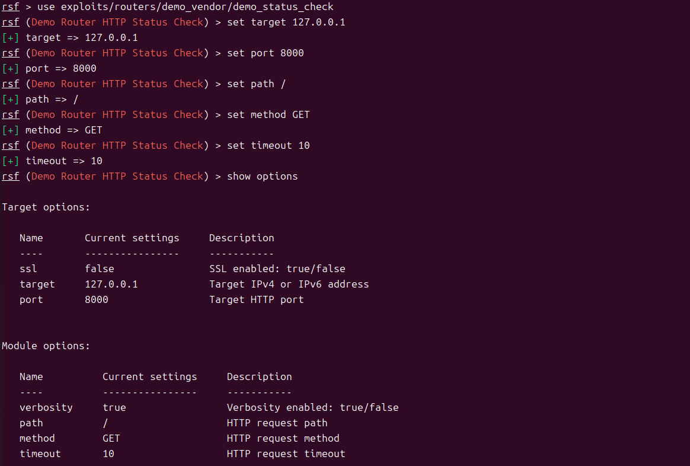

从截图可以看到，RouterSploit 成功加载 `Demo Router HTTP Status Check` 模块，并显示了目标选项和模块选项。当前目标地址为 `127.0.0.1`，端口为 `8000`，请求路径为 `/`，请求方法为 `GET`，超时时间为 `10`，说明模块参数能够被正确识别和修改。

### 3.4 执行 check 和 run 方法

完成参数设置后，首先执行 `check` 命令：

```bash
check
```

随后执行 `run` 命令：

```bash
run
```

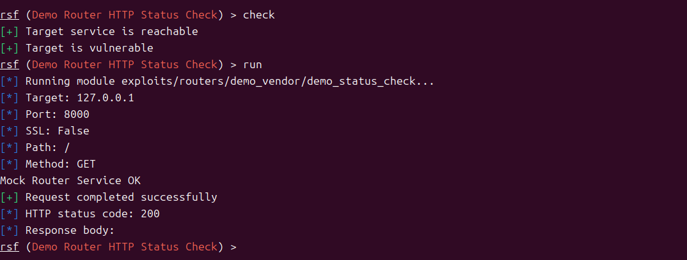

从截图可以看到，执行 `check` 后返回 `Target service is reachable`，说明模块成功访问本地模拟服务；RouterSploit 同时输出 `Target is vulnerable`，这是框架在 `check()` 方法返回 `True` 时给出的统一提示，并不代表真实漏洞存在。

执行 `run` 后，模块输出当前目标地址、端口、SSL 状态、请求路径和请求方法，并成功收到模拟服务返回的 `Mock Router Service OK`。同时，HTTP 状态码为 `200`，说明自定义模块的请求逻辑执行成功。

---

### 4. 模块测试

#### 4.1 创建测试文件目录

根据实验手册要求，模块开发完成后需要编写测试文件，并使用 `pytest` 进行测试。本实验在 `tests/modules/exploits/routers/demo_vendor/` 目录下创建测试文件。

执行命令如下：

```bash
cd ~/0x10/routersploit
mkdir -p tests/modules/exploits/routers/demo_vendor
nano tests/modules/exploits/routers/demo_vendor/test_demo_status_check.py
```

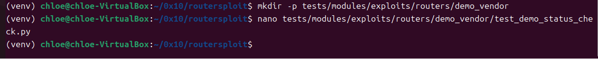

#### 4.2 编写单元测试代码

测试文件 `test_demo_status_check.py` 的内容如下：

```python
import unittest

from routersploit.modules.exploits.routers.demo_vendor.demo_status_check import Exploit


class TestDemoStatusCheck(unittest.TestCase):
    def setUp(self):
        self.exploit = Exploit()
        self.exploit.target = "127.0.0.1"
        self.exploit.port = 8000
        self.exploit.path = "/"
        self.exploit.method = "GET"
        self.exploit.timeout = 10

    def test_module_options(self):
        """验证模块选项设置是否正确"""
        self.assertEqual(self.exploit.target, "127.0.0.1")
        self.assertEqual(self.exploit.port, 8000)
        self.assertEqual(self.exploit.path, "/")
        self.assertEqual(self.exploit.method, "GET")
        self.assertEqual(self.exploit.timeout, 10)

    def test_check(self):
        """验证 check() 方法能否正常检测目标服务"""
        self.assertTrue(self.exploit.check())


if __name__ == "__main__":
    unittest.main()
```

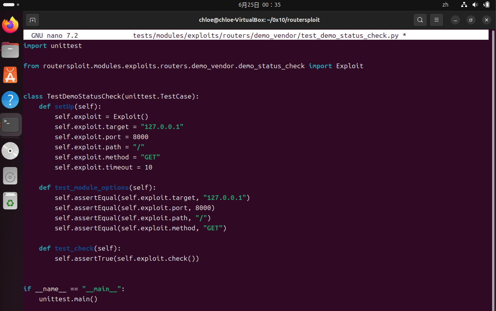

在测试代码中，`setUp()` 方法用于创建模块对象并设置测试参数；`test_module_options()` 用于验证模块参数设置是否正确，本实验中验证了 `target`、`port`、`path`、`method` 和 `timeout` 共五个选项；`test_check()` 用于验证模块的 `check()` 方法是否能够正常返回 `True`。

根据实验手册建议，完整的测试还应包含 `test_run()` 方法，用于验证 `run()` 方法是否能够正常执行而不抛出异常。由于 `run()` 方法主要通过 `print_success`/`print_error` 进行输出而非返回值，其测试方式通常为：设置必要的目标参数后调用 `self.exploit.run()`，并在 try-except 块中验证执行过程无异常。

#### 4.3 运行 pytest 测试

保持 `/tmp/mock_router.py` 本地模拟服务处于运行状态，然后执行以下命令运行测试：

```bash
python3 -m pytest tests/modules/exploits/routers/demo_vendor/test_demo_status_check.py -v
```

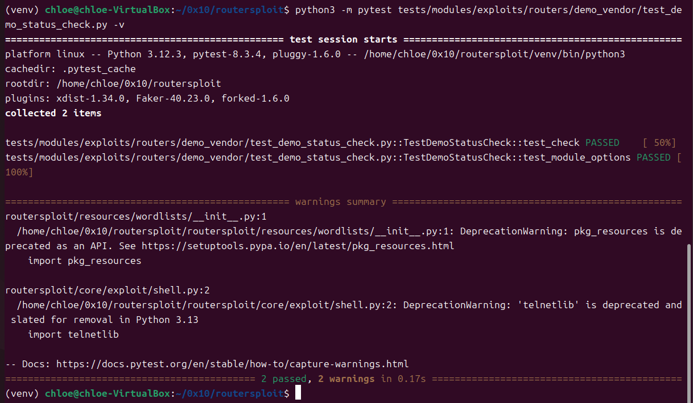

从截图可以看到，pytest 共收集到 2 个测试项，分别为 `test_check` 和 `test_module_options`，最终结果均为 `PASSED`。终端最后显示 `2 passed, 2 warnings in 0.17s`，说明自定义模块已经通过单元测试。出现的 warning 为 Python 版本相关的弃用提醒，不影响本次实验结果。

---

### 5. 模块文档编写

#### 5.1 修改模块文档信息

RouterSploit 模块通过 `__info__` 字段定义模块文档信息，包括模块名称、模块描述、作者、参考资料和适用设备等内容。为了使模块信息更加完整，本实验对 `demo_status_check.py` 中的 `__info__` 字段进行了修改。

执行命令如下：

```bash
cd ~/0x10/routersploit
nano routersploit/modules/exploits/routers/demo_vendor/demo_status_check.py
```

将原本较简单的 `__info__` 字段修改为如下内容：

```python
__info__ = {
    "name": "Demo Router HTTP Status Check",
    "description": """
    This module is a RouterSploit demo exploit module used for learning
    module development. It sends HTTP requests to a mock router service
    and verifies whether the target service is reachable.

    The module demonstrates:
    1. RouterSploit module structure
    2. Target and module option definition
    3. check() method implementation
    4. run() method implementation
    5. Basic module testing process
    """,
    "authors": [
        "Chloe",
    ],
    "references": [
        "RouterSploit Module Development Guide",
    ],
    "devices": [
        "Local mock router service",
        "Demo embedded device web service",
    ],
}
```

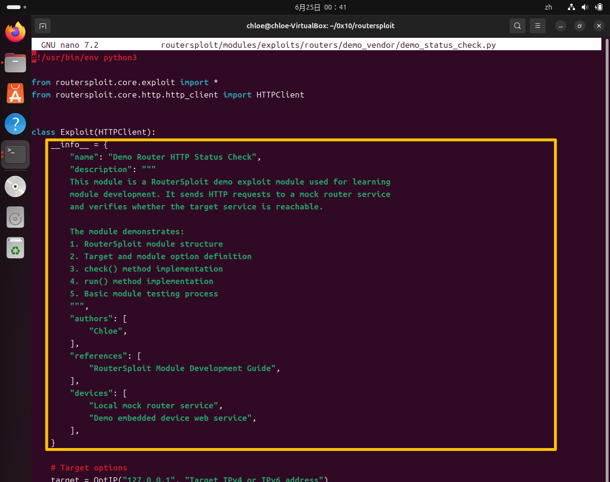

该字段中，`name` 用于说明模块名称；`description` 用于描述模块功能、实验目的和演示内容；`authors` 用于记录作者信息；`references` 用于填写参考资料；`devices` 用于说明适用设备或测试对象。通过补充这些信息，可以使模块在 RouterSploit 框架中具有更清晰的说明文档。

#### 5.2 查看模块文档信息

修改完成后，重新启动 RouterSploit 并加载自定义模块：

```bash
python3 rsf.py
use exploits/routers/demo_vendor/demo_status_check
show info
```

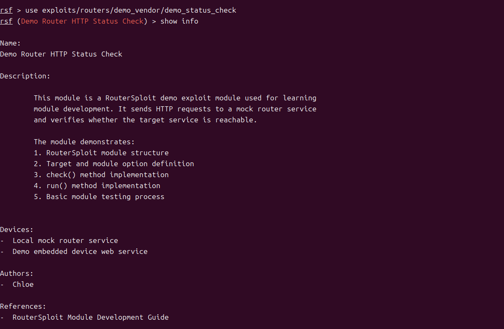

从截图可以看到，RouterSploit 成功显示了模块名称 `Demo Router HTTP Status Check`、模块描述、适用设备、作者和参考资料等内容，说明 `__info__` 字段已经被框架正确读取和展示，模块文档编写完成。

通过本次实验，完成了从模块目录创建、模块代码编写、选项定义、命令交互测试、单元测试到模块文档补充的完整流程，加深了对 RouterSploit 模块开发规范、接口设计和测试方法的理解。

## 五、实验问题与解决方法

### （一）`ssl` 参数传递导致模块运行报错

在自定义 RouterSploit 模块编写完成后，模块可以被正常加载，`target`、`port`、`path`、`method`、`timeout` 等参数也能够通过 `set` 命令正常设置。但是在执行 `check` 命令时，程序出现如下报错：

```bash
Check failed: Session.request() got an unexpected keyword argument 'ssl'
Target is not vulnerable
```
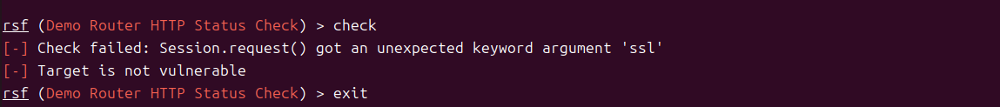

该问题出现在模块的 HTTP 请求部分。最初在 `check()` 和 `run()` 方法中调用 `self.http_request()` 时，将 `ssl=self.ssl` 作为参数传入，代码如下：

```python
response = self.http_request(
    method="GET",
    path=self.path,
    ssl=self.ssl,
    timeout=self.timeout
)
```

从报错信息可以看出，程序最终调用到了 `requests.Session.request()` 方法，而该方法并不接收名为 `ssl` 的关键字参数。因此，虽然模块中定义了 `ssl = OptBool(False, "SSL enabled: true/false")` 作为可配置选项，但不能直接把 `ssl` 参数传入当前版本的 `http_request()` 调用中，否则会导致底层请求函数无法识别该参数。

为解决该问题，对模块代码进行了修改，保留 `ssl` 选项用于显示模块配置，但在实际发送 HTTP 请求时不再将 `ssl=self.ssl` 传入 `http_request()`。修改后的 `check()` 方法中请求部分如下：

```python
response = self.http_request(
    method="GET",
    path=self.path,
    timeout=self.timeout
)
```

`run()` 方法中请求部分修改为：

```python
response = self.http_request(
    method=self.method,
    path=self.path,
    timeout=self.timeout
)
```

修改完成后，重新加载模块并执行 `check` 和 `run` 命令，模块能够成功访问本地模拟路由器服务。`check` 返回 `Target service is reachable`，`run` 返回 `Mock Router Service OK` 和 HTTP 状态码 `200`，说明问题已经解决。

通过该问题可以看出，在进行 RouterSploit 模块开发时，不能只根据选项名称直接向底层请求函数传参，而需要结合当前框架版本中函数实际支持的参数进行编写。对于模块选项，可以用于控制逻辑或显示配置，但是否能够直接传入某个函数，需要根据具体接口进行判断。


## 六、拓展思考


### 1. 模块继承关系

**问题**：RouterSploit 中的 Exploit、Scanner、Creds 和 Generic 模块分别继承自哪些基类？它们各自有什么特点和使用场景？

**回答**：

RouterSploit 的所有模块最终都继承自 `BaseModule` 基类（定义于 `routersploit/core/exploit/` 目录下），`BaseModule` 提供了模块的通用基础能力，包括选项解析、`__call__` 调用机制、`__str__` 字符串表示、模块元数据管理（`__info__` 字典）以及 `register_option()`、`check_required()` 等辅助方法。

四类模块的具体继承关系和特点如下：

| 模块类型    | 继承关系                    | 核心方法                  | 特点与使用场景                                   |
| ------- | ----------------------- | --------------------- | ----------------------------------------- |
| Exploit | Exploit → BaseModule    | `run()`, `check()`    | 用于漏洞利用，自动添加 `target`/`port` 选项，针对单个目标执行攻击操作 |
| Scanner | Scanner → BaseModule    | `run()`, `scan()`     | 用于漏洞扫描与检测，支持 CIDR 网段格式的目标地址，适合批量发现         |
| Creds   | Creds → BaseModule      | `run()`, `login()` 等  | 用于凭证管理，内置用户名/密码选项，适合默认口令测试和暴力破解            |
| Generic | Generic → BaseModule    | `run()`               | 用于通用辅助功能，不自动添加 target/port，适合工具类模块           |

- **Exploit** 是本次实验的重点关注对象，其核心在于 `check()` 进行漏洞验证（发送测试请求判断漏洞是否存在）和 `run()` 执行漏洞利用（构造恶意请求触发命令执行或建立反弹连接）。两者分工明确，前者偏向检测，后者偏向利用。
- **Scanner** 适合在渗透测试的侦察阶段使用，通过向多个目标发送探测请求来判断哪些设备存在特定漏洞，通常返回检测结果而非执行实际攻击。
- **Creds** 专注于认证相关功能，内置了用户名和密码的选项管理，可以配合字典文件进行批量登录测试。
- **Generic** 是最轻量级的模块类型，不强制要求目标地址和端口选项，适合实现一些辅助工具功能，如编码转换、数据格式化等。

理解这些模块类型的继承关系和分工，有助于在开发时选择正确的基类，并根据模块用途设计合适的接口和选项。

### 2. 高级选项类型

**问题**：除了基本的 OptIP、OptPort 等选项类型外，RouterSploit 还支持哪些高级选项类型？如何实现自定义选项类型？

**回答**：

除了在本次实验中使用的 `OptIP`、`OptPort`、`OptString`、`OptBool` 和 `OptInteger` 五种基本选项类型外，RouterSploit 框架还支持以下高级选项类型：

| 高级选项类型            | 说明                           |
| ----------------- | ---------------------------- |
| `OptMAC`          | 验证 MAC 地址格式（如 `ff:ff:ff:ff:ff:ff`） |
| `OptWord`         | 验证单字输入（不允许包含空格字符）            |
| `OptIntegerRange` | 验证整数是否在指定的最小/最大范围内            |
| `OptFloat`        | 验证浮点数格式                      |
| `OptPayload`      | 用于嵌入或引用 Payload              |
| `OptSelection`    | 从预定义的选项列表中进行选择（如 `["GET", "POST"]`） |

所有选项类型都继承自 `Option` 基类，利用 Python 的描述符协议（Descriptor Protocol）实现 `__get__` 和 `__set__` 方法，使得选项可以像普通类属性一样被读取和赋值，同时在赋值时自动进行类型检查和验证。

实现自定义选项类型的方法如下：

* 继承 `Option` 基类；
* 重写 `__init__` 方法，接收默认值和描述信息；
* 重写 `__set__` 方法，在其中添加自定义的验证逻辑。例如，如果需要实现一个验证 IPv6 地址的 `OptIPv6` 类型，可以在 `__set__` 中通过正则表达式检查 `value` 是否符合 IPv6 格式，不符合则抛出异常或拒绝赋值。

```python
from routersploit.core.exploit.option import Option
import re

class OptIPv6(Option):
    def __set__(self, instance, value):
        if not re.match(r'^([0-9a-fA-F:]+)$', value):
            raise ValueError(f"Invalid IPv6 address: {value}")
        instance.__dict__[self.name] = value
```

通过这种设计，开发者可以根据特定漏洞利用场景的需求，灵活扩展新的选项类型，同时保持与 RouterSploit 框架的兼容性。

### 3. 模块间通信

**问题**：在 RouterSploit 中，如何实现不同模块之间的数据共享和通信？有哪些内置的机制可以支持模块间的协作？

**回答**：

RouterSploit 框架在设计上以模块的**独立运行**为基本原则。每个模块都是自包含的，从 `use` 命令加载到 `run` 命令执行，整个过程在当前模块实例内部完成。框架本身**不提供内建的进程间通信（IPC）机制、全局数据存储或事件总线**来实现模块间的直接数据传递。

然而，以下机制可以在一定程度上实现模块间的协作和数据共享：

- **共享工具函数**：所有模块可以调用 `routersploit/core/` 中的公共工具函数，如 `print_status()`、`print_success()`、`print_error()` 用于统一输出。这些函数写入同一输出流，但本身不携带任何状态。模块也可以调用 HTTP 客户端、TCP 客户端等封装好的网络工具类，避免在每个模块中重复编写底层通信代码。

- **Import 复用**：模块文件通过 `from routersploit.core.exploit import *` 导入所有公共基础设施。一个模块可以显式导入另一个模块的类或函数来复用其逻辑，但这通常用于复用漏洞检测或利用的辅助代码，而非运行时数据传递。

- **外部编排**：跨模块的工作流需要通过外部脚本来协调。例如，可以先运行一个 Scanner 模块扫描存活主机，将结果写入文件，再由另一个脚本读取文件内容，逐条调用 Exploit 模块进行漏洞利用。RouterSploit 控制台本身也支持顺序执行多个模块，但各模块之间不直接共享内存数据。

- **Payloads 和 Encoders 模块**：RouterSploit 提供了独立的 Payloads（有效载荷）和 Encoders（编码器）模块，Exploit 模块可以通过 `OptPayload` 选项类型引用 Payload 模块生成的数据，这是一种有限的"模块间数据传递"机制。

- **文件/标准输出传递**：最简单的模块间通信方式是通过标准输出和文件。前一个模块将结果输出到标准输出或写入文件，后一个模块从标准输入或文件中读取数据。这种方式虽然粗糙，但在实际渗透测试中非常实用。

总体而言，RouterSploit 的模块间通信能力相对有限，这是其作为模块化安全测试框架的设计选择——优先保证模块的独立性和可复用性，而非模块间的紧耦合协作。对于需要复杂工作流的场景，建议通过外部脚本进行编排。

## 七、实验总结

通过本次实验，我完成了 RouterSploit 模块开发的完整流程，具体包括以下几个方面：

- **环境配置**：在 Ubuntu 虚拟机中完成 RouterSploit 源码的克隆、Python 虚拟环境的创建以及运行依赖和开发依赖的安装，并通过启动 `rsf.py` 验证环境配置正确。
- **模块目录创建与代码编写**：按照 RouterSploit 的目录规范，在 `routersploit/modules/exploits/routers/demo_vendor/` 下创建了自定义厂商目录和模块文件 `demo_status_check.py`，模块继承 `HTTPClient`，实现了 `__info__` 模块信息定义和选项参数定义。
- **参数选项定义**：学习了 `OptIP`、`OptPort`、`OptString`、`OptBool`、`OptInteger`、`OptSelection` 等选项类型的使用方式，以及 `register_option()` 注册机制和自定义验证器的实现原理；理解了目标选项组和模块选项组的分类设计。
- **命令交互测试**：编写了本地模拟路由器服务，在 RouterSploit 控制台中通过 `use`、`set`、`show options`、`check` 和 `run` 等命令完成了模块的加载、参数设置和功能验证，模块成功访问模拟服务并返回 HTTP 状态码 `200`。
- **单元测试**：按照实验手册规范搭建了测试目录结构，编写了 `test_module_options` 和 `test_check` 两个测试用例，并通过 `pytest` 验证模块功能正确。
- **模块文档补充**：完善了 `__info__` 字段，添加了详细的模块描述、设备列表和参考资料，并通过 `show info` 命令验证文档展示正确。

在实验过程中，通过解决 `ssl` 参数传递导致的报错问题，我深刻认识到模块开发不仅要遵循框架规范，还需要结合当前框架版本中底层函数实际支持的参数进行编写。对于模块选项，一个选项可以用于控制逻辑或显示配置，但是否能够直接传入某个底层函数，需要根据具体接口进行判断，这是安全工具开发中的重要经验。

此外，通过本次实验，我对以下方面有了更深的理解：

- **RouterSploit 模块开发流程**：从目录创建到模块编写再到测试验证，形成了一套规范的开发流程，为后续编写真实漏洞利用模块打下了基础。
- **Python 模块开发**：学习了如何使用类继承、描述符协议（选项类型）和装饰器模式来构建可扩展的安全工具框架。
- **HTTP 协议基础**：通过编写模拟服务和发送 HTTP 请求，加深了对 HTTP 请求方法、状态码和请求-响应模型的理解。
- **单元测试编写**：掌握了使用 `unittest` 和 `pytest` 对安全工具模块进行自动化测试的方法，理解了测试驱动开发在安全工具开发中的重要性。

总体来看，本次实验加深了我对 RouterSploit 模块结构和开发流程的理解，提升了我编写、测试和调试安全工具模块的能力，也为后续学习物联网设备安全测试奠定了基础。

## 参考资料

[1] 课程实验资料：《RouterSploit 模块开发指南》（0x10）。

[2] RouterSploit 官方项目仓库：https://github.com/threat9/routersploit

[3] RouterSploit Wiki 文档：https://github.com/threat9/routersploit/wiki

[4] pytest 官方文档：https://docs.pytest.org/

[5] Python `unittest` 标准库文档：https://docs.python.org/3/library/unittest.html
